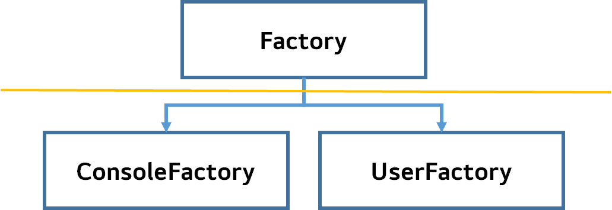

> @Autowired의 개념을 접하기 이전, DI 개념, SOLID 원칙이 무엇인지 파악하고 접근하자!  

## DI(Dependency Injection)란?  

- DI(Dependency Injection, 의존성 종속)란, 객체 지향 프로그래밍에서 강한 결합도를 가진 객체들 사이의 의존성을 약한 결합도로 만들어주는 설계 원칙이다.

- 스프링 관점에서는 **클래스 간 의존관계를 스프링 컨테이너가 자동으로 연결**해 주는 것을 의미한다. 즉, 객체는 의존성에 대한 관리를 신경쓰지 않고 독립적으로 동작 가능하다.  

### 왜 객체 간 결합도를 낮춰야 하나요?
- 코드의 재사용성, 유지보수성, 테스트 용이성 등이 향상되기 때문이다.

1. 재사용성(Reusability) : 의존성을 외부에서 주입받는 경우, 객체는 독립적으로 동작 가능하다.
    - 객체를 다른 컨텍스트에서 재사용하기 쉬워진다
    - 예를 들어, 데이터베이스 연결을 관리하는 객체를 의존성으로 주입받는 경우, 동일 객체를 다른 데이터베이스에 연결하여 재사용 가능하다.

2. 유지보수성(Maintainability) : 결합도가 낮으면 변경 사항에 대한 영향 범위가 제한된다.
    - 한 객체의 변경이 다른 객체에 영향을 미치지 않기 때문에 코드 수정이 간편해진다.
    - 예를 들어, 데이터 소스를 변경해야할 때, 의존성 주입을 통해 데이터 소스를 제공하는 객체만 수정하면 된다.

3. 테스트 용이성(Testability) : 객체 간의 결합도가 낮아지면 단위 테스트가 용이해진다.
    - 의존성을 외부에서 주입받기에, 테스트 환경에서 모의 객체(Mocking)를 주입하여 테스트를 수행 가능하다.
    - 즉, 의존 객체의 동작을 모의화하여 특정 시나리오를 테스트하는데 도움을 준다.

4. 확장성(Scalability) : 새로운 기능을 추가하거나 변경할 때, 객체들 간 결합도가 낮으면 전체 시스템을 다시 구성할 필요 없이 해당 객체만 수정하면 된다.
    - 이는 시스템의 확장성을 높여준다.
    - 예를 들어, 새로운 알림 방법을 추가하려면, 알림을 제공하는 객체만 수정하면 된다.

5. 관리 용이성(Manageability) : 객체 간 의존성을 외부에서 설정하고 관리하기에, 애플리케이션의 전체 구성과 의존성 관리가 용이해진다.  
    - 의존성 주입 컨테이너를 사용하면 의존성을 중앙 관리 가능하며, 객체 생성과 의존성 설정에 대한 로직을 분리하여 코드의 가독성을 향상시킨다.

- 위의 장점들은 객체 지향 프로그래밍의 핵심 원칙인 **SOLID 원칙**을 따르고, 유연하고 테스트 가능한 코드를 작성하기 위해 중요하다.

- 결합도가 낮아지면 코드의 유지보수성과 확장성이 향상되며, 코드의 재사용성과 테스트 용이성도 향상된다.  

### DI(Dependency Injection) 예시
  

- SW를 사용하는 클라이언트는 Factory 클래스만을 호출해야하며, 구현체인 ConsoleFactory, UseFactory의 사용을 몰라야한다.  

- 클라이언트마다 전용 Factory 클래스를 생성할 경우, 생산성이 떨어지며, 코드가 노출되기 때문이다.  

- 이를 위해, 스프링은 객체 간 의존성을 주입함으로써, 클라이언트가 사용하는 Factory가 ConsoleFactory인지, UserFactory인지를 감춘다.  

## SOLID 원칙이란?  
- 객체 지향 프로그래밍에서 유지보수 가능하고 확장 가능한 소프트웨어를 설계하기 위한 다섯 가지 원칙의 앞글자를 딴 약어이다.  

1. 단일 책임 원칙(SRP, Single Responsibility Principle)
    - 클래스는 하나의 책임만 가져야 한다. 즉, 클래스는 한 가지 기능 또는 역할을 수행해야 한다.
    - 이를 통해 클래스는 한 가지 책임에 집중하며, 변경이 발생할 경우 클래스만 수정하면 된다.
    - ex) 주문 관리 시스템에서 주문 정보를 처리하는 클래스 - 주문 생성, 수정, 삭제 관련 책임만 지닌다.

2. 개방-폐쇄 원칙(OCP, Open-Closed Principle)  
    - 소프트웨어의 엔티티(클래스, 모듈, 함수 등)는 확장에는 열려 있어야 하고, 수정에는 닫혀 있어야한다.  
    - 즉, 기존 코드를 수정하지 않고도 기능을 확장할 수 있어야 한다.  
    - 이를 위해 추상화와 다형성을 활용하여 확장 가능한 구조를 만들어야 한다.  
    - ex) 도형 그리는 프로그램 - 도형 종류가 늘어날 때마다 기존 로직 변경하지 않고 새로운 도형 추가하게끔 설계  

3. 리스코프 치환 원칙(LSP, Liskov Substitution Principle)  
    - 상위 타입 객체는, 하위 타입 객체로 대체 가능해야한다.  
    - 즉, 어떤 클래스가 상위 클래스를 상속받을 때, 이 클래스를 사용하는 코드는 상위 클래스의 인스턴스를 언제나 대체 가능한 하위 클래스의 인스턴스로 취급할 수 있어야 한다.  
    - ex) 자동차(Car) 인터페이스의 엑셀 메서드 - 무조건 앞으로!!  

4. 인터페이스 분리 원칙(ISP, Interface Segregation Principle)  
    - 클라이언트는 자신이 사용하지 않는 메서드에 의존해서는 안된다.  
    - 인터페이스는 클라이언트가 필요로 하는 기능에만 집중되어야 하며, 불필요한 메서드를 포함하지 않아야 한다.  
    - 즉, 인터페이스는 작고 응집력 있는 단위로 분리되어야 한다.  
    - ex) `createOrder()`, `updateOrder()`, `deleteOrder()` 메서드를 포함하는 주문처리 인터페이스 - 주문 조회와 같은 필요없을 수 있는 기능 분리  

5. 의존성 역전 원칙(DIP, Dependency Inversion Principle)  
    - 추상화에 의존해야하며, 구체화에는 의존하면 안된다.  
    - 즉, 고수준 모듈은 저수준 모듈에 의존해서는 안되며, 양쪽 모두 추상화에 의존해야한다.  
    - 추상화된 인터페이스나 추상 클래스를 통해 의존성을 주입받아야 한다.  
    - ex) 데이터베이스에 직접적으로 의존하는 서비스 클래스  

- SOLID 원칙을 통해 코드의 유지보수성, 확장성, 재사용성, 테스트 용이성 등이 향상되며, 더 풍부하고 유연한 객체 지향 소프트웨어 개발이 가능하다.


## @Autowired란?  
- @Autowired란 스프링 프레임워크에서 제공하는 의존성 주입(DI, Dependency Injection) 기능 중 하나이다.  

- @Autowired annotation은 스프링 컨텍스트에 등록된 빈(Bean) 객체들 사이에서 의존성을 자동으로 주입하기 위해 사용된다.  

- 즉, 스프링은 @Autowired를 사용하여 의존성을 갖는 객체를 찾아서 해당 객체를 자동으로 생성하고 주입해준다.  

### 예시  
- @Autowired를 사용하지 않은 예 : 
```
public class UserService {
    private UserRepository userRepository;

    public UserService(UserRepository userRepository) {
        this.userRepository = userRepository;
    }

    public void saveUser(User user) {
        userRepository.saveUser(user);
    }

    public void getUserById(int id) {
        userRepository.getUserById(id);
    }

    public void deleteUser(int id) {
        userRepository.deleteUser(id);
    }

    public void updateUser(User user) {
        userRepository.updateUser(user);
    }
}


```   
- UserService 클래스는 UserRepository에 의존하는 중 == UserService가 UserRepository에 강하게 결합되어 있다.  
    - 유연성, 테스트 용이성 감소
- 다른 UserRepository 구현체로 변경 시, UserService의 코드를 수정해야한다.  

- **SOLID 원칙 위배**
1. 단일 책임 원칙 (SRP) 위배:
    - UserService 클래스는 사용자(User)를 저장하는 책임뿐만 아니라 UserRepository의 인스턴스를 생성하는 책임도 가지고 있다.
    - 이는 UserService 클래스가 여러 가지 역할을 동시에 수행하고 있음을 의미합니다. 
    - UserService 클래스는 단지 사용자를 저장하는 기능에만 집중해야 한다.

2. 개방-폐쇄 원칙 (OCP) 위배:
    - UserService 클래스는 UserRepository의 구체적인 구현체에 직접 의존하여 UserRepository의 인스턴스를 생성한다. 
    - 이는 UserService 클래스가 특정 구현체에 강하게 결합되어 있음을 의미
    - UserRepository의 구현체를 변경하려면 UserService 클래스의 코드를 수정해야 한다. 
    - 새로운 UserRepository 구현체를 추가하거나 기존 구현체를 변경할 때마다 UserService 클래스를 수정해야 하므로, 유연성과 확장성이 떨어진다.

3. 리스코프 치환 원칙 (LSP) 위배:
    - UserService 클래스는 UserRepository의 인스턴스를 직접 생성하고 사용한다. 
    - 이는 UserRepository 인터페이스에만 의존하도록 설계된 것이 아니라, UserRepository의 구체적인 구현체에 의존한다는 의미 
    - UserService 클래스는 UserRepository 인터페이스를 구현한 다른 구현체를 사용할 수 없으며, 강하게 특정 구현체에 의존한다.

4. 인터페이스 분리 원칙 (ISP) 위배:
    - UserService 클래스는 사용자 저장과 관련된 메서드만을 사용해야 하는데, getUserById(), deleteUser(), updateUser()와 같은 다른 기능에도 의존한다면, ISP를 위반하게 된다. 
    - UserService 클래스는 자신이 필요로 하는 기능에만 의존해야 하며, 다른 기능에는 의존하지 않아야 한다.

5. 의존성 역전 원칙 (DIP) 위배:
    - UserService 클래스는 UserRepository의 인스턴스를 직접 생성하고 사용한다. 
    - 이는 고수준 모듈(UserService)이 저수준 모듈(UserRepository)에 직접 의존한다는 의미
    - UserService 클래스는 UserRepository 구현체에 직접 의존하므로, UserRepository 구현체의 변경에 유연하게 대응할 수 없다.  

- @Autowired를 사용한 예 : 
```
public class UserService {
    @Autowired
    private UserRepository userRepository;

    public void saveUser(User user) {
        userRepository.save(user); // @Autowired를 통해 의존성 주입
    }
}  
```  
- @Autowired 어노테이션을 사용하여 UserRepository에 대한 의존성 주입을 수행하고 있다.  
- 스프링 프레임워크는 UserRepository의 인스턴스를 자동 생성하고 UserService에 주입해준다.  
- 즉, UserService는 UserRepositoru에 대한 의존성을 명시하지 않고도 사용 가능하며, UserRepository 구현체를 변경하더라도 UserService의 코드를 수정할 필요가 없다.  
- 의존성 주입을 통해 유연성과 테스트 용이성이 향상된다.  
- 스프링은 의존성을 관리하고 주입하기에, 객체 간 결합도가 낮아지며, 코드를 더 쉽게 테스트하고 확장가능하다.  

**SOLID 원칙 준수**
1. 단일 책임 원칙 (SRP): 
    - UserService 클래스는 사용자(User)를 저장하는 책임을 가지고 있다.
    - UserRepository는 데이터베이스에 사용자를 저장하는 책임을 가지고 있다. 
    - 각 클래스는 한 가지 책임만을 가지고 있으므로 단일 책임 원칙을 준수한다.

2. 개방-폐쇄 원칙 (OCP): 
    - UserService 클래스는 UserRepository에 의존하지만, 구체적인 UserRepository 구현체에는 의존하지 않는다. 
    - 따라서 UserRepository의 구현체를 변경하더라도 UserService 클래스는 수정할 필요가 없다. 
    - 새로운 UserRepository 구현체를 추가하거나 기존 구현체를 변경할 때에도 UserService 코드에는 영향을 주지 않으므로 OCP를 준수한다.

3. 리스코프 치환 원칙 (LSP): 
    - UserService 클래스는 UserRepository 인터페이스에 의존한다. 
    - LSP에 따르면 상위 타입의 객체(인터페이스)는 하위 타입의 객체로 대체 가능해야 한다. 
    - UserService 클래스는 UserRepository 인터페이스를 구현한 어떤 구현체든지 사용할 수 있으며, UserRepository의 메서드를 동일하게 사용할 수 있다.

4. 인터페이스 분리 원칙 (ISP): 
    - UserService 클래스는 UserRepository 인터페이스에만 의존하고, 필요한 메서드만 사용한다. 
    - UserService는 자신이 사용하지 않는 메서드에 의존하지 않으므로 ISP를 준수한다. 
    - UserRepository 인터페이스는 사용자 저장에 필요한 메서드만을 포함하고 있으며, 사용자 조회 등과 같은 다른 기능은 다른 인터페이스에 분리될 수 있다.

5. 의존성 역전 원칙 (DIP): 
    - UserService 클래스는 UserRepository에 의존하지만, 의존성 주입을 통해 추상화된 UserRepository 인터페이스를 의존하도록 설계되었다. 
    - 즉, 의존성 주입을 통해 고수준 모듈(UserService)은 저수준 모듈(UserRepository)에 의존하지 않고, 양쪽 모두 추상화된 인터페이스에 의존한다. 
    - 이를 통해 UserService는 UserRepository 구현체의 변경에 유연하게 대처할 수 있으며, 의존성 역전 원칙을 준수한다.  

## @Autowired의 주입 방법 
- 주입별 차이는 주입되는 위치에 따라서 다르게 사용될 수 있습니다. 스프링에서는 다음과 같은 주입 방식을 지원한다:  

1. 생성자 주입(Constructor Injection)
2. 세터 주입(Setter Injection)  
3. 필드 주입(Field Injection)

### 생성자 주입(Constructor Injection)
```
public class UserService {
    private UserRepository userRepository;

    @Autowired
    public UserService(UserRepository userRepository) {
        this.userRepository = userRepository;
    }

    // ...
}
```

- 특징
    - 클래스를 인스턴스화 할 때 모든 필수적인 의존성을 주입받아야 한다.
    - 생성자 호출 시점에 딱 1번만 호출된다는 것이 보장된다.
    - 생성자가 딱 1개만 있으면 @Autowired 생략가능하다. (스프링 빈에만 적용)
    - 불변성(Immutability)을 강조하여 객체를 불변 상태로 유지할 수 있다.
        - 생성자 호출 시점에 딱 1번만 호출한다.
    - 코드의 가독성이 높아진다.
        - 의존성 주입을 생성자를 통해 명시적으로 표현하기에 의존성이 명확하게 드러난다.
    - 테스트 용이성이 높아진다.
        - Mock 객체 등을 주입하여 테스트 하기 쉽다.

- 장점: 
    - 필수적인 의존성을 강제로 주입받기에 객체의 일관성을 보장 가능하다.
    - 의존성 변경에 유연하게 대처할 수 있다.

- 단점: 
    - 의존성이 많은 경우 생성자의 파라미터 개수가 늘어날 수 있다.
    - 객체 생성 시 매번 모든 의존성을 주입해야하기에 코드의 중복이 발생할 수 있다.


### 수정자 주입(Setter Injection) 
```
public class UserService {
    private UserRepository userRepository;

    @Autowired
    public void setUserRepository(UserRepository userRepository) {
        this.userRepository = userRepository;
    }

    // ...
}
```

- 특징:
    - 스프링 컨테이너가 세터 메서드를 호출하여 의존성을 주입한다.
    - 생성자 주입과 같이 있으면 생성자 주입 다음으로 이루어진다.
    - 선택적인 의존성이 있는 경우에 유용하다.

- 장점:
    - 선택적인 의존성에 유연하게 대처할 수 있다.

- 단점: 
    - 외부에서 의존성을 변경하기 어렵다.
    - 세터 메서드가 노출되어 객체의 일관성을 해치는 가능성이 있다.
    - 코드의 가독성이 생성자 주입에 비해 낮아질 수 있다.


### 필드 주입(Field Injection)  
```
public class UserService {
    @Autowired
    private UserRepository userRepository;

    public void saveUser(User user) {
        userRepository.save(user); // userRepository에 자동으로 의존성 주입
    }
}
```

- 특징:
    - 스프링 컨테이너가 필드에 직접 접근하여 주입한다.
    - 주입받을 필드에 대한 접근 제어자를 `private`로 지정할 수 있으므로, 필드의 캡슐화를 유지할 수 있다.
    - 코드의 간결성을 유지할 수 있다.

- 장점:
    - 코드가 간결하고 읽기 쉽다.
    - 필드의 접근 제어자를 `private`로 설정하여 캡슐화를 유지한다.  

- 단점: 
    - 필드에 직접 접근하므로 외부에서 의존성을 변경하기 어렵다.
    - 주입할 의존성이 선택적이 아닌 경우에도 `null`이 될 수 있다.
    - 의존성을 명시적으로 표현하지 않기 때문에 코드의 의존성 관계 파악이 어려울 수 있다.


### 결론

- 생성자 주입을 선택하라!!!!  

- 이유:
1. 불변: 
    - 대부분의 의존관계는 종료시점까지 변경할 일이 없다. 오히려 대부분은 변하면 안된다.(불변해야한다)
    - 수정자 주입을 사용하면 set 메서드를 public으로 열어둬야하는데 이로 인하여 실수로 변경될 수 있고 좋은 설계방법이 아니다.
    - 생성자 주입은 객체 생성 때 딱 1번만 호출되므로 이후에 호출되는 일이 없다. 따라서 불변하게 설계 가능하다.

2. 누락: 
    - 프레임워크 없이 순수한 자바 코드를 단위 테스트 하는 경우 생성자 주입을 사용하면 주입 데이터를 누락 했을 때 `컴파일 오류`가 발생한다.
    - 그리고 IDE에서 바로 어떤 값을 필수로 주입 하는지 알 수 있다.

3. fianl 키워드:
    - 생성자 주입을 사용하면 필드에 final 키워드를 사용할 수 있다. 이로인해 생성자에서 혹시라도 값이 설정되지 않는 오류를 컴파일 시점에 막아준다.
    - 객체 안의 변수라면 생성자, static 블럭을 통한 초기화까지는 허용
    - 수정자 주입을 포함한 나머지 주입 방식은 모두 생성자 호출 이후에 호출되므로, 필드에 fianl 키워드를 사용할 수 없다.
    - 오직 생성자 주입 방식만 final 키워드를 사용할 수 있다.

**컴파일 오류가 세상에서 가장 빠르고 좋은 오류다!!**

- 생성자 주입 방식을 선택하는 이유는 프레임워크에 의존하지 않고, 순수한 자바 언어의 특징을 잘 살리는 방법이다.
-  생성자 주입을 사용하고, 필수 값이 아닌 경우에는 수정자 주입 방식을 옵션으로 부여하면 된다. 생성자 주입과 수정자 주입을 동시에 사용할 수 있다.
- 항상 생성자 주입을 선택하라! 가끔 옵션이 필요하면 수정자 주입을 선택하라.

---

### 📢 면접 질문
1. @Autowired 애너테이션은 무엇을 의미하며 어떻게 작동하는지 설명해주세요.
2. @Autowired를 사용하여 의존성을 주입하는 방식은 어떤 것들이 있고, 각각의 차이점은 무엇인지 설명해주세요.
3. 생성자 주입을 권장하는 이유는 무엇인가요?

---

### 📌 References
- https://life-with-coding.tistory.com/433
- https://m42-orion.tistory.com/100
- https://devlog-wjdrbs96.tistory.com/166
