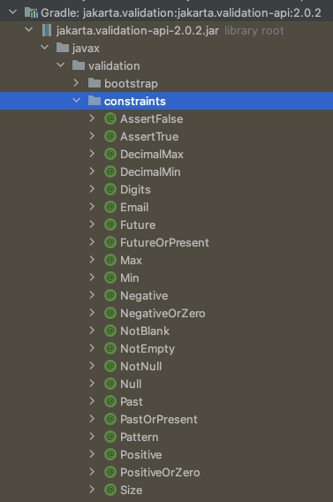
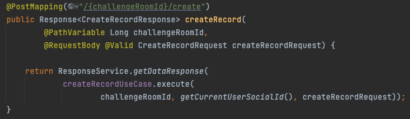
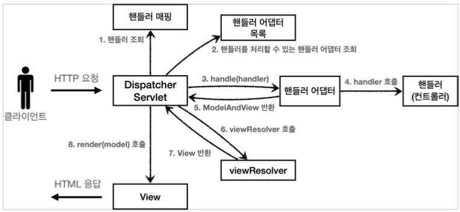
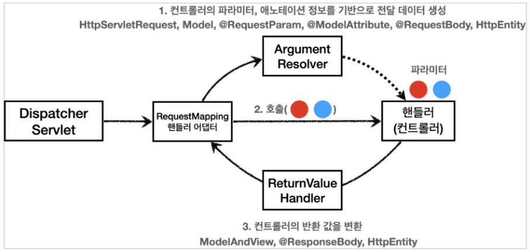
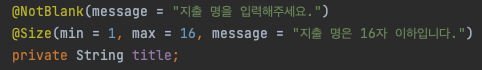
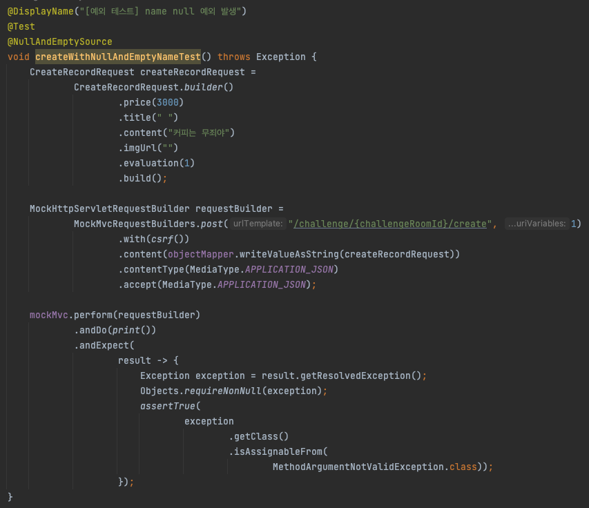
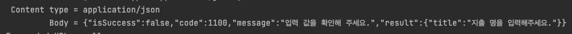
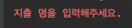
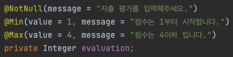

> [해당 포스팅](https://hello-judy-world.tistory.com/217)에서도 내용을 확인할 수 있습니다.

> written by [judy](https://github.com/ParkJungYoon)

validator 공부해보자!

<br>

# ✅ @Valid 사용해서 DTO 검증하기

## 1. 검증은 왜 필요할까?

컨트롤러의 중요한 역할 중 하나는 HTTP 요청이 정상인지 검증하는 것이다.

> 🤖 : 근데 클라이언트에서 잘못된 요청은 걸러주지 않아?

> 🐰 : 그럼 클라이언트를 거치지 않은 요청은 다 받아줄겨? 

클라이언트 검증은 조작할 수 있어 보안에 취약하다. 또한 서버에서도 잘못된 요청을 검증하는 로직을 필요하다.

그리고 나는 그 중 DTO에서 데이터를 검증하는 방법을 알아보려고 한다.

<br>

## 2. Bean Validation

Bean Validation은 특정한 구현체가 아니라 Bean Validation 2.0(JSR-380)이라는 기술 표준이다.

즉, 검증 애노테이션과 여러 인터페이스의 모음이다.

Bean Validation을 구현한 기술중에 일반적으로 사용하는 구현체는 하이버네이트 Validator이다.

Bean Validation을 잘 활용하면, 애노테이션 하나로 검증 로직을 매우 편리하게 적용이 가능하다.

### 1) 의존성 추가

우선 아래 코드로 의존성을 추가하자.

- `build.gradle`

```
implementation 'org.springframework.boot:spring-boot-starter-validation'
```

해당 의존 관계를 추가하면 아래 라이브러리가 추가된다.

- `jakarta.validation-api` : Bean Validation 인터페이스

- `hibernate-validator` :구현체

<div align='center'>
    
</div>

이렇게 인터페이스가 있고, 실제 동작을 위한 구현체는 `hibernate-validator`로 받아진다.

<br>

### 2) annotation 종류

> [검증 어노테이션 자료](https://docs.jboss.org/hibernate/validator/6.2/reference/en-US/html_single/#validator-defineconstraints-spec)


- `@AssertFalse` : false 값 통과
- `@AssertTrue` : true 값 통과
- `@DecimalMax(value=, inclusive=)` : 지정된 값 이하의 실수 통과
- `@DecimalMin(value=,  inclusive=)` : 지정된 값 이상의 실수 통과
- `@Digits(integer=, fraction=)` : 대상 수가 지정된 정수와 소수 자릿수보다 적을 경우 통과
- `@Email` : 이메일 형식 통과
- `@Future` : 대상 날짜가 현재보다 미래일 경우만 통과
- `@Past` : 대상 날짜가 현재보다 과거일 경우만 통과
- `@Max(value=)` : 지정된 값보다 아래일 경우만 통과
- `@Min(value)` : 지정된 값보다 이상일 경우만 통과
- `@NotNull` : null 값이 아닐 경우만 통과
- `@NotEmpty` : null, "" 이 아닌 경우 통과
- `@NotBlank` : null, "", " " 이 아닌 경우 통과
- `@Null` : null일 겨우만 통과
- `@Pattern(regex=, flag=, message=)` : 해당 정규식을 만족할 경우만 통과
- `@Size(min=, max=)` : 문자열 또는 배열이 지정된 값 사이일 경우 통과
 

**@NotBlank**는 문자열의 공백까지 체크해주기 때문에 문자열은 이것으로 사용하면 된다.

**@notempty**는 collection,
**@NotNull**은 객체

<br>

### 3) DTO에 적용하기

위에서 알아본 validation 어노테이션을 활용해 보자.

DTO에 적용한 어노테이션이 동작하기 위해서는 컨트롤러 메서드 매개변수에 `@Valid` 어노테이션을 붙여야 한다.

스프링 부트는 이 어노테이션이 있으면 JSR 380 구현체인 Hibernate Validator를 자동으로 실행하고 `Arguement를 검증`한다.

<div align='center'>
    
</div>

다음과 같이 DTO에 적용할 수 있다.

```java
@Builder
@Getter
@AllArgsConstructor
@NoArgsConstructor
public class CreateRecordRequest {
 
    @NotNull(message = "지출 비용을 입력해주세요.")
    @Min(value = 0, message = "지출 비용 최소 값은 0입니다.")
    @Max(value = 999999, message = "지출 비용 최대 값은 999999입니다.")
    private Integer price;
 
    @NotBlank(message = "지출 명을 입력해주세요.")
    @Size(min = 1, max = 16, message = "지출 명은 16자 이하입니다.")
    private String title;
 
    @NotBlank(message = "내용을 입력해주세요.")
    @Size(min = 1, max = 80, message = "내용은 80자 이하입니다.")
    private String content;
 
    private String imgUrl;
 
    @NotNull(message = "지출 평가를 입력해주세요.")
    @Min(value = 1, message = "점수는 1부터 시작합니다.")
    @Max(value = 4, message = "점수는 4이하 입니다.")
    private Integer evaluation;
}
```

추가적으로 애노테이션에 메시지를 입력할 때 다음과 같은 방식으로 입력 값을 알 수 있다.

```java
@Email(message = "올바르지 않은 이메일형식입니다: ${validatedValue}")
```

<br>

### 4) @Valid 동작 시점

- **SpringMVC 구조**

<div align='center'>
    
    <p>출처: 김영한 님 강의</p>
</div>

@Valid는 <u>**핸들러 어댑터가 핸들러를 호출하는 과정**</u>에서 동작한다.

즉, 핸들러(컨트롤러)에서만 동작한다.

<br>

- **RequestMappingHandlerAdapter 동작 방식**

<div align='center'>
    
    <p>출처: 김영한 님 강의</p>
</div>

좀 더 자세히 살펴보면 <u>**RequestMapping 핸들러 어댑터가 Argument Resolver를 통해 JSON 타입의 데이터를 객체로 변환하는 과정**</u>에서 동작한다.

그리고 이 과정에서 예외가 발생하면 `MethodArgumentNotValidException`이 발생한다.

<br>

### 5) Controller에서 Test 하기

>❗️**현재 상황**: Controller @RequestBody에 @Valid 어노테이션을 붙였고, body에 대한 DTO에 검증 어노테이션을 붙였다.

Controller로 들어오는 입력 값에 대한 검증이 제대로 이루어지는지 테스트 코드로 살펴보자.


title은 현재 NotBlank이다. 아래에서 title에 " " 공백을 입력했을 때 예외 처리 되는 것을 볼 수 있다.

<div align='center'>
    
</div>

<div align='center'>
    
</div>

<div align='center'>
    
</div>

<br>

### 6) DTO에서 Test 하기

하지만 대부분의 경우 Controller와 통합해서 테스트할 것이다. 다음과 같은 방법도 가능하단건만 알아두자.

```java
class CreateRecordRequestTest {
 
    private static ValidatorFactory factory;
    private static Validator validator;
 
    @BeforeAll
    public static void init() {
        factory = Validation.buildDefaultValidatorFactory();
        validator = factory.getValidator();
    }
 
    @Test
    @DisplayName("")
    void title_validation() {
        CreateRecordRequest createRecordRequest =
                CreateRecordRequest.builder()
                        .price(3000)
                        .title(" ") // 공백
                        .content("커피는 무죄야")
                        .imgUrl("")
                        .evaluation(1)
                        .build();
        Set<ConstraintViolation<CreateRecordRequest>> violations = validator.validate(createRecordRequest);
        for (ConstraintViolation<CreateRecordRequest> violation : violations) {
            System.err.println(violation.getMessage());
        }
    }
 
}
```

<div align='center'>
    
</div>

<br>

---

### 🤔 고민

서비스의 안정성을 위해서는 잘못된 요청에 대한 검증은 꼭 필요하다고 생각한다.

DTO에서 제약조건으로 잘못된 요청을 검증하는 것은 Controller 단에서 요청을 막을 수 있기 때문에 효과적이다.

하지만 만약 서비스 제약조건이 변경됐을 경우에는?

 

예를 들면 아래와 같은 경우에는 충분히 기획에 따라 변경될 수 있는 조건이다.

실제로도 처음 개발에 들어갔을 때 1~5까지의 제약조건이었지만, 1~4로 수정되었다.

이 경우에 수정해야하는 부분이 두 군데이다. DTO도 수정하고, 도메인 조건도 수정해주어야 한다.

 

물론 해당 파트에 개발은 내가 시작했기 때문에 헷갈리지 않고, 두 군데 모두 수정할 수 있다. 하지만 다른 개발자가 해당 파트를 맡았을 때 잊지 않고 모두 수정할 수 있을까..🧐

 

한 번의 요구사항 변경으로 여러 군데 수정이 필요하다면 유지보수 측면에서 좋아 보이지는 않는다.

그렇지만.. Controller 단에서 잘못된 요청은 퉤퉤! 하고 싶은 마음~

 

정답은 없으니깐 잘 고민하고 수정해 나가야겠다~

<div align='center'>
    
</div>

<br>

---

### 📌 Reference

- [인프런 김영한 님] 스프링 MVC 2편 - 백엔드 웹 개발 활용 기술
- [[Spring] Validation Annotation이란? + DTO에서는 어디까지 검증해야 할까?](https://seongwon.dev/Spring-MVC/20220622-Valid%EB%9E%80/)