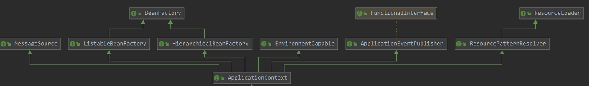
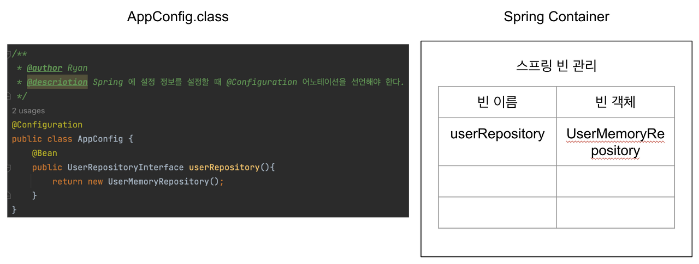
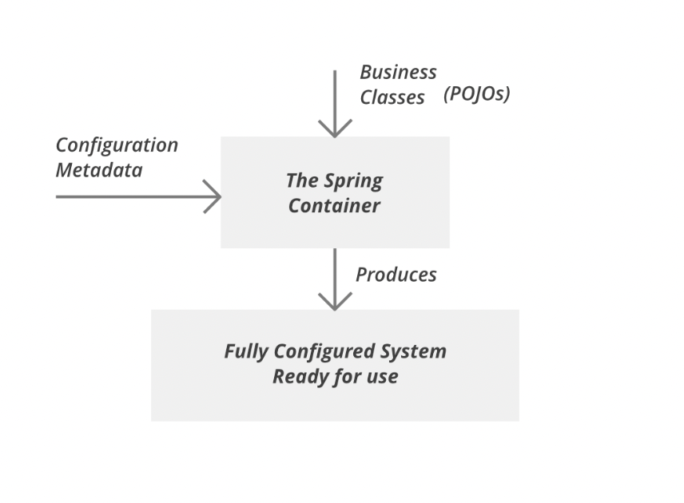
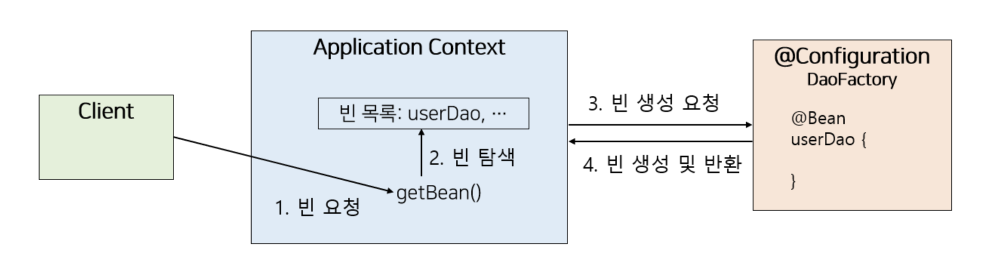

# ApplicationContext
> ApplicationContext는 빈들의 생성과 의존성 주입 등의 역할을 하는 일종의 DI 컨테이너, 스프링 컨테이너
>
> Spring에서는 Bean의 생성과 관계설정 같은 **제어역할**을 담당하는 IoC(Inversion of Control) 컨테이너인 `Bean Factory`가 존재합니다. 하지만 이것만으로는 서비스에서 요구하는 다양한 기능들을 수용하기에 다소 무리가 있습니다. 따라서 `ApplicationContext`라는 인터페이스를 만들어 **개발자의 Bean을 생성하고 제어**하는 것뿐만 아니라 **설정 정보들을 이용한 Bean간의 관계 설정, 제어 작업** 등 추가적인 기능을 수행할 수 있도록 하였습니다.

<div align='center'>
    
</div>

## 스프링 컨테이너
스프링 컨테이너에는 `BeanFactory`와 `Application Context` 두가지가 있습니다.

<div align='center'>
    
</div>

컨테이너 내부에는 빈 저장소가 존재합니다. key로 빈의 이름을 가지고 있고 value로는 실제 빈 객체를 가지고 있습니다.

스프링 컨테이너는 기본적으로 빈을 싱글톤으로 관리해주기 때문에 싱글톤 컨테이너라고도 불립니다.

@Bean의 이름은 메서드이름(@Bean(name="userMemoryRepo"이런식으로 설정할 수 있음)
@Configuration 어노테이션은 @Bean을 생성하고 Spring Container에 등록하게 하는 어노테이션입니다.


## Spring IOC Container 동작과정
<div align='center'>
    
</div>

어플리케이션을 실행할 경우, 구성 메타데이터(xml)와 POJOs를 Spring IOC Container에서 읽어 Bean을 생성하고 해당 Bean들을 통해 시스템을 사용할 수 있도록 구성합니다.

이 때, Bean을 생성하고 관계설정과 같은 제어역할을 담당하는 것이 `BeanFactory`입니다. `BeanFactory`는 스프링의 최상위 인터페이스이며 Spring IOC Container의 기본 요소입니다.

`ApplicationContext`는 이런 `BeanFactory`를 상속받아 구현되어졌습니다.

`Application Context`는 별도의 설정 정보를 참고하고 IoC를 적용하여 Bean의 생성, 관계설정 등의 제어 작업을 총괄합니다. Application Context에는 직접 오브젝트를 생성하고 관계를 맺어주는 코드가 없고, 그런 생성 정보와 연관관계 정보에 대한 설정을 읽어 처리합니다. 

예를 들어 @Configuration과 같은 어노테이션이 대표적인 IoC의 설정정보입니다.


**ApplicationContext.java**
```
package org.springframework.context;

import org.springframework.beans.factory.HierarchicalBeanFactory;
import org.springframework.beans.factory.ListableBeanFactory;
import org.springframework.beans.factory.config.AutowireCapableBeanFactory;
import org.springframework.core.env.EnvironmentCapable;
import org.springframework.core.io.support.ResourcePatternResolver;
import org.springframework.lang.Nullable;

public interface ApplicationContext extends EnvironmentCapable, ListableBeanFactory, HierarchicalBeanFactory, MessageSource, ApplicationEventPublisher, ResourcePatternResolver {
    @Nullable
    String getId();

    String getApplicationName();

    String getDisplayName();

    long getStartupDate();

    @Nullable
    ApplicationContext getParent();

    AutowireCapableBeanFactory getAutowireCapableBeanFactory() throws IllegalStateException;
}
```

#### 상속받는 인터페이스 목록
- EnvironmentCapable
- ListableBeanFactory
- HierarchicalBeanFactory
- MessageSource
- ApplicationEventPublisher
- ResourcePatternResolver

 대표적으로 BeanFactory의 기능을 상속받았으며 ApplicationEventPublisher(이벤트),ResourcePatternResolver(설정 정보 처리) 등을 추가로 상속 받습니다.

 결국 ApplicationContext의 역할은 BeanFactory가 담당하는 Bean을 생성하고 관계설정과 같은 제어역할 뿐만 아니라 설정 정보를 통해 제어까지 담당하는 것을 알 수 있습니다.

이는 ApplicationContext = Spring IOC Container의 역할을 수행하고 있음을 의미합니다.

**BeanFactory**
```
public interface BeanFactory {

    String FACTORY_BEAN_PREFIX = "&";

    Object getBean(String name) throws BeansException;

    <T> T getBean(String name, Class<T> requiredType) throws BeansException;

    Object getBean(String name, Object... args) throws BeansException;

    <T> T getBean(Class<T> requiredType) throws BeansException;

    <T> T getBean(Class<T> requiredType, Object... args) throws BeansException;

    <T> ObjectProvider<T> getBeanProvider(Class<T> requiredType);

    <T> ObjectProvider<T> getBeanProvider(ResolvableType requiredType);

    boolean containsBean(String name);

    boolean isSingleton(String name) throws NoSuchBeanDefinitionException;

    boolean isPrototype(String name) throws NoSuchBeanDefinitionException;

    boolean isTypeMatch(String name, ResolvableType typeToMatch) throws NoSuchBeanDefinitionException;

    boolean isTypeMatch(String name, Class<?> typeToMatch) throws NoSuchBeanDefinitionException;

    @Nullable
    Class<?> getType(String name) throws NoSuchBeanDefinitionException;

    @Nullable
    Class<?> getType(String name, boolean allowFactoryBeanInit) throws NoSuchBeanDefinitionException;

    String[] getAliases(String name);
}
```
`BeanFactory`는 1개의 빈을 찾기 위한 메소드들을 갖고 있습니다.

하지만 스프링은 동일한 타입의 빈이 여러개 존재할때에도 List로 빈을 찾아서 주입해줍니다.
그 이유는 `Applicaion Context`가 `BeanFactory`를 바로 상속받은 것이 아닌 `ListableBeanFactory`와 `HierarchcalBeanFactory`를 통해 상속받았기 때문입니다.

> `ListableBeanFactory` : 빈 리스트를 처리하기 위한 퍼블릭 인터페이스를 가짐
> `HierarchcalBeanFactory` : 여러 BeanFactory들 간의 계층(부모-자식) 관계를 설정하기 위한 퍼블릭 인터페이스를 가짐

#### Bean 요청시 처리 과정
<div align='center'>
    
</div>

1. ApplicationContext는 @Configuration이 붙은 클래스들을 설정 정보로 등록해두고, @Bean이 붙은 메소드의 이름으로 빈 목록을 생성합니다.(서비스 실행)
2. 클라이언트가 해당 Bean을 요청합니다.
3. ApplicationContext는 자신의 Bean 목록에서 요청한 이름이 있는지 찾습니다.
4. ApplicationContext는 설정 클래스로부터 Bean 생성을 요청하고, 생성된 Bean을 반환해줍니다.

> 구체적으로는 Spring 내부에서 Reflection API를 이용하여 Bean 정의에 나오는 클래스 이름을 이용하거나 Bean Factory를 통해 Bean을 생성합니다.

## ApplicationContext의 장점
**1) 클라이언트는 @Configuration이 붙은 구체적인 팩토리 클래스를 알 필요가 없다.**
애플리케이션 발전 -> 팩토리 클래스 계속해서 증가 

애플리케이션 컨텍스트가 없다면 클라이언트는 원하는 객체를 가져오려면 어떤 팩토리 클래스에 접근해야 하는지 알아야 하는 번거로움이 생깁니다.
<br>반면에 애플리케이션 컨텍스트를 사용하면 팩토리가 아무리 많아져도 이에 직접 접근할 필요가 없어, 일관된 방식으로 원하는 Bean을 가져올 수 있습니다.

**2) 애플리케이션 컨텍스트는 종합 IoC 서비스를 제공해준다.**
애플리케이션 컨텍스트는 객체의 생성과 관계 설정뿐만 아니라 객체가 만들어지는 방식과 시점 및 전략 등을 다르게 가져갈 수 있고, 그 외에도 후처리나 정보의 조합 인터셉트 등과 같은 다양한 기능이 존재합니다.

**3) 애플리케이션 컨텍스트를 통해 다양한 빈 검색 방법을 제공할 수 있다.**
애플리케이션 컨텍스트에서 Bean 목록을 관리하여, Bean의 이름이나 타입 또는 어노테이션 설정 등으로 빈을 찾을 수 있습니다.(의존성 검색(dependency lookup))


### 📖 참고 자료
[Spring Boot - ApplicationContext에 대해 알아보자.](https://velog.io/@gehwan96/Spring-Boot-ApplicationContext%EC%97%90-%EB%8C%80%ED%95%B4-%EC%95%8C%EC%95%84%EB%B3%B4%EC%9E%90)

[[Spring] 애플리케이션 컨텍스트(Application Context)와 스프링의 싱글톤(Singleton)](https://mangkyu.tistory.com/151)

[[Spring] SpringBoot 소스 코드 분석하기, 애플리케이션 컨텍스트(Application Context)와 빈팩토리(BeanFactory) - (2)](https://mangkyu.tistory.com/210)

[ApplicationContext (Spring Framework 6.0.9 API)](https://docs.spring.io/spring-framework/docs/current/javadoc-api/org/springframework/context/ApplicationContext.html)

[Spring Boot] 구조 분석 (2) - 스프링 컨테이너](https://any-ting.tistory.com/m/144)

[[Spring] 스프링 컨테이너(ApplicationContext)](https://velog.io/@max9106/Spring-ApplicationContext)
