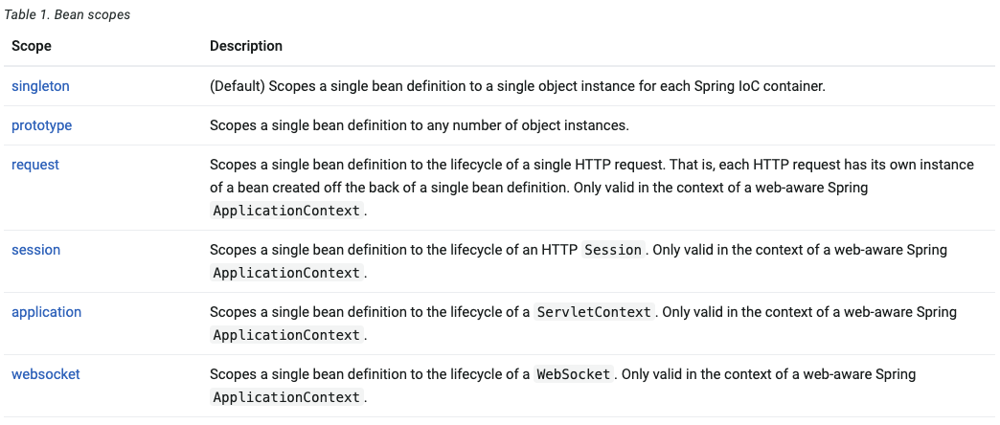

# 🚀 스프링 빈 스코프 Singleton vs Prototype

## 📍 0. 들어가기 전에 - 스프링 빈이 뭔가요?

- 스프링 IoC 컨테이너에 등록된 자바 객체.
- Java Bean과는 다르다.
- IoC 컨테이너에 등록하는 방법으로는 아래와 같은 방법이 있다.
  - 클래스 레벨 애노테이션 설정
    ```
    @Component
    public class MyBean {
        ...
    }
    ```
  - Configuration 정의
    ```
    @Configuration
    public class MyConfig {
        ...
        @Bean
        public MyBean() {
          return new MyBean();
        }
        ...
    }
    ```
  - 3. XML 파일 설정
    ```
    <?xml version="1.0" encoding="UTF-8" ?>
    <beans ...>
        ...
    </beans>
    ```

## 🔍 1. 스프링 빈 스코프의 종류

<a href="https://docs.spring.io/spring-framework/reference/core/beans/factory-scopes.html" target="_blank">
  공식문서 링크
</a>



### 1.1 Singleton

- 이름에서 알 수 있듯 싱글톤으로 관리된다.
- 디폴트 스프링 빈 스코프

### 1.2 Prototype

- 빈을 요청할 때 마다 새로운 빈 객체를 생성해서 사용한다.

### 1.3 Web Scope

- 웹에서만 동작하는 빈 스코프.

  #### 1.3.1 Request

  - 클라이언트의 요청이 들어올 때 마다 새로운 빈 객체가 생성된다.
  - use-case: 로그를 남긴 요청 확인

  #### 1.3.2 Session

  - HTTP Session과 같은 생명주기를 가진다.

  #### 1.3.3 Application

  - 서블릿 컨텍스트와 같은 생명주기를 가진다.

  #### 1.3.4 WebSocket

  - 웹 소켓과 같은 생명주기를 가진다.

## 💡 2. 빈 스코프와 프록시 모드

- 싱글톤 빈과 다른 생명주기를 가지는 빈을 사용하는 경우 문제가 발생할 수 있다.

### 2.1 문제 상황

- 예를 들어 다음과 같이 싱글톤 빈 `MySingletonBean`이 프로토타입 빈 `MyPrototypeBean`을 포함한다고 가정하자.

  ```
  @Component
  public class MySingletonBean {

      private final MyPrototypeBean prototypeBean;

      @Autowired
      MySingletonBean(MyPrototypeBean prototypeBean) {
          this.prototypeBean = prototypeBean;
      }

      public MySingletonBean getSingleton() {
          return this;
      }

      public MyPrototypeBean getPrototypeBean() {
          return prototypeBean;
      }
  }

  ---

  @Component
  @Scope(value = "prototype")
  public class MyPrototypeBean {
      ...
  }

  ```

- 이 때, 싱글톤 빈을 반복해서 호출 하고 그 객체가 서로 같은지 테스트를 해보면 항상 같은 객체를 반환하므로 
테스트는 항상 성공한다.

  ```
  @Test
  void singletonTest() {
      MySingletonBean Bean1 = singletonBean.getSingleton();
      MySingletonBean Bean2 = singletonBean.getSingleton();
      assertThat(Bean1.toString()).isEqualTo(Bean2.toString());
      System.out.println("\nbecause\nBean1 is " + Bean1 + "\nBean2 is " + Bean2);
  }

  Result----------------
  ...
  because
  Bean1 is com.example.beanscope.MySingletonBean@c14e5a5
  Bean2 is com.example.beanscope.MySingletonBean@c14e5a5
  ...
  ```

- 그런데 싱글톤 인스턴스 안에 있는 프로토타입 빈은 매 호출마다 갱신될까? 테스트를 해보자.

  ```
  @Test
  void prototypeTest() {
      MyPrototypeBean Bean1 = singletonBean.getPrototypeBean();
      MyPrototypeBean Bean2 = singletonBean.getPrototypeBean();
      assertThat(Bean1.toString()).isNotEqualTo(Bean2.toString());
      System.out.println("\nbecause\nBean1 is " + Bean1 + "\nBean2 is " + Bean2);
  }

  Result----------------
  Expecting actual:
    com.example.beanscope.MyPrototypeBean@3e6748ae
  not to be equal to:
    com.example.beanscope.MyPrototypeBean@3e6748ae

  java.lang.AssertionError: 
  Expecting actual:
    com.example.beanscope.MyPrototypeBean@3e6748ae
  not to be equal to:
    com.example.beanscope.MyPrototypeBean@3e6748ae
  ```

- 테스트에 실패한다.

- 이처럼 빈 스코프를 프로토타입으로 설정해도 그 빈이 싱글톤 빈 안에서 사용되는거라면 **이미 싱글톤 빈의 생성 시점에 주입이 끝난 상태가 되어 항상 같은 인스턴스를 반환**하게 된다.

### 2.2 문제 해결을 위한 3가지 방법

#### 2.2.1 원초적인 방법 Dependency Lookup

- 싱글톤 빈이 프로토 타입 빈을 사용 할 때 마다 스프링 컨테이너에 요청하는 방법.

- 싱글톤 빈 내에서 `ApplicationContext`를 주입받아서 사용한다.

  ```
  @Component
  public class MySingletonBean {

      private final ApplicationContext applicationContext;

      @Autowired
      MySingletonBean(ApplicationContext applicationContext) {
          this.applicationContext = applicationContext;
      }

      public MySingletonBean getSingleton() {
          return this;
      }

      public MyPrototypeBean getPrototypeBean() {
          return applicationContext.getBean(MyPrototypeBean.class);
      }
  }
  ```

  #### 문제점

  - **스프링 컨테이너에 종속적**이다.
  - 스프링 컨테이너에 대한 종속성으로 **확장성이 저하**된다.

#### 2.2.2 ObjectProvider 주입

- 위에서 `ApplicationContext`를 직접 주입 받아서 **디펜던시를 찾는 과정(Dependency Lookup)**을 제공해주는 인터페이스가 있다.

- 싱글톤 빈 내에서 `ObjectProvider`를 주입받아서 사용한다.

  ```
  @Component
  public class MySingletonBean {
      private final ObjectProvider<MyPrototypeBean> objectProvider;

      @Autowired
      MySingletonBean(ObjectProvider<MyPrototypeBean> objectProvider) {
          this.objectProvider = objectProvider;
      }

      public MySingletonBean getSingleton() {
          return this;
      }

      public MyPrototypeBean getPrototypeBean() {
          return objectProvider.getObject();
      }
  }
  ```

  #### 문제점

  - 여전히 **스프링 컨테이너에 종속적**이다.

#### 2.2.3 Proxy

- 위에서 알아본 두가지 방법은 **스프링 컨테이너에 종속적이고 웹 스코프에서 동작하지 않는 단점**을 갖고 있다.

> #### 🧐 웹 스코프에서 동작하지 않는다고?
> - 예를 들어 싱글톤 빈 내부에 있는 `request` 스코프를 가진 빈을 호출하는것을 테스트해야할 때, 웹 요청이 없으므로 싱글톤 빈 내부에 있는 `requestBean`은 생성되지 않는다.
> - 이 때, 빈 테스트 하나를 위해 모든 테스트 케이스에 웹 요청을 추가하는것은 올바르지 않다.

- 프록시를 설정할 빈의 @Scope 애노테이션에 속성을 추가해서 사용한다.

  ```
  @Component
  @Scope(value = "prototype", proxyMode = ScopedProxyMode.TARGET_CLASS)
  public class MyPrototypeBean {

      public void printBeans() {
          System.out.println("prototype: " + this);
      }
  }
  ```

- 프록시 모드를 추가하게되면 스프링 컨테이너가 바이트 코드 조작 라이브러리 **CGLIB를** 사용한다.
- 해당 클래스를 상속받은 가짜 객체를 만들어 두고 요청이 왔을때 마다 진짜 클래스를 반환해준다.

---

### 📚 References

