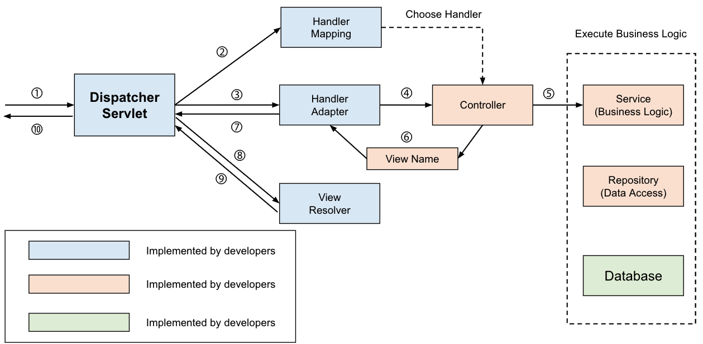
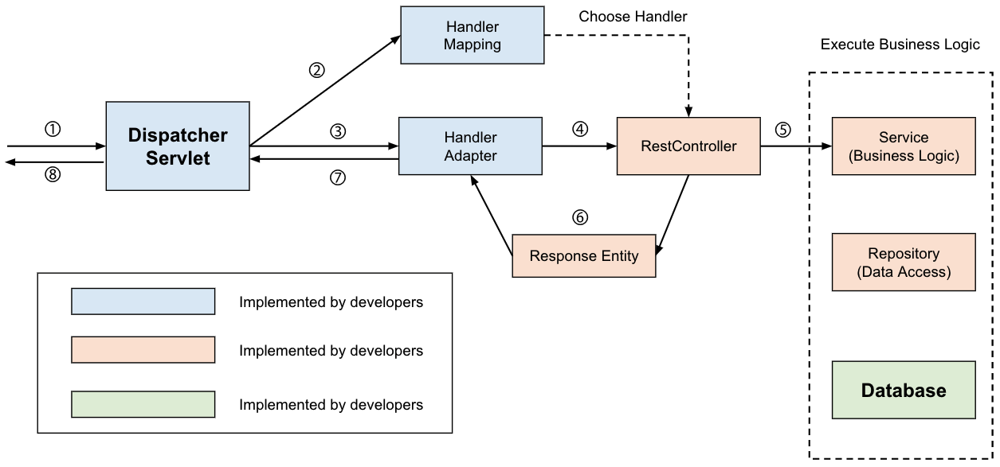

# @Controller vs @RestController

- `@Controller`와 `@RestController` 둘 다 스프링에서 `Controller`를 지정해주기 위한 어노테이션으로 사용된다.
- 둘의 주요한 차이점은 `ResponseBody`가 생성되는 방식인데 하나씩 알아가보자.

## 1. @Controller

- `@Controller` 어노테이션은 Spring MVC의 전통적인 컨트롤러 어노테이션이다.
- 기본적으로는 다음과 같은 시퀀스로 **View**를 반환한다.

- 컨트롤러는 받은 요청을 처리 후 지정된 `ViewName`을 반환하는데 `DispatcherServlet`은 `ViewResolver`를 통해 해당하는 **View**를 찾아서 반환해준다.

## 2. @RestController

- `@Controller`와 `@RestController`가 합쳐진 어노테이션으로 View가 아닌 **Data**를 반환한다.

- 일반적으로 JSON형태의 데이터(객체)를 반환하고 주로 `ResponseEntity`를 생성하고 필요한 데이터를 `헤더`/`쿠키`/`바디` 등에 적절하게 배치해서 반환해준다.

> ### 🧐 `@Controller`에서 데이터(객체)를 반환할 수 있나요?
>
> - @ResponseBody 어노테이션으로 **Data**를 반환할 수 있다.
> ```
> @Controller
> public class MyController {
>     ...
>     @GetMapping("/get")
>     public @ResponseBody ResponseEntity<Data> getData() {
>         return ResponseEntity.ok(myService.getData());
>     }
>     ...
> }
>```
> - `@Controller`를 통해 객체(데이터)를 반환할 때 일반적으로 위 예제 코드처럼 `ResponseEntity`로 감싸서 반환한다.
> - 이 때, `viewResolver`대신 `HttpMessageConverter`가 동작하는데, 내부에 여러가지 데이터 타입에 따른 `Converter`를 사용해 처리된다.

---

### 📚 References

- [The Spring @Controller and @RestController Annotations](https://www.baeldung.com/spring-controller-vs-restcontroller)
- [[Spring] @Controller와 @RestController의 차이](https://velog.io/@dyunge_100/Spring-Controller%EC%99%80-RestController%EC%9D%98-%EC%B0%A8%EC%9D%B4)
