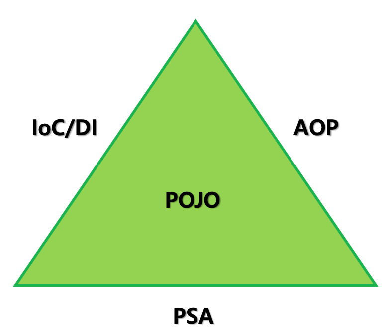

# POJO란 무엇인가?

POJO(Plain Old Java Object)는 직역하면 간단한 오래된 자바 오브젝트을 뜻합니다. 즉, 다른 환경에 종속되지 않고, 필요에 따라 재사용이 가능한 자바 오브젝트를 뜻합니다.

스프링에 탄생하기 전에 자바 엔트프라이즈 시장은 EJB(Enterprise Java Bea)이 독점하고 있었습니다.

EJB는 엔터프라이즈 개발을 단순화하기 위해 Sun 사에서 만들어낸 JAVA 스펙입니다.

아래는 EJB을 통해 짠 코드입니다

```java
import javax.ejb.EJBException;
import javax.ejb.SessionBean;
import javax.ejb.SessionContext;

public class OrdersService implements SessionBean {

    private SessionContext ctx;

    public Orders placeOrder(String menuName) {
        Orders orders = new Orders(menuName);
        orders.init()
        return orders;
    }

    @Override
    public void setSessionContext(SessionContext ctx) throws EJBException {
        this.ctx = ctx;
    }

    @Override
    public void ejbRemove() throws EJBException {

    }

    @Override
    public void ejbActivate() throws EJBException {

    }

    @Override
    public void ejbPassivate() throws EJBException {

    }
}
```

코드를 살펴보면, 변수부터, 예외처리, 상속까지 EJB에 의존적인 것을 볼수 있습니다.

당시 마틴 파울러는 이런한 **문제점을 의식하고, 복잡하고 제한적인 기술보다 자바의 단순 오브젝트를 이용해 비즈니스 로직을 구현하는 편이 낫다**고 생각하여 그것을 뜻하는 `POJO` 를 만들었다.



POJO를 지키기위해 PSA,IOC,AOP 의 개념을 Spring에 추가하였다.

# PSA(Portable Service Abstraction)

PAS는 직역하면 휴대용 서비스 추상화라는 의미를 가진다.

서비스 추상화란 특정 서비스가 추상화되어있다는 것은 서비스의 내용을 모르더라고 해당 서비스를 이용할 수 있다는 것을 의마한다.

PAS은 Portable 서비스 추상화이다. 그럼 휴대용은 어떤 의미가 있을까?

직역을 해서 휴대용이지 Portable은 가지고 다닐수 있도록 가볍고 작다는 의미를 가졌다. 즉, 교체가 쉽다 라는 말도 될 수 있다.

즉, 비즈니스 로직의 수정없이 언제든지 변경할 수 있는 것을 의미한다.

예를 들어, MySQL Driver를 사용하다가 Oracle Driver로 변경하여도 비즈니스 로직은 아무 영향을 받지 않고 실행이 됩니다.

## PSA은 왜 사용할까?

서비스를 추상화함으로써 개발자가 실제 구현부를 알지 못하더라고 해당 기능을 사용할 수 있게된다. 즉, 추상화 계층인 인터페이스 API의 정보를 활용해 해당 서비스의 모든 기능을 이용하면 된다.

또한  PSA는 해당 추상화 계층을 구현하는 또 다른 서비스로 언제든지 교체할 수 있게 해준다.

예를 들어 Spring 기본으로 톰캣으로 실행이 된다. 그것을 netty 기반으로 실행하는 것도 spring-boot-starter-web 의존성 대신 spring-boot-starter-webflex으로 변경하면 된다.

톰캣을 프로젝트에서 netty로 변경하는 것은 복잡한 과정이 있지만, 이것이 추상화가 되고 편하게 사용할수 있게됩니다.

## Spring에대 대표적으로 재공하는 PSA

### Spring Web MVC

Spring안에는 Servlet을 통해 개발을 할수 있게 많은 기능을 제공해준다.

Servlet을 통해 프로그램을 실행할려면 클래스에 HttpServlet을 상속박도, doGet(), doPost()을 구현하는 등의 작업을 직접하여야 합니다.

하지만, Spring에서는 `@Controller` 와 `@GetMapping`, `@PostMapping` 으로 이러한 어노테이션을 통해 요청을 매핑 할수 있습니다.

### Spring Transaction

Low level로 트랜잭션을 처리를 하려먼 setAutoCommit()과 commit(), rollback()을 명시적으로 호출해야한다

하지만 Spring이 제공하는 @Transactionsl 어노테이션을 메소드에 붙어줌으로써 트랜잭션 처리를 쉽게 해준다.

또한 JDBC를 사용하는 DatasourceTransactionManager, JPA를 사용하는 JpaTransactionManager, Hibernate를 사용하는 HibernateTransactionManager를 유연하게 바꿔서 사용할수 있습니다.

즉, 구현제가 변경이 되어도 트랙잭션이 처리하는데 전혀 문제가 없습니다

### Sprint Cache

Cache도 Transaction과 동일하게 JCacheManager, ConcurrentMapCacheMannager, EhCacheCacheManager와 같은 구현제를 사용할수 있다.

사용자는 @Cacheable 에노테이션을 붙여줌으로써 구현재를 크게 신경쓰지 않아도 필요에 따라 바꿔 쓸수 있다.

# IOC(Inversion Of Control)

Spring과 EJB은 개발자가 복잡하고 실수하기 쉬운 로우 레벨의 기술에 많이 신경쓰지 않고도, 애플리케이션의 핵심인 사용자의 요구사향, 즉 비즈니스 로직을 빠르고 효과적으로 구현하게 하는 목표로 했습니다.

그러나 EJB는 **메서드나 객체의 호출 작업** 등에 대한 제어를 코드에 침투적으로 반영했고, Spring은 제어와 비지니스 로직을 분리할 수 있게 했다는 차이가 있습니다

IOC는 해석하면 제어의 역전을 뜻한다.

제어는 개발자가 직접 관리를 하는데 이것을 프레임워크에서 객체의 생성과 관리를 하는 것을 의미한다.

개발자가 직접 객체를 생성하고 관리하는 코드는 아래와 같이 작성을 합니다

```java
public class A {
	
		private B b;
		
		public A(){
				b = new B();
		}
}
```

위 코드를 보고 “A객체는 B객체에 의존하고 있어” 라고 말할 수 있습니다.

```java
public class A {

		private final B b;

		@Autowired
		private B b;

}
```

Spring 에서 위와 같은 코드로 의존성이 주입됩니다. 그것을 DI(Dependency Injection)이라고 합니다.

즉 외부에서 의존을 주입받으면 DI, 그 의존이 개발자가 아닌 프레임워크에서 관리를 하면 IOC 라고 합니다.

## DI의 방법

의존성을 주입 받는 방법은 3가지가 있습니다.

### Field Injection

가장 흔히 볼 수 있는 Injection방법입니다

```java
@Service
public class A {

		@Autowired
		private B b;

		public A() {}

}
```

### Setter Injection

선택적인 의존성을 주입할 경우 유용합니다.

```java
@Service
public class A 
		private B b;

		public A() {}

		@Autowired
		public void setA(B b){
				this.b = b;
		}
}
```

### Constructer Injection

```java
@Service
public class A {
		private final B b;

		public A(B b) {
				this.b = b;
		}
}
```

# AOP(Aspect Oriented Programming)

관점 지향 프로그래밍이란 객채 지향 프로그램밍의 단점을 보완하기 위해 나온 패러다임이다.

객체지향의 가장 큰 장점은 프로그램을 모듈화를 시켜 이를 재활용함으로써 코드의 중복을 줄이고, 재사용성을 높이는 것이었다.

하지만 프로그램이 커짐으로서 모듈 안에서 중복되는 코드가 생기게 되었습니다.

그렇게 되면 그부분을 수정하면, 다른 클래스에 있는 같은 코드도 수정을 하게됩니다.

유지보수 측면에서는 아쉬운 점이 생기죠

이런한 것은 횡단 관심사(Crosscutting-Concerns) 라고 합니다.

횡단 관심사들은 모듈들을 횡단하면서 존재하게 됩니다.

AOP의 목적은 횡단 관심사를 모듈화하는 방법을 제시하는 것입니다.

# 레퍼런스

**[[Spring] POJO 프로그래밍과 스프링 프레임워크의 탄생(망나니 개발자)](https://mangkyu.tistory.com/281)**

[**[TI/SPRING] IOC, DI 정의/ 장점(디벨로폴리)](https://isoomni.tistory.com/entry/TISPRING-IOC-DI-%EC%A0%95%EC%9D%98-%EC%9E%A5%EC%A0%90)
[[Spring DI/IoC] IoC? DI? 그게 뭔데?(ohzzi.log)](https://velog.io/@ohzzi/Spring-DIIoC-IoC-DI-%EA%B7%B8%EA%B2%8C-%EB%AD%94%EB%8D%B0)**

[**[Spring Boot] Spring PSA(ch4njun)**](https://ch4njun.tistory.com/270)

[**Aspect Oriented Programming(관점지향프로그래밍) 소개(DEEPLAY)**](https://3months.tistory.com/74)

[**[Spring] 스프링 PSA(공부하는 개발자의 스토리)**](https://byeong9935.tistory.com/124)