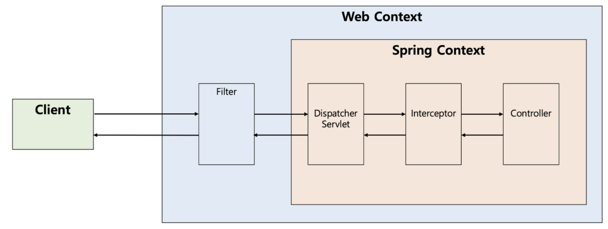
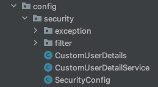
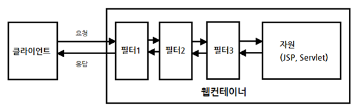
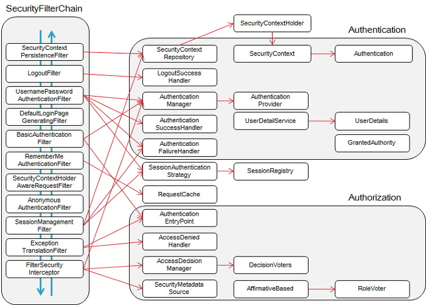
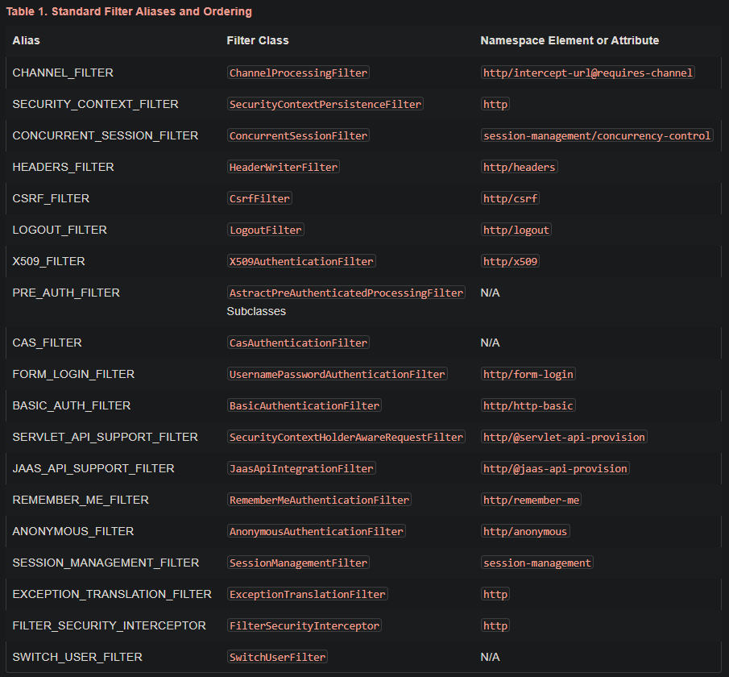
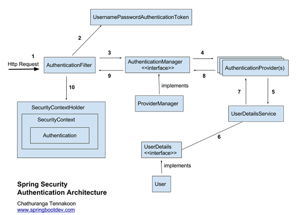
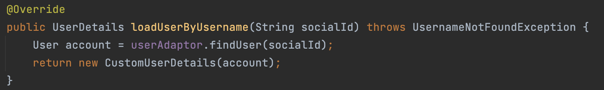

> [해당 포스팅](https://hello-judy-world.tistory.com/216)에서도 내용을 확인할 수 있습니다.

> written by [judy](https://github.com/ParkJungYoon)

유저가 있는 서비스라면 인증과 인가 처리는 필수이다.

Spring에서는 Spring Security라는 프레임워크로 관련 기능을 제공하고 있다.

오늘은 **Security 개념**과 **처리 과정**에 대해서 알아보려고 한다.

출~발~

<br>

# 👮‍♀️ Spring Security

/** 평화로운 토끼 마을 */

토끼 마을에 입장하기 위해서는 신원을 입증해야 한다.
 

> 🐰 : 안녕하세요. 토끼입니다. 저는 토끼마을 주민이에요. 딱 봐요? 토끼상이됴?

> 🤖 : 삐빅. 박.주.디. 신원이 입증되었습니다.

방금 주디가 한 것이 **`인증`**(Authentication)이다.

하지만, 주디의 **Role**은 '마을 주민'이다.

마을 주민인 주디는 허락된 구역에만 들어갈 수 있다.

> 🐰 : 안녕하세요. 옆 마을 토끼입니다. 들어가도 될까요.

> 🤖👮‍♀️ : 죄송합니다. 당신은 저희 마을 접근 권한이 없습니다.

권한에 따라 다른 마을에는 접근하지 못하는 상황.

이것이 **`인가`**(Authorization)라고 한다.

<br>

이때, <u>스프링 시큐리티(Spring Security)</u>를 사용하면 편리하게 인증/인가를 구현할 수 있다.

<br>

## 1. Spring Security 개념

> 스프링 기반의 애플리케이션의 보안(인증과 권한)을 담당하는 프레임워크

스프링 시큐리티는 **필터(Filter)** 기반으로 동작하기 때문에 스프링 MVC와 분리되어 관리 및 동작한다.
 
**필터(Filter)** 는 Dispatcher Servlet으로 가기 전에 적용되므로 가장 먼저 URL 요청을 받지만, Interceptor는 Dispatcher와 Controller사이에 위치한다. 그래서 이 둘은 적용 시기에 차이점이 있다.

> **Client (request) → Filter → DispatcherServlet → Interceptor → Controller**
<br>
(실제로 Interceptor가 Controller로 요청을 위임하는 것은 아님, Interceptor를 거쳐서 가는 것)


<div align='center'>
    
</div>

또한 스프링 시큐리티 3.2부터는 XML로 설정하지 않고 **자바 config 설정**으로 간단하게 설정할 수 있도록 지원하고 있다.


<div align='center'>
    
</div>

뒤에 설명에서 계속 나올 용어에 대해 먼저 정리하고 넘어가자.

<br>

### [ 용어 ]

* `접근 주체(Principal)` : 보호된 대상에 접근하는 유저

* `인증(Authentication)` : 인증은 '증명하다'라는 의미로 예를 들어, 유저 아이디와 비밀번호를 이용하여 로그인하는 과정과정

* `인가(Authorization)` : '권한부여'나 '허가'와 같은 의미로 사용된다. 즉, 어떤 대상이 특정 목적을 실현하도록 허용(Access) 하는 것을 의미

* `권한(Role)` : 인증된 주체가 애플리케이션의 동작을 수행할 수 있도록 허락되었는지를 결정할 때 사용

<br>

## 2. Spring Security Filter

<div align='center'>
    
</div>

위에서 스프링 MVC에서는 요청을 가장 먼저 받는 것이 DispatcherServlet이라고 했다. 그리고 이 DispatcherServlet이 요청을 받기 전에 다양한 **필터**가 있을 수 있다.

필터가 하는 역할은 클라이언트와 자원 사이에서 요청과 응답 정보를 이용해 다양한 처리를 하는데 목적이 있다. 

<br>

### ✔️ Security Filter Chain

그리고 Spring Security는 <u>다양한 기능을 가진 필터들을 10개 이상 기본적으로 제공</u>한다. 이렇게 제공되는 필터들을 Security Filter Chain(시큐리티 필터 체인)이라고 말한다.

<div align='center'>
    
</div>

많은 종류의 필터가 존재한다.


<div align='center'>
    
</div>

<br>

## 3. Spring Security 주요 모듈

이 모듈들은 4번에서 인증 과정과 함께 보면 이해가 빠를 것이다.

### [ Authentication  ]

현재 접근하는 주체의 정보와 권한을 담는 인터페이스이다.

```java
public interface Authentication extends Principal, Serializable {
	// 현재 사용자의 권한 목록을 가져옴
	Collection<? extends GrantedAuthority> getAuthorities();
    
	// credentials(주로 비밀번호)을 가져옴
	Object getCredentials();
    
	Object getDetails();
 
	// Principal 객체를 가져옴
	Object getPrincipal();
 
	// 인증 여부를 가져옴
	boolean isAuthenticated();
    
	// 인증 여부를 설정함
	void setAuthenticated(boolean isAuthenticated) throws IllegalArgumentException;
 
}
```

### [ SecurityContext ]

Authentication을 보관하는 역할을 하며, SecurityContext를 통해 Authentication 객체를 꺼내올 수 있다.


### [ SecurityContextHolder ]

보안 주체의 세부 정보를 포함하여 응용프로그램의 현재 보안 컨텍스트에 대한 세부 정보가 저장된다.

<br>

이 3가지 모듈의 연관 관계를 알아보자.

우선 유저가 로그인을 통해 인증을 마친다.

인증에 성공하면 principal과 credential 정보를 `Authentication`에 담는다.

그리고 Spring Security에서 Authentication을 `SpringContext`에 보관한다.

그리고 이 SpringContext을 `SecurityContextHolder`에 담아 보관한다.

<br>

### [ UserDetails ]

인증에 성공하여 생성된 **`UserDetails`** 객체는 Authentication 객체를 구현한 UsernamePasswordAuthenticationToken을 생성하기 위해 사용된다. UserDetails를 implements 하여 처리할 수 있다.

```java
public interface UserDetails extends Serializable {
 
	// 권한 목록
	Collection<? extends GrantedAuthority> getAuthorities();
 
	String getPassword();
 
	String getUsername();
 
	// 계정 만료 여부
	boolean isAccountNonExpired();
 
	// 계정 잠김 여부
	boolean isAccountNonLocked();
 
	// 비밀번호 만료 여부
	boolean isCredentialsNonExpired();
 
	// 사용자 활성화 여부
	boolean isEnabled();
 
}
```

이것을 현재 프로젝트에서 **CustomUserDetails**로 구현했다.

```java
public class CustomUserDetails implements UserDetails {
 
    private User user;
 
    public User getUser() {
        return user;
    }
 
    public CustomUserDetails(User account) {
        this.user = account;
    }
 
    @Override
    .
    .
    .
}
```

<br>

### [ UserDetailsService ]

UserDetailsService는 UserDetails 객체를 반환하는 하나의 메서드만을 가지고 있는데, 일반적으로 이를 implements 한 클래스에 UserRepository를 주입받아 DB와 연결하여 처리한다.

즉, 이곳에서 DB의 사용자 정보를 조회한다.

```java
public interface UserDetailsService {
 
	UserDetails loadUserByUsername(String username) throws UsernameNotFoundException;
 
}
```

이것을 현재 프로젝트에서 `CustomUserDetailsService`로 구현했다.

우리 서비스에서는 Adaptor를 사용하고 있기 때문에 UserRepository를 주입받는 게 아니라 UserAdaptor를 주입받았다.

```java
@Service
@RequiredArgsConstructor
public class CustomUserDetailService implements UserDetailsService {
 
    private final UserAdaptor userAdaptor;
 
    @Override
    public UserDetails loadUserByUsername(String socialId) throws UsernameNotFoundException {
        User user = userAdaptor.findUser(socialId);
        return new CustomUserDetails(user);
    }
}
```

<br>

### [ UsernamePasswordAuthenticationToken ]
 

Authentication을 implements 한 AbstractAuthenticationToken의 하위 클래스로, **User의 ID가 Principal 역할**을 하고, **Password가 Credential의 역할**을 한다. 

UsernamePasswordAuthenticationToken의 첫 번째 생성자는 인증 전의 객체를 생성하고, 두 번째는 인증이 완료된 객체를 생성한다.

```java
public abstract class AbstractAuthenticationToken implements Authentication, CredentialsContainer {
}
 
public class UsernamePasswordAuthenticationToken extends AbstractAuthenticationToken {
 
	private static final long serialVersionUID = SpringSecurityCoreVersion.SERIAL_VERSION_UID;
 
	// 주로 사용자의 ID에 해당
	private final Object principal;
 
	// 주로 사용자의 PW에 해당
	private Object credentials;
 
	// 인증 완료 전의 객체 생성
	public UsernamePasswordAuthenticationToken(Object principal, Object credentials) {
		super(null);
		this.principal = principal;
		this.credentials = credentials;
		setAuthenticated(false);
	}
 
	// 인증 완료 후의 객체 생성
	public UsernamePasswordAuthenticationToken(Object principal, Object credentials,
			Collection<? extends GrantedAuthority> authorities) {
		super(authorities);
		this.principal = principal;
		this.credentials = credentials;
		super.setAuthenticated(true); // must use super, as we override
	}
}
```

<br>

### [ AuthenticationManager ]

인증에 대한 부분은 AuthenticationManager를 통해서 처리하게 되는데, 실질적으로는 AuthenticationManager에 등록된 `AuthenticationProvider`에 의해 처리된다.

(이것을 implements 한 것이 ProviderManager이다.)
 
인증에 성공하면 두 번째 생성자를 이용해 객체를 생성하여 `SecurityContext`에 저장한다.

<br>

### [ AuthenticationProvider ]

AuthenticationProvider에서는 실제 인증에 대한 부분을 처리하는데, 인증 전의 Authentication 객체를 받아서 인증이 완료된 객체를 반환하는 역할을 한다.

<br>

## 4. Spring Security 인증 처리 과정

그림의 번호에 맞춰서 인증을 처리하는 과정에 대해서 알아보자.
 
<div align='center'>
    
</div>

<br>

### ✔️ 일반적인 프로세스
 

### 1) 클라이언트(유저)가 로그인을 시도한다.

### 2-1) AuthenticationFilter에서 인증을 처리한다.

Servlet Filter에 의해서 Security Filter로 Security 작업이 위임되고,

여러 Security Filter 중에서 UsernamePasswordAuthenticationFilter에서 인증을 처리한다.

<br>

/** 로그인 폼을 사용하지 않는 주디는? */

UsernamePasswordAuthenticationFilter를 사용해 로그인 폼으로 보내진다.

하지만 현재 내 프로젝트에서는 이것을 사용하지 않아 이전에 사용자 정의 필터를 생성했다.

```java
@Component
@RequiredArgsConstructor
public class JwtRequestFilter extends OncePerRequestFilter {
 
    private final JwtUtil jwtUtil;
 
    @Override
    protected void doFilterInternal(
    .
    .
}
```

그리고 **SecurityConfig**에서 다음 코드를 추가해 준다.

```java
.addFilterBefore(jwtRequestFilter, UsernamePasswordAuthenticationFilter.class)
```

<br>

### 2-2) UsernameAuthenticationToken 발급

AuthenticationFilter는 HttpServletRequest에서 아이디와 비밀번호를 추출하여 `UsernameAuthenticationToken 토큰`을 발급한다.

<br>

### 3) AuthenticationManager에게 인증 객체 전달

AuthenticationFilter는 AuthenticationManager에게 인증 객체를 전달한다.

`AuthenticationManager`는 인증을 담당한다. 그래서 2번에서 발급한 토큰이 올바른 유저인지 확인한다.

<br>

### 4) 인증을 위해 AuthenticationProvider에게 인증 객체 전달

### 5) 전달받은 인증 객체의 정보를 UserDetailsService에 전달

AuthenticationProvider는 전달받은 인증 객체의 정보를 UserDetailsService에 넘겨준다.

<br>

### 6) UserDetails 구현 객체 생성

`UserDetailsService`는 전달받은 사용자 정보를 통해 DB에서 알맞은 사용자를 찾고 이를 기반으로 `UserDetails`을 구현한 객체를 반환한다.

이때 메서드는 UserDetails을 반환하는 것 하나이다.

<div align='center'>
    
</div>

<br>

### 7) UserDetails객체를 AuthenticationProvider에 전달

### 8) ProviderManager에게 권한을 담은 검증된 인증 객체를 전달

AuthenticationProvider은 전달받은 UserDetails를 인증해 성공하면 ProviderManager에게 권한을 담은 검증된 인증 객체를 전달한다.

<br>

### 9) 검증된 인증 객체를 AuthenticationFilter에게 전달

ProviderManager가 AuthenticationFilter에 전달한다.

<br>

### 10) 검증된 인증 객체를 SecurityContextHolder의 SecurityContext에 저장

AuthenticationFilter가 UserDetails 정보를 `SecurityContextHolder`에 저장한다.

<br>

## 5.  로그인 한 사용자 정보 가져오기

위 과정을 통해 인증을 했다. 그렇다면 그 이후에 다른 유저 서비스를 이용하면 Current User 정보가 필요하다. 이때는 어떻게 해야 할까?

### ✔️ Bean에서 사용자 정보 가져오기

가장 간단한 전역에 선언된 `SecurityContextHolder`에서 가져오는 방법이다.

```java
public static String getCurrentUserSocialId() {
        Object principal = SecurityContextHolder.getContext().getAuthentication().getPrincipal();
        User currentUser = (User) principal;
        Social social = currentUser.getSocial();
        return social.getId();
}
```

<br>

### ✔️ Controller에서 사용자 정보 가져오기

`principal` 객체뿐만 아니라 `Authentication` 토큰 또한 가져올 수 있다.

```java
@PostMapping("/{challengeRoomId}/create")
    public Response<CreateRecordResponse> createRecord(
            // Principal 또는 Authentication
            Principal principal,
            Authentication authentication
            ) {
            .
            .
            .
     }
```

<br>

### ✔️  @AuthenticationPrincipal

Spring Security 3.2부터는 annotation을 이용하여 현재 로그인한 사용자 객체를 인자에 주입할 수 있다.

우리 프로젝트를 기준으로 UserDetails를 구현한 CustomUserDetails 클래스가 있고, UserDetailsService 구현체에서 CustomUserDetails 객체를 반환한다.

```java
@PostMapping("/{challengeRoomId}/create")
    public Response<CreateRecordResponse> createRecord(
            @AuthenticationPrincipal CustomUserDetails customUserDetails
            ) {
            .
            .
            .
     }
```

다음과 같은 방법으로 넘겨줄 수 있다.

---

### 📌 Reference

- [부스트 캠프 - 1) Spring Security 개요](https://www.boostcourse.org/web326/lecture/58997?isDesc=false)
- [Spring Security의 구조(Architecture) 및 처리 과정 알아보기](https://dev-coco.tistory.com/174)
- [Spring Security + JWT를 통해 프로젝트에 인증 구현하기](https://imbf.github.io/spring/2020/06/29/Spring-Security-with-JWT.html)
- [스프링부트 Spring Security 기본 세팅 (스프링 시큐리티)](https://nahwasa.com/entry/%EC%8A%A4%ED%94%84%EB%A7%81%EB%B6%80%ED%8A%B8-Spring-Security-%EA%B8%B0%EB%B3%B8-%EC%84%B8%ED%8C%85-%EC%8A%A4%ED%94%84%EB%A7%81-%EC%8B%9C%ED%81%90%EB%A6%AC%ED%8B%B0)
