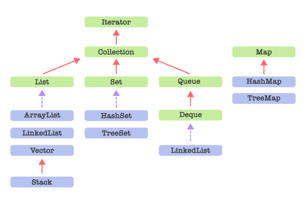

# 🚀 컬렉션 프레임 워크

## 📌 0. 들어가기 전에
- 프로그래밍을 하다보면 여러 객체를 어딘가에 저장해두고 꺼내 사용하는 상황이 많다.
- 이 때, 객체들을 모아 배열의 형태로 관리하게되는데 필요한 자료구조의 형태에 맞게 사용하려면 자바의 배열만으로는 효율적인 관리가 어려울 수 있다.
- 그래서 **자바 1.2** 부터는 **일반적으로 알려진 자료구조**의 특징과 형태를 바탕으로 **객체**를 효육적으로 관리할 수 있게 `컬렉션 프레임워크`를 지원한다.

## 🔍 1. 상속 구조

- 위 다이어그램에서 초록색 박스는 인터페이스, 파란색 박스는 클래스를, 빨간 실선 화살표는 상속, 보라색 점선 화살표는 구현을 나타낸다.
- 컬렉션 프레임워크는 추상화된 여러 인터페이스를 각각의 클래스에서 구현하는 방식으로 이루어져있다.
- 위 상속 구조도에 나와있는 클래스 외에도 `Arrays`와 같은 클래스들이 `컬렉션 프레임워크`에 포함되어 있다.

## 💡 2. 자료구조를 구현한 대표적인 컬렉션
- 컬렉션 프레임워크에는 많은 자료구조를 구현한 클래스들이 있다.
- 대표적인 인터페이스의 몇가지의 특징과 구현 클래스에 대해 알아보자.

  ### 2.1 List
  - List 컬렉션은 배열과 유사한 구조로 객체를 저장하게되면 각각의 주소에 인덱스가 부여되고 그 인덱스로 검색 삭제 기능을 제공할 수 있다.
  - 순서를 가지고, 같은 객체의 중복저장이 가능하다.
  - 대표적으로 `ArrayList`, `LinkedList`, `Vector`가 있다. → [LinkedList?](https://github.com/Fancy96/2023-CS-Study/blob/main/Algorithm/algorithm_linkedlist.md) - [Fancy](https://github.com/Fancy96)

  <br>

  > #### 🧐 각각의 차이?
  > - `ArrayList`와 `Vector`는 동적 크기를 가지는 **배열**의 형태, `LinkedList`는 **연결리스트**의 형태를 가진다.
  > - `ArrayList`는 **동기화** 되어있지 않아 멀티스레드 환경에서 명시적인 **동기화**가 필요하고 `Vector`의 경우 **동기화**된 자료구조로 멀티스레스 환경에서 안전하게 사용 가능하다.
  > - 연산 속도를 비교해보면 **동기화** 여부의 차이로 인해 `ArrayList`가 `Vector`보다 빠르다.

  > #### 🧐 ArrayList와 Vector를 좀 더 자세히 비교해보자.
  > [ArrayList 테스트 코드](https://www.jdoodle.com/iembed/v0/Icu)
  > [Vector 테스트 코드](https://www.jdoodle.com/iembed/v0/Icv)
  > - 위 테스트 코드링크로 들어가 실행해보면 7, 8번 라인에 각각 Vector와 ArrayList가 List의 객체로 들어가있다.
  > - 두 라인의 주석을 해제해 가며 실행해보자.
  > - 결과의 차이가 있는 이유는 ArrayList는 두개 이상의 스레드에서 동시에 add메서드를 호출 할 경우 발생되는 경합때문에 하나만 추가되고 Vector의 add메서드는 동기화라 경합이 발생하지 않음에 있다.

  ### 2.2 Set
  - Set 컬렉션은 집합형태의 구조를 가진다.
  - 중복된 데이터를 저장 할 수 없고, 순서가 존재하지 않는다.
  - 저장된 데이터를 인덱스로 관리하지 않기때문에 인덱스를 매개변수로 가지는 메서드가 존재하지 않는다.
  - 대표적으로 순서가 없는 `HashSet`, 순서가 있는 `TreeSet` 클래스가 있다.

  <br>

  > #### 🧐 중복된 데이터?
  > - Set 에서는 객체의 `hashCode`로 중복을 판별한다.
  > - 따라서 분명 다른 객체지만 같은 `hashCode`를 갖는다면 **같은 객체로 판별**한다.
  > - 한마디로 `==`연산자가 아닌 `equals()`메서드로 비교했을 경우 `true`값이 나오면 **같은 객체**로 판별한다.
  > - 다음 예제로 확인해보자.
  >   ```
  >   import java.util.Set;
  >   import java.util.HashSet;
  >
  >   public class MyClass {
  >       public static void main(String args[]) {
  >
  >           Set<String> set = new HashSet<>();
  >           String str1 = "hi";
  >           String str2 = new String("hi");
  >
  >           System.out.println("str1\nhashCode : " + str1.hashCode());
  >           System.out.println("identity : " + System.identityHashCode(str1));
  >           System.out.println("str2\nhashCode : " + str2.hashCode());
  >           System.out.println("identity : " + System.identityHashCode(str2));
  >
  >           set.add(str1);
  >           set.add(str2);
  >
  >           System.out.println("set size : " + set.size());
  >       }
  >   }
  >
  >   Result----------------------------------------------------------------
  >
  >   str1
  >   hashCode : 3329
  >   identity : 116211441
  >   str2
  >   hashCode : 3329
  >   identity : 607635164
  >   set size : 1
  >   ```
  > - 새로운 String 객체를 만들어 Set에 저장했지만 str1과 str2의 해시코드가 같으므로, set에 저장된 객체 수를 출력한 결과는 1이다.
  > - 왜 같은 해시코드를 리턴하는지가 궁금하면 [String Pool](https://inpa.tistory.com/entry/JAVA-%E2%98%95-String-%ED%83%80%EC%9E%85-%ED%95%9C-%EB%88%88%EC%97%90-%EC%9D%B4%ED%95%B4%ED%95%98%EA%B8%B0-String-Pool-%EB%AC%B8%EC%9E%90%EC%97%B4-%EB%B9%84%EA%B5%90)에대해 알아보자.

  ### 2.3 Map
  - Map 컬렉션은 **Key**와 **Value**로 구성된 **Entry** 객체를 저장하는 컬렉션이다.
  - 이 때, **Key**의 객체는 중복될 수 없지만 **Value**의 객체는 중복될 수 있다.
  - **Key**로 객체를 관리하기때문에 대부분의 메서드의 파라미터로 **Key**를 가진다.
  - 대표적으로 엔트리 순서를 보장하지 않는 `HashMap`와 `HashTable`, 순서를 가지는 `TreeMap` 클래스가 있다.

  <br>

  > #### 🧐 HashMap과 HashTable?
  > - 둘의 가장 큰 차이점으로는 동기화 여부를 들 수 있다.
  > - 위에서 살펴본 `ArrayList`와 `Vector`를 비교한 테스트처럼 동기화 여부로 인해 실행되지 멀티스레드 환경에서는 사용 함에 있어 주의를 기울일 필요가 있다.


  ### 2.4 TreeSet과 TreeMap
  - 이름에서도 알 수 있듯 `TreeSet`은 `Set` 인터페이스를 구현한 클래스고 `TreeMap`은 `Map` 인터페이스를 구현한 클래스다.
  - 이 둘은 **트리** 자료구조를 통해 검색기능에 특화된 클래스다. → [Tree란?](https://github.com/Fancy96/2023-CS-Study/blob/main/Algorithm/algorithm_tree.md) - [Fancy](https://github.com/Fancy96)
  - 앞서 봤듯 이 둘은 순서를 가지기 때문에 `TreeSet`에 저장되는 객체와 `TreeMap`의 `Key`에 저장되는 객체는 **Comparable 인터페이스를 구현**하고 있어야한다.
  
  <br>

  > #### 🧐 저장되는 객체에서 반드시 `Comparable` 인터페이스를 구현해야하나요?
  > - TreeSet과 TreeMap 객체를 생성할 때 다음과 같이 비교자를 제공하는 방법이 있다.
  > ```
  > new TreeSet<>(new ComparatorImpl());
  > ```
  
  ### 2.5 Stack과 Queue
  - [스택과 큐?](https://github.com/Fancy96/2023-CS-Study/blob/main/Algorithm/algorithm_stack_and_queue.md)
  - Stack은 클래스로 Vector 클래스를 상속받았지만 사실상 독자적인 메서드들로 이루어져 있다.
  - Queue는 인터페이스로 LinkedList 클래스로 구현되어있다.
  ```
  Stack<String> stack = new Stack<>();
  Queue<String> queue = new Queue<>();
  ```
  - [읽을거리 - [Java] Stack 클래스는 무엇이고 문제점은 무엇일까?](https://devlog-wjdrbs96.tistory.com/244)

  ### 2.6 수정할 수 없는 컬렉션
  - 프로그래밍을 하다보면 간혹 수정할 수 없는(unmodifiable) 컬렉션을 생성 해야할 때가 있다.
  - `List`, `Set`, `Map` 에서 생성하는경우 `.of()`나 `.copyOf()` 메서드를 상황에 맞게 사용할 수 있다.
  - `배열`을 `List`로 만들때 수정 할 수 없는 컬렉션을 생성하는경우 `Arrays`클래스의 `.asList()` 메서드를 사용할 수 있다.

## 3. Arrays와 Collections 클래스

- 각각 배열과 컬렉션에서 동작하는 정적 메서드로 구성된 클래스.
- 채우기, 복사, 정렬, 검색 등 각종 알고리즘 메서드를 제공한다.

---

### 📚 References

- [한빛미디어 - 이것이 자바다](https://product.kyobobook.co.kr/detail/S000061695652)
- [[Java] Stack 클래스는 무엇이고 문제점은 무엇일까?](https://devlog-wjdrbs96.tistory.com/244)
- [Tree - Fancy](https://github.com/Fancy96/2023-CS-Study/blob/main/Algorithm/algorithm_tree.md)
- [LinkedList - Fancy](https://github.com/Fancy96/2023-CS-Study/blob/main/Algorithm/algorithm_linkedlist.md)
- [스택과 큐 - Neo](https://github.com/Fancy96/2023-CS-Study/blob/main/Algorithm/algorithm_stack_and_queue.md)