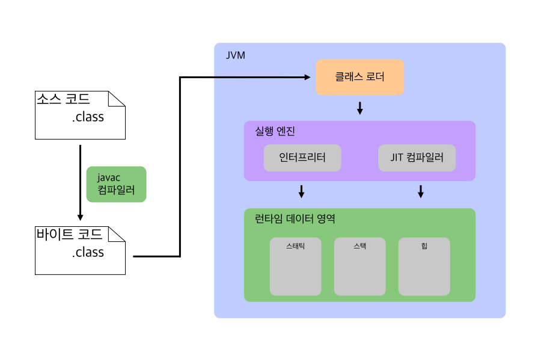

# 🚀 Java 컴파일 과정

> #### 📃 Java 컴파일 챕터 작은 목차
> - [자바 컴파일 과정](./java_compile_sequence.md) - 현재 포스트
> - [자바 클래스 로더](./java_class_loader.md)
> - [자바 실행 엔진](./java_execution_engine.md)

## 📍 0. 들어가기 전에

### 0.1 컴파일 이란?

`컴파일`은 **원시코드(소스코드)를 컴퓨터가 이해할 수 있는 목적코드(바이트코드, 기계어)로 바꿔주는 것**.  
목적코드를 실행파일로 바꾸는것을 `링크`라고 한다.

> #### 🧐 빌드(Build)는 뭔가요?
> 
> 빌드란 소스코드파일을 하나의 실행파일로 만들어주는 과정이다.  
> 컴파일과 링크 과정을 포함한 실행파일 생성 과정.

## 🔍 1. 자바의 컴파일과 실행 과정

컴파일과 실행 과정을 큰 덩어리들로 분리해보면 다음과 같이 나타낼 수 있다.

1. 작성된 소스코드를 `자바 컴파일러`가 `JVM`이 이해 할 수 있는 `바이트코드`로 변환한다.
2. 컴파일된 바이트 코드를 `JVM`내부의 `클래스 로더`가 가져와 `동적 로딩`을 통해 `JVM 메모리` 상에 적재한다.
3. `JVM 메모리`에 적재된 바이트코드를 `실행엔진`을 통해 실행한다.

---

### 📚 References

- [[Java] 컴파일 과정](https://gyoogle.dev/blog/computer-language/Java/%EC%BB%B4%ED%8C%8C%EC%9D%BC%20%EA%B3%BC%EC%A0%95.html)
- [[Java] Java파일의 컴파일 과정](https://yang-droid.tistory.com/48)
- [알기쉽게 정리한 JAVA의 컴파일과정 및 JVM 메모리 구조, JVM GC](https://aljjabaegi.tistory.com/387)
