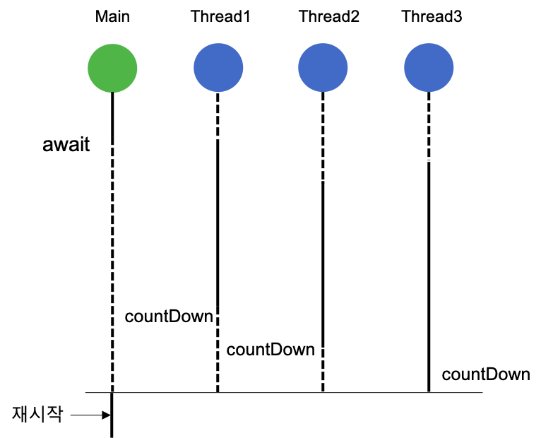
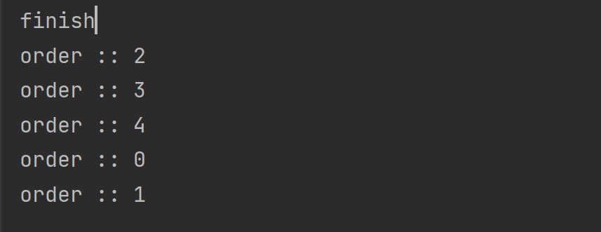
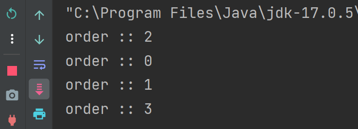
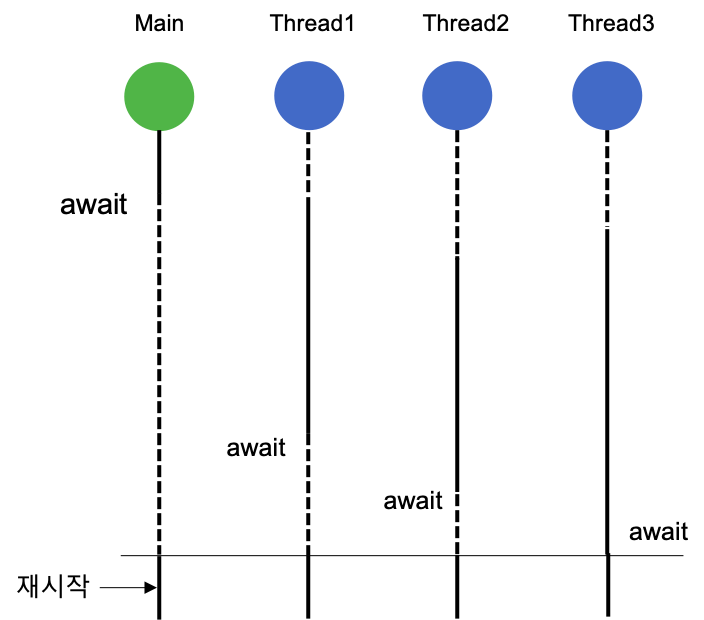

# 🎈CountdownLatch vs CyclicBarrier

`CountdownLatch`와 `Cyclicbarrier`은 쓰레드를 관리해주는 클래스입니다.

## CountdownLatch

`CountdownLatch`는 어떤 쓰레드가 다른 쓰레드에서 작업이 완료될 때까지 기다릴 수 있도록 해주는 클래스이다.

## CountDownLatch 작동 원리

Latch의 사전적 의미는 '걸쇠'를 의미로 원하는 지점에서 `await()`메소드를 호출하여 코드의 실행을 중단시키고 다른 쓰레드들에서 원하는 횟수만큼 `countDown()` 메서드를 호출하여 코드가 진행되는 방식이다.

CountDownLatch는 다음과 같이 생성할 수 있다. 

인자로 Latch의 숫자를 전달한다.



``` java
CountDownLatch countDownLatch = new CountDownLatch(5);
```

다음과 같이 `countDown()`을 호출하면 Latch의 숫자가 1개씩 감소합니다.
``` java
countDownLatch.countDown();
```

`await()`은 Latch의 숫자가 0이 될 때까지 기다리는 코드입니다.
``` java
countDownLatch.await();
```

## 예제
```java
public class ExampleCountDownLatch {

    public static void main(String[] args) throws InterruptedException {
        CountDownLatch countDownLatch = new CountDownLatch(5);

        ExecutorService es = Executors.newFixedThreadPool(5);
        for(int i = 0; i<5; i++){
            int n = i;
            es.execute(() -> {
                countDownLatch.countDown();
                System.out.println("order :: " + n);
            });
        }

        countDownLatch.await();
        es.shutdown();
        System.out.println("finish");
    }
}
```

## 실행 화면


`await()` 를 통해 메인 쓰레드를 대기 상태로 바꾸고 다른 쓰레드를 실행을 하여 `countDown()`을 호출한다. 

`countDown()`메소드를 5번 실행하지 않으면,`await()`아래의 코드는 실행이 되지 않는다 

아래의 사진은 for문의 조건을 4로 바꾸었을 때 나오는 결과이다.



아래의 코드가 실행이 되지 않아 프로그램이 종류가 안되는 것도 확인할 수 있다. 

`await()`는 타임아웃을 인자로 받는데, 이 타임아웃을 설정할 시에는 해당 시간동안 기다리다가 아래 코드를 실행한다.

## CyclicBarrier
`CountdownLatch`와 비슷하지만 다른 점은 다른 쓰레드가 전부 대기 상태가 되었을 때 모든 쓰레드의 대기 상태가 해제가 되고 재사용이 가능해진다.

즉, `CyclicBarrier`는 `CountdownLatch` 처럼 1이상의 인자를 count 값을 받는다. 그리고 각 쓰레드에서 `await()`를 호출하면 쓰레드는 대기상태로 들어간다.

`await()`가 count 값만큼 호출이 되면, 대기 상태로 있던 쓰레드는 대기 상태가 해제된다.



## 예제
```java
public class ExampleCyclicBarrier {

    public static void main(String[] args) throws InterruptedException, BrokenBarrierException {
        CyclicBarrier cyclicBarrier = new CyclicBarrier(5);

        ExecutorService es = Executors.newFixedThreadPool(4);
        for(int i = 0; i<4; i++){
            int n = i;
            es.submit(() -> {
                cyclicBarrier.await();
                System.out.println("order :: " + n);
                return 1;
            });
        }

        Thread.sleep(5000);
        cyclicBarrier.await();

        es.shutdown();
        System.out.println("finish");
    }
}
```

## 실행 화면


메인 쓰레드가 멈추면 다른 쓰레드가 동작을 하는데 각각의 쓰레드가 다 대기 상태에 들어가면 재귀함수처럼 마지막 대기에서 부터 출력이 이루어진다.

# 면접 질문
- `Countdownlatch`와 `Cyclicbarrier`의 차이점은 무엇인가요?

# 🛠레퍼런스
- [간서치의 IT세상](https://younghwannam.blogspot.com/2019/12/java-countdownlatch-cyclicbarrier-phaser.html)
- [codechacha.com](https://codechacha.com/ko/java-countdownlatch/)
- [자바봄](https://javabom.tistory.com/35)