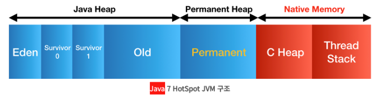
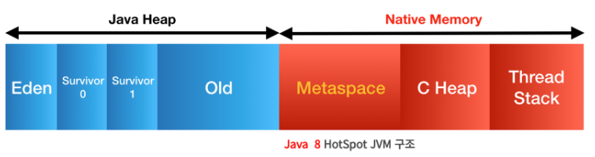

# 자바 8의 특징

##  람다 표현식(Lambda expression)

메서드로 전달할 수 있는 익명 함수(Anonymous function)를 단순한 문법으로 표기한 것이다.

자세한 설명은 아래의 링크에 들어가면 볼수 있습니다


## 함수형 인터페이스(Functional interface)

**추상 메서드가 오직 하나인 인터페이스**를 의미한다.

여러 개의 디폴트 메소드와 static 메소드가 있어도 함수형 인터페이스로 취급한다.

함수형 인터페이스는 단일 추상 메서드(Single Abstract Method)를 가지는 인터페이스를 말한다.

이러한 인터페이스는 람다 표현식(lamda expression)이나 메서드 참조(method reference)를 사용하여 함수형 프로그래밍을 쉽게 구현할 수 있다.

```java
@FunctionalInterface
public interface Math {

    public int Callc(int first, int secont);
}


public class Main {

    public static void main(String[] args) {
        Math plusLambda = ((first, secont) -> first + secont);
        System.out.println(plusLambda.Callc(4,2));


        Math minusLambda = new Math() {
            @Override
            public int Callc(int first, int secont) {
                return first - secont;
            }
        };
        System.out.println(minusLambda.Callc(4,2));
    }
}
```

위의 코드는 함수형 인터페이스의 선언하여 사용하는 방법과 람다식을 사용하지 않은 다른 방법으로 추상메소드를 구현하는 방법입니다.
`@FunctionalInterface`은 함수형 인터페이스의 규칙을 위반하였을 때 컴파일 에러가 발생하도록하여 함수형 인터페이스를 명시적을 만들 수 있게 도와준다.


## 디폴트 메소드(Default method)

인터페이스 내에서 구현이 가능한 메소드를 의미한다.

static 메소드도 추가로 구현이 가능하다.

이전 버전에서는 인터페이스 내에서 추상메소드만을 선언을 할수 있었지만, static, default 메소드를 구현을 할수 있게 되었다.

자세한 설명은 아래의 링크에서 볼 수 있다.


## 스트림(Stream)

켈렉션과 배열의 데이터를 처리를 도와주는 기술이다.

이전 버전에서 데이터를 처리를 하는 방법은 for 또는 for-each 문을 돌면서 데이터를 가공하였다.

간단한 경우라면 상관없지만 로직이 복잡한 경우, 코드의 양이 많아져 로직이 섞이게 되고, 쉽게 이해를 할수 없는 상황이 발생한다.

이러한 문제점을 해결하기 위해서 나타난 기술이다.

또 다른 장점으로는 병렬 처리가 가능하다는 것이다.

자세한 설명은 아래의 링크에서 볼수 있다.


## 옵셔널(Optional)

`NullPointerExceptin`을 방지하기 위해서 null 대신으로 나온 클래스이다

Optional은 '존재할 수도 있지만 안 할 수도 있는 객체' 즉 'null이 될 수도 있는 객체을' 감싸고 있는 일종의 래퍼 클래스이다

Optional을 사용하면 NPE를 유발할 수 있는 Null을 직접 다루지 않아도 됩니다.

null 체크를 통해 직접하지 않아도 됩니다

### Optional 기본 사용법

#### Optional 변수 선언

제네릭을 제공하기 때문에 변수를 선언할 때 명기한 타입 파라미터에 따라서 감쌀 수 있는 객체의 타입이 결정된다

```
Optional<Order> maybeOrder; // Order 타입의 객체를 감쌀 수 있는 Optional 타입의 변수
Optional<Member> optMember; // Member 타입의 객체를 감쌀 수 있는 Optional 타입의 변수
Optional<Address> address; // Address 타입의 객체를 감쌀 수 있는 Optional 타입의 변수
```

변수명은 클래스 이름을 사용하기도 하지만 "maybe"나 "opt"와 같은 접두어를 붙어서 사용하는게 Optional클래스를 명확히 나타낸다.

#### Optional 객체 생성하기

객체 생성하는 방법은 세가지가 있다.
```
Optional<Member> maybeMember = Optional.empty();
```
null을 담고 있는 객체를 생성한다. 클래스 내부적으로 미리 생성해 놓은 싱글턴 인스턴스이다.

```
Optional<Member> maybeMember = Optional.of(aMember);
```
null이 아닌 객체를 생성한다. null이 넘어올 경우 NPE를 던지기 때문에 주의해야 한다.

```
Optional<Member> maybeMember = Optional.ofNullable(aMember);
Optional<Member> maybeNotMember = Optional.ofNullable(null);
```
null인지 아닌지 모르는 객체를 생성할 때 사용한다. null 넣어 생성한 경우 앞의 `empty()`함수처럼 비어있는 객체가 생성이 된다.

#### Optional이 담고 있는 객체 접근하기
간략하게 Optional에 null을 가지고 있을 때 다르게 작동하는 함수들에 대해 서술한다.

- `get()`
 
비어있는 Optional 객체에 대해서 `NoSuchElementException`을 던진다.

- orElse(T other)

비어있는 Optional 객체에 대해서 넘어온 인자를 반환한다.

- orElseGet(Supplier<? extends T> other)

비어있는 Optional 객체에 대해서,넘어온 인자를 반환한다

- orElseThrow(Supplier<? extends X> exceptionSupplier)

비어있는 Option미 객체에 대해서, 넘어온 함수형 인자를 통해 생성된 예외를 던진다.

### Optional의 잘못된 사용

Optional에는 객체가 null인지를 확인하는 `isPresent()`라는 메소드가 있다. null이 아니면 true을 null이면 false를 출력한다.

``` java
String text = getText();
Optional<String> maybeText = Optional.ofNullable(text);
int length;
if (maybeText.isPresent()) {
	length = maybeText.get().length();
} else {
	length = 0;
}
```

``` java
String text = getText();
int length;
if (text != null) {
	length = maybeText.get().length();
} else {
	length = 0;
}
```

위 코드와 아래의 코드를 비교하면 왜 Optional을 사용하는지 의문이 들 것이다.
Optional을 사용하는 이유는 **null 처리를 직접하지 않고 Optional클래스에 위임하기** 위해서이다.

아래와 같이 코드를 짜기위해 노력해야 한다.
``` java
int length = Optional.ofNullable(getText()).map(String::length).orElse(0);
```
위 코드는 orElse()함수를 통해 null이면 0을 출력하도록 하는 코드이다.


## JVM의 변화



원래 `Permanent Generation Heap(== PermG)`에는 아래와 같은 정보가 저장이 되었다.

- Class의 메타데이터 (바이크코드 포함)
- Method의 메타데이터
- static 객체, static 상수
- 상수화된 String Object
- Class와 관련된 배열 객체 메타데이터
- JVM 내부적인 객체들과 JIT의 최적화 정보

Permanent Heap은 일정량의 데이터 공간을 필수적으로 가지고 있어야 했다.



Class와 Method의 메타데이터와 여러 객체들이 증가함으로 메모리량이 저장 공간보다 늘어나 OOM(Out Of Memory Error)가 발생하는 문제점이 생겼다

JVM에서 PermG 부분이 삭제되고, Native Memory 부분에 Metaspace가 추가 되었다.

기존의 PermG에 있었던 데이터는 아래와 같이 변경되었다.

### MetaSpace에 저장되는 데이터
- Class의 메타데이터 (바이크코드 포함)
- Method의 메타데이터
- Class와 관련된 배열 객체 메타데이터
- JVM 내부적인 객체들과 JIT의 최적화 정보

### Heap에 저장되는 데이터
- static 객체, static 상수
- 상수화된 String Object

Heap에 저장되는 데이터는 GC의 대상이 될수 있게 되었고 Navtive 영역은 OS레벨에서 관리해 자동으로 크리를 조절하고, 개발자가 메모리 영역확보의 상한을 크게 인식할 필요가 없게 되었다.

# 레퍼런스

- [Java 8의 주요 변경 사항과 실무 적용 포인트](https://bbubbush.tistory.com/23)

- [JVM의 Java8 에서의 변화](https://becomeweasel.tistory.com/entry/JVM%EC%9D%98-Java-8%EC%97%90%EC%84%9C%EC%9D%98-%EB%B3%80%ED%99%94)

- [자바8 Optional 2부: null을 대하는 새로운 방법](https://www.daleseo.com/java8-optional-after/) 

