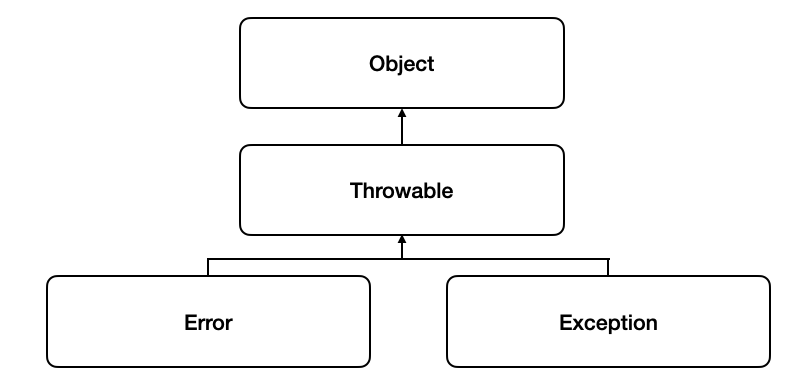
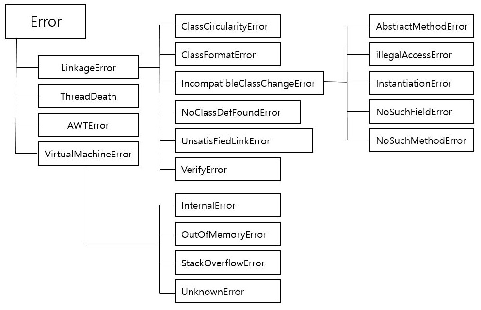

# Error와 Exception

## Throwable 클래스
Trowable 클래스는 예외 처리를 할수 있는 최상위 클래스입니다 Exception과 Error는 Throwable의 상속을 받습니다.


## Error
Error는 컴퓨터 시스템의 동작 동증 예기치 않았던 이상 상태가 발생하여 수행 중인 프로그램이 영향을 받을 경우입니다.

시스템 레벨에서 발생하여, 개발자가 어떻게 조치할 수 없는 수준을 의미합니다.

예를 들어 OutOfMemoryError(메모리 부족)이나 StackOverflowError(스택오버프로우)와 같은 상황이다.

- StackOverflowError: 호출의 깊이가 깊어지거나 재귀가 지속되어 stack overflow 발생 시 던져지는 오류


- OutOfMemoryError: JVM이 할당된 메모리의 부족으로 더이상 객체를 할당할 수 없을 때 던져지는 오류




## Exception
Exception은 컴퓨터 시스템의 동작 도중 예기치 않았던 이상 상태가 발생하여 수행 중인 프로그램이 영향을 받는 경우입니다. 개발자가 구현한 로직에서 발생하며 개발자가 예측하여 방지할 수 잇기에 상황에 맞게 예외처리(Exception Handle)를 해야 합니다


### Exception의 종류
에외는 Checked Exception, Unchecked Exception으로 두 개의 종류로 나누어집니다.

- Checked Exception: 예외처리가 필수이며, 처리하지 않으면 컴파일이 되지 않습니다. JVM 외부와 통신(네트워크, 파일시스템 등)할 때 주로 쓰입니다.

  - `RuntimeException` 이외에 있는 모든 예외


  - `IOException`, `SQLException` 등


- Unchecked Exception: 컴파일 때 체크되지 않고, Runtime에 발생하는 Exception을 말합니다.
  - `RuntimeException` 하위의 모든 예외

  
  - `NullPointerException`, `IndexOutBoundException` 등

### 대표적인 Exception Class

- `NullPointerException` : Null 레퍼런스를 참조할때 발생, 뭔가 동작시킬 때 발생합니다.

- `IndexOutOfBoundsException` : 배열과 유사한 자료구조(문자열, 배열, 자료구조)에서 범위를 벗어난 인덱스 번호 사용으로 발생합니다.

- `FormatException` : 문자열, 숫자, 날짜 변환 시 잘못된 데이터(ex. "123A" -> 123 으로 변환 시)로 발생하며, 보통 사용자의 입력, 외부 데이터 로딩, 결과 데이터의 변환 처리에서 자주 발생합니다.

- `ArthmeticException` : 정수를 0으로 나눌때 발생합니다.

- `ClassCastException` : 변환할 수 없는 타입으로 객체를 변환할 때 발생합니다.

- `IllegalArgumentException` : 잘못된 인자 전달 시 발생합니다.

- `IOException` : 입출력 동작 실패 또는 인터럽트 시 발생합니다.

- `IllegalStateException` : 객체의 상태가 매소드 호출에는 부적절한 경우에 발생합니다.

- `ConcurrentModificationException` : 금지된 곳에서 객체를 동시에 수정하는것이 감지될 경우 발생합니다.

- `UnsupportedOperationException` : 객체가 메소드를 지원하지 않는 경우 발생합니다.


## Exception handler(예외 처리)
Java에서 모든 예외가 발생함녀 ~Exception 객체를 생성합니다.

- 직접 `try ~ catch`를 이용해서 예외를 처리하는 방식 (예외 복구)

``` java
final int MAX_RETRY = 100;
public Object someMethod() {
    int maxRetry = MAX_RETRY;
    while(maxRetry > 0) {
        try {
            ...
        } catch(SomeException e) {
            // 로그 출력. 정해진 시간만큼 대기한다.
        } finally {
            // 리소스 반납 및 정리 작업
        }
    }
    // 최대 재시도 횟수를 넘기면 직접 예외를 발생시킨다.
    throw new RetryFailedException();
}
```

- throws Exception을 이용해서 발생한 예외의 책임을 호출 하는 쪽이 책임지도록 하는 방식 (예외 회피)

``` java
// 예시 1
public void add() throws SQLException {
    // ...생략
}

// 예시 2 
public void add() throws SQLException {
    try {
        // ... 생략
    } catch(SQLException e) {
        // 로그를 출력하고 다시 날린다!
        throw e;
    }
}
```

- Exception 전환으로 throws Exception와 try ~ catch문을 활용하여 적절한 Exception으로 전환해서 넘기는 방법 (예외 전환)
``` java
// 조금 더 명확한 예외로 던진다.
public void add(User user) throws DuplicateUserIdException, SQLException {
    try {
        // ...생략
    } catch(SQLException e) {
        if(e.getErrorCode() == MysqlErrorNumbers.ER_DUP_ENTRY) {
            throw DuplicateUserIdException();
        }
        else throw e;
    }
}

// 예외를 단순하게 포장한다.
public void someMethod() {
    try {
        // ...생략
    }
    catch(NamingException ne) {
        throw new EJBException(ne);
        }
    catch(SQLException se) {
        throw new EJBException(se);
        }
    catch(RemoteException re) {
        throw new EJBException(re);
        }
}
```

# 면접 질문
- 예외 처리하는 방법은 무엇이 있는가?

- Unchecked Exception과 Checked Exception의 차이점은 무엇인가?

# 레퍼런스
- [예외 처리](https://gyoogle.dev/blog/computer-language/Java/Error%20&%20Exception.html)


- [이미지 출처](https://gyoogle.dev/blog/computer-language/Java/Error%20&%20Exception.html)


- [소스 코드 출처](https://madplay.github.io/post/java-checked-unchecked-exceptions)