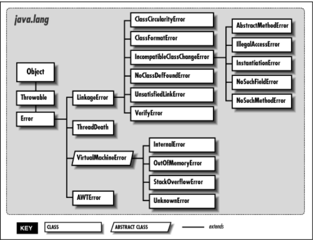
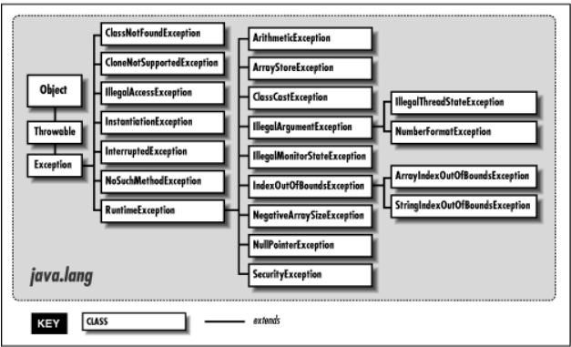

오류와 예외가 무엇인지 자세히 알아보기 전, 이들이 상속하는 클래스들의 계층구조를 아래 사진으로 먼저 파악해보자

<div align='center'>
    
</div>

### [ Throwable ]

예외와 관련된 최상위 클래스는 `Throwable`이다.  
하지만 대부분 직접적으로 이 클래스를 사용하기보다는 이를 상속받은 `Exception`이나 `Error`가 주로 사용된다.  
또한, Error는 예외 처리의 대상으로 보지 않기에 제외하면 나머지 `Exception` 클래스와 그 하위 클래스가 주요 처리 대상이다.  

> Instances of two subclasses, Error and Exception, are conventionally used to indicate that exceptional situations have occurred.  
-Oracle-

Throwable 클래스에 대한 Oracle의 공식문서를 읽어보면 **이 클래스의 객체에 오류나 예외에 대한 메시지를 담는다**는 이야기가 나옵니다.  

> ...The recording of this causal information is referred to as the chained exception facility, as the cause can, itself, have a cause, and so on, leading to a "chain" of exceptions, each caused by another.  
-Oracle-

또한, 예외가 연결될 때(chained exception) 연결된 예외의 정보들을 기록하기도 한다고 합니다.  
이 Throwable 객체가 지닌 정보와 할 수 있는 행위는 `getMessage()`와 `printStackTrace()`라는 메소드로 구현되어 있으며 Throwable 클래스를 상속하는 Error와 Exception에서 두 메서드를 사용가능하다.

**getMessage()** : 발생한 예외에 대한 구체적인 메시지를 반환하므로 간단히 예외에 관한 내용을 확인할 때 좋다.

**printStackTrace()** : 예외에 대한 자세한 디버깅을 위해 주로 사용되는 메서드이다.

### [ Exception ]

`Exception`은 다시 `RuntimeException` 계열과 그 외의 `Exception` 계열로 나뉜다.  
이 두 계열의 차이는 컴파일 시점에 예외 상황에 대한 대비 코드(try ~ catch)가 있는지를 체크하는지 여부에 있으며 각각 `unchecked exception`과 `checked exception`으로 불린다.  

`RuntimeException`의 하위 클래스들은 모두 `unchecked exception`으로 예외에 대한 처리 코드가 없어도 컴파일 오류가 발생하지 않는다.  
물론 대비 코드를 작성하지 않은 상태에서 예외가 발생하면 프로그램은 비정상 종료된다.  
하지만, 나머지 `checked exception`의 경우 예외에 대한 처리 코드가 없을 경우 커마일 오류가 발생하므로 반드시 작성해 주어야 한다.  

`checked exception`이나 `unchecked exception` 모두 일단 발생하면 해당 예외에 대한 처리 코드가 있어야 프로그램의 비정상 종료를 막을 수 있다.


## 오류(Error) vs 예외(Exception)

### [ 오류(Error) ]
메모리가 부족하거나 메서드끼리 호출을 무한 반복하는 것처럼 일단 발생하면 복구하거나 되돌릴 수 없는 심각한 상황이다. 이는 개발자가 **미리 예측하여 방지할 수 없으며**, 처리방법은 오류를 발생하는 요인을 찾아서 없애는 디버깅 뿐이다. 즉, 프로그램을 잘 짜는 것만이 대안이다.

<div align='center'>
    
</div>

- **StackOverflowError** : 호출의 깊이가 깊어지거나 재귀가 지속되어 stack overflow 발생 시 던져지는 오류입니다. 재귀를 사용할 때에 조심하거나 가시적인 loop를 사용하는 간접적인 예방이 가능합니다.  

- **OutOfMemoryError** : JVM이 할당된 메모리의 부족으로 더 이상 객체를 할당할 수 없을 때 던져지는 오류입니다. Garbage Collector에 의해 추가적인 메모리가 확보되지 못하는 상황이기도 합니다. 새는 메모리를 차단하거나 heap의 크기를 늘려주면서 이를 방지할 수 있습니다.


### [ 예외(Exception) ]
오류와 비교하면 심각도가 낮으며 프로그램의 정상적인 흐름을 방해하는 상황이다. 개발자가 구현한 로직에서 발생한 실수 혹은 사용자의 영향에 의해 발생한다. 예를 들면 파일을 읽으려고 하는데 해당하는 파일이 없거나 네트워크 프로그램이 동작 중 네트워크 연결이 끊기는 상황들이다. 이러한 상황들은 **개발자가 미리 예측하여 방지할 수 있기** 때문에 상황에 맞는 `예외 처리(Exception Handle)`를 해야 한다.  

<div align='center'>
    
</div>

- **NullPointerException** : 객체가 필요한 경우인데 응용프로그램이 null을 사용하려고 시도할 경우 던져지는/던질 수 있는 예외입니다.  

- **IllegalArgumentException** : 메서드가 허가되지 않거나 부적절한 argument를 받았을 경우 던져지는/던질 수 있는 예외입니다.  

이 때 **던질 수 있는**이란, 개발자가 임의로 예외를 던질 수 있음을 의미합니다.

- **Checked Exception(=Compile Exeption)** : 컴파일 시점에 예외를 catch하는지 정적으로 확인합니다. 만일 컴파일 시점에 예외에 대해 처리(try...catch) 하지 않는다면 컴파일 에러가 발생합니다.

- **Unchecked Exception** : 컴파일 시점에 예외를 catch하는지 확인하지 않습니다. 그렇기에 컴파일 시점에 예외가 발생하는지 여부를 확인할 수 없습니다.

예외 가능성이 있는 메서드를 호출하는 메서드가 예외를 활용하여 의미있는 작업을 할 수 있다면 Checked Exception을 활용할 수 있다. 

하지만 호출하는 메서드가 예외 상황이나 문제 해결능력이 없다면 Unchecked Exception을 활용할 수 있다. 

Checked Exception을 처리하기 위해서는 throws를 사용하여 피호출 메서드에서 호출하는 메서드로 예외를 던진다고 이해하면 된다.  

하지만 무분별한 throws의 사용은 코드의 가독성을 떨어트림과 예외발생지점을 알 수 없게 만드는 원인이 될 수 있다.  

이에 try문 안에서 발생하는 Checked Exception을 catch문 안에서 Unchecked Exception으로 바꿔주는 방법을 적용할 수 있다.  

그 결과 예외가 발생한 메서드에서 예외를 처리하거나 개발자 혹은 사용자에게 처리를 위임할 수 있기 때문이다.

```
public static String extractRequestLine(BufferedReader bufferedReader) {
    try {
    	String requestLine = bufferedReader.readLine();
        if (requestLine == null) {
            throw new InvalidHttpRequestException("request line이 없습니다.");
    	}

      return requestLine;
    } catch (IOException e) {
        throw new InvalidHttpRequestException("입력 값이 잘못되어 RequestLine 객체를 생성할 수 없습니다.");
    }
}
```

## 예외 처리 기법
### [ try ~ catch ]
예외를 처리하기 위해서는 try...catch 블록을 이용한다.  
try 블록에는 예외가 발생할 수 있는 코드를 작성한다.
catch의 파라미터에는 try 블록에서 발생할 수 있는 예외를 설정한다.  
마지막으로 catch 블록에서는 해당 예외가 발생 시 처리할 코드를 작성한다.  

형식은 아래와 같다.
```
try {
    //예외가 발생할 수 있는 코드
}catch(XXException e) { //던질 예외를 받음
    //예외가 발생했을 때 처리할 코드
}
```
이를 기반으로 아래 예제를 살펴보자.
```
package 상혁.exception;  

public class SimpleException {

    public static void main(String[] args) {
        int[] intArray = { 10 };
        System.out.println(intArray[2]); //예외 발생 지점
        System.out.println("프로그램 종료합니다");
    }
}
```

실행 결과 아래와 같은 예외가 발생한다.  
> Exception in thread "main" java.lang.ArrayIndexOutOfBoundsException: 2 at 상혁.exception.ExceptionCase.main(ExceptionCase.java:7) 

위 코드 상에서 컴파일에는 문제가 없었지만, 실행 결과를 확인하면 ArrayIndexOutOfBoundsException이 발생한다.  
이에 프로그램은 비정상종료되며 예외 발생 지점 아래 출력문은 출력되지 않는다.  
이처럼 컴파일에는 지장이 없지만, 프로그램 동작 중 발생하는 예외를 runtime 계열의 예외(Unchecked Exception)이라고 부른다.

위 예제에서 발생한 코드를 try...catch 블록을 이용해서 처리해보자.  
```
package 상혁.exception;  

public class SimpleTryCatch {

    public static void main(String[] args) {
        int[] intArray = { 10 };
        try {
            System.out.println(intArray[2]); //예외 발생 지점
        }catch(ArrayIndexOutOfBoundsException e) {
            System.out.println("예외가 발생하였지만 처리함: 배열 크기 확인 필요");
        }
        System.out.println("프로그램 종료합니다");
    }
}
```

실행 결과 아래와 같이 출력한다.  
> 예외가 발생하였지만 처리함: 배열 크기 확인 필요  
프로그램 종료합니다.   

---

### 📢 예상 면접 질문들

- Q. checked Exception과 Unchecked Exception을 알고 있나요?
    - A. RuntimeException 상속하는 클래스는 Unchecked Exception, 그렇지 않다면 Checked Exception. Unchecked Exception의 경우 예외 처리를 명시적으로 할 필요는 없지만, Checked Exception의 경우 반드시 필요!
- Q. Error와 Exception의 차이를 설명해주세요
    - A. Error는 실행 중 일어날 수 있는 치명적 오류, 컴파일 시점 체크 불가, 오류 발생 시 프로그램은 비정상적으로 종료되며 Unchecked Exception에 속함. 반면 Exception은 Error보다 경미한 오류이며, try...catch문을 사용하여 비정상 종료를 막을 수 있다.
--- 

### 📌 Reference

- [[wellbell's blog] Error 와 Exception(Checked, Unchecked)](https://wellbell.tistory.com/198)
- [[넥스트리소프트]](https://www.nextree.co.kr/p3239/)
- [[Inpa Dev's blog]](https://inpa.tistory.com/entry/JAVA-%E2%98%95-%EC%97%90%EB%9F%ACError-%EC%99%80-%EC%98%88%EC%99%B8-%ED%81%B4%EB%9E%98%EC%8A%A4Exception-%F0%9F%92%AF-%EC%B4%9D%EC%A0%95%EB%A6%AC)


