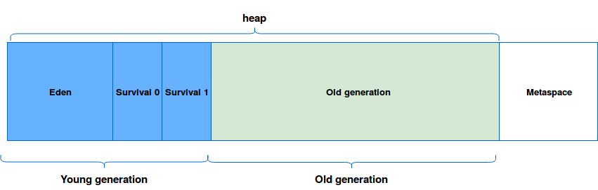
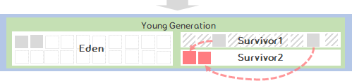
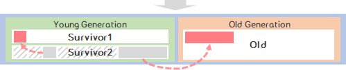
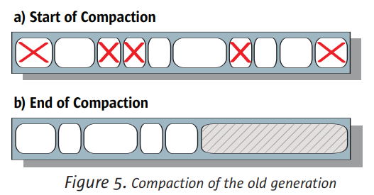
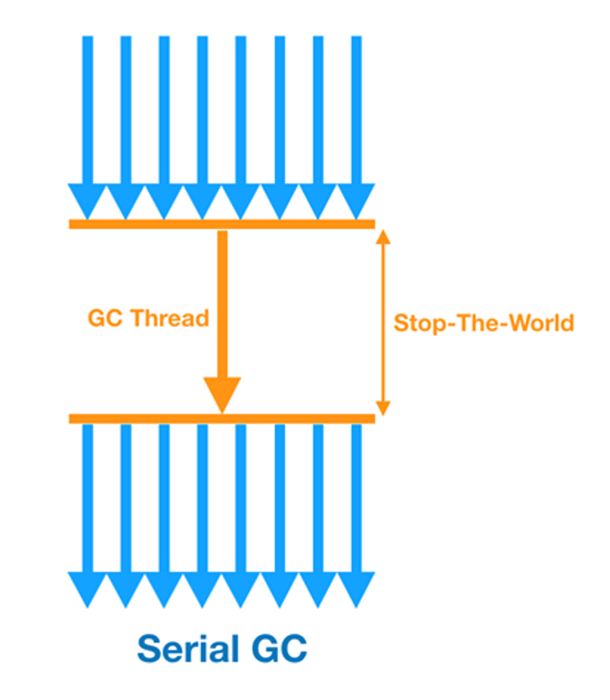
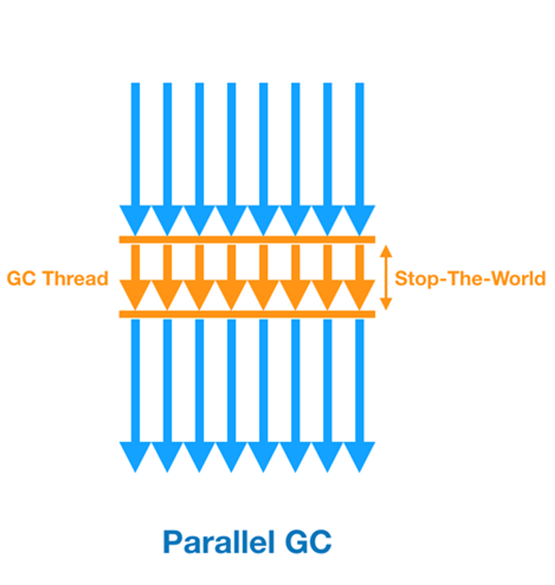
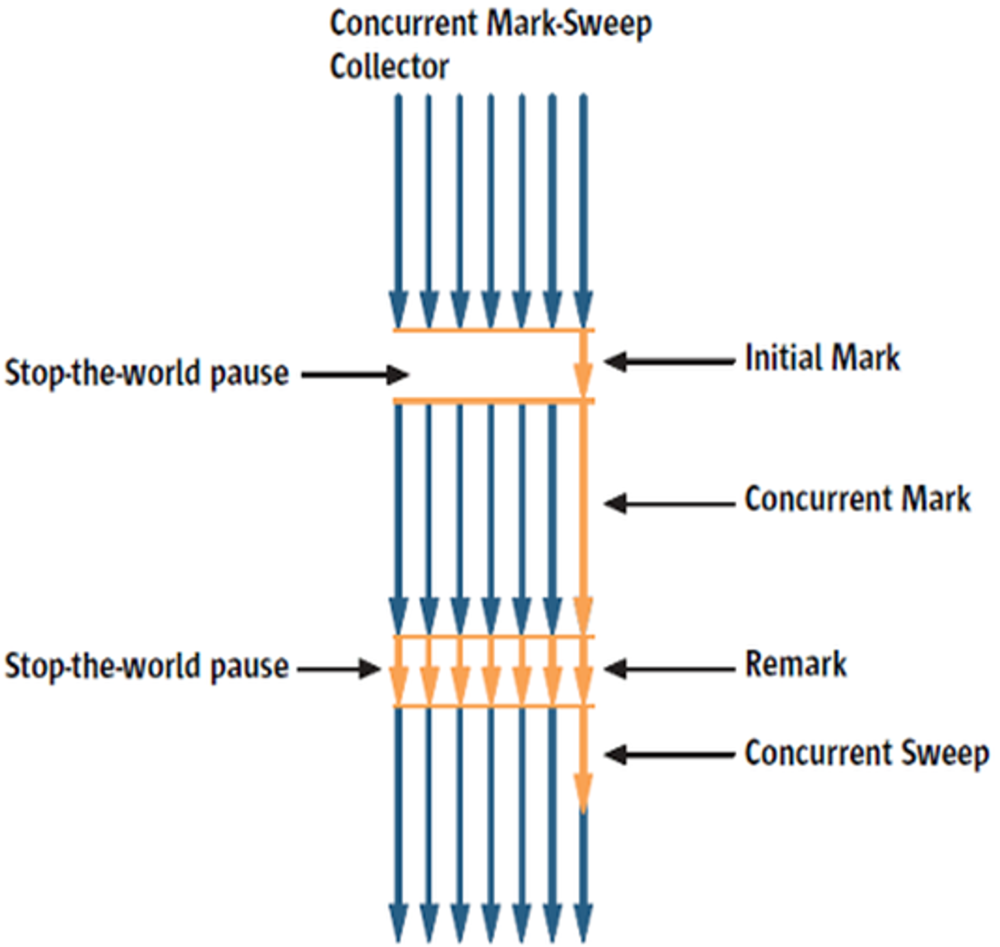
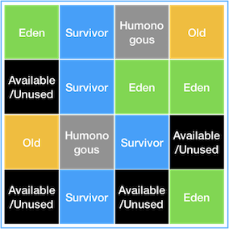
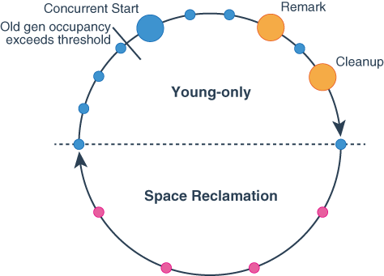

# Garbage Collection(GC) 🦹‍♂️
> JAVA의 특징 중 하나로 메모리 관리를 개발자가 직접 명시적으로 수행하지 않고, JVM에서 자동으로 수행해 주는 것이 있다.
> 이와 같은 역할을 하는 프로세스를 **Garbage Collector(GC)**라 한다.

**Java의 GC 도입의 전재 가설(week generational hypothesis)**

- 대부분의 객체는 금방 **접근 불가능 상태(unreachable)**가 된다.
- 오래된 객체에서 젊은 객체로의 참조는 아주 적게 존재한다.

=> 이러한 전재 가설 때문에 Yong영역과 Old영역으로 나누어진다.

```
for (int i = 0; i <1000; i++) {
	SampleObj obj = new SamepleObj();
	obj.doTest(i);
}
```
위의 코드에서 마지막 한번을 제외한 9,999번의 객체들은 생성 후 바로 **접근 불가능 상태(unreachable)**가 된다. GC가 발생하지 않으면 10,000개의 객체가 현재 참조되지 않지만 메모리를 점유하고 있다고 볼 수 있다.

<br>

```
SampleObj obj = new SamepleObj();
obj.setValue(1);
doTest(obj);
```
객체를 생성하고 다른 메소드나 클래스에 해당 객체를 전달 후에는 다시 참조하지 않는 경우가 대부분이다.
이를 **오래된 객체에서 젊은 객체로의 참조는 아주 적게 발생**한다고 말할 수 있다.

<br>

## 🔮 GC의 역할
1. 메모리 할당
2. 사용 중인 메모리 인식
3. 사용하지 않는 메모리 인식

<br>

## 🔮 GC 수행 영역별 구분
#### JVM 메모리 영역
JVM의 메모리는 크게 클래스 영역, 자바 스택, 힙, 네이티브 메소드 스택 의 4가지 영역으로 이루어져있다.

GC는 JVM의 메모리 영역 중 **`Heap`** 메모리에서 이루어진다.
<br>(Java에서 새로운 객체가 할당될 때, Heap 메모리 영역에 할당되기 때문)

<div align='center'>
    
</div>

이 Heap 영역은 세 영역으로 나누어진다. 
- **New/Young 영역** : 생성된지 얼마 안된 객체를 저장, 시간이 지남에 따라 우선순위가 낮아지면 Old 영역으로 옮겨진다.
- **Old 영역** : 생성된지 오래된 객체를 저장
- **Perm 영역** : Class, Method 등의 코드가 저장되는 영역, 자바 언어 레벨에서 사용되지 않음

<br>

### [ 👶 Minor GC ]
> New/Young 영역의 GC를 `Minor GC`라고 부르며, 이에 사용되는 알고리즘을 **`Copy & Scavenge`** 라고 칭함

이 영역은 `Eden`/`Survivor` 이라는 두 영역으로 나뉘어진다.
- **Eden** : 
	- 자바 객체가 생성되자마자 저장되는 곳
	- 객체가 계속 생성되어 `Eden`영역이 다 차게 되면, `Minor GC`가 발생, 살아남은 객체는 `Survivor`영역 중 하나로 이동
- **Survivor** :
	- Survivor1 과 Survivor2로 나누어짐 (그러나 우선순위가 존재하는 건 아님)
	- 한 `Survivor`영역이 가득차게 되면 그 중 살아남은 객체를 다른 `Survivor`영역으로 이동
	- 가득찬 `Survivor`영역은 아무 데이터가 없는 상태가 됨
		- `Survivor` 영역 중 하나는 반드시 비어있는 상태이어야함, 아니라면 시스템이 비정상적인 상황
	- 더 큰 객체가 생성되거나, 더 이상 `Young`영역에 공간이 남지 않으면 `Survivor`영역에서 오래된 객체 `Old`영역으로 이동(이를 `Promotion`이라고 칭함)

> **Object Aging**
>
> Survivor영역에서 Survivor영역으로 이동할 때 마다 객체의 살아남은 횟수를 나타내는 age값을 증가시킨다.
> Object Header에 기록하며, age를 보고 Minor GC때 Old 로 이동(Promotion)을 결정한다.


속도가 매우 빠르고, 작은 크기의 메모리를 콜렉팅하는데에 효과적
<br> 자주 일어나기 때문에 시간이 짧은 알고리즘이 적합

<br>

### [ 🧓 Major GC(Full GC) ]
> Old 영역의 GC를 `Major GC`라고 부르며, 이에 사용되는 알고리즘을 `Mark & Compact`라고 칭함
>
> Minor GC 과정에서 삭제되지 않고, Old Generation영역으로 옮겨진 객체 중 미사용된다고 판단되는 객체를 메모리에서 삭제한다.

객체들의 참조를 확인하면서 참조가 연결되지 않은 객체를 표시
<br> 이 작업이 끝나면 사용되지 않는 객체를 모두 표시하고 이 표시된 객체들을 삭제함

Full GC는 속도가 매우 느리며, Full GC가 일어나는 도중에는 순간적으로 자바 애플리케이션이 멈춰버리기 때문에 Full GC가 일어나는 정도와 시간은 어플리케이션의 성능과 안정성에 아주 큰 영향을 미친다.

<br>

### GC 발생 시나리오
<div align='center'>
    
</div>

1. 객체가 생성되면 `Eden`영역에 위치하게 된다.

<div align='center'>
    
</div>

2. `Eden`영역이 가득차게 되면 `Minor GC`가 발생하여 참조가 없는 객체는 삭제되고, 참조 중인 객체는 `Survivor` 영역으로 이동한다.

<div align='center'>
    
</div>

3. `Survivor`영역이 가득차게 되면, `Minor GC`가 발생하여 참조가 없는 객체는 삭제되고, 참조 중인 객체는 다른 `Survivor`영역으로 이동한다.

<div align='center'>
    
</div>

4. `Survivor`영역에서 GC과정을 반복하며, 계속 참조 중인 객체는 `Old`영역으로 이동한다.

<div align='center'>
    
</div>

5. `Eden`영역에서 `Survivor`영역으로 이동할 때 객체가 남아있는 영역보다 클 경우 `Old`영역으로 이동한다.

<br>

## 🔮 GC의 동작방식
`Young`영역과 `Old`영역은 서로 다른 메모리 구조로 되어있기 때문에, 세부적인 동작 방식은 다르다.
<br> 하지만 기본적으로 GC가 수행된다고 하면 다음의 2가지 공통적인 단계를 따르게 된다.

### [ Stop The World ]
> GC 실행을 위해 JVM이 애플리케이션의 실행을 멈추는 작업

GC가 실행될 때는 GC를 실행하는 thread를 제외한 모든 thread들의 작업이 중단되고, GC가 완료되면 작업이 재개된다.

모든 thread의 작업이 중단되면 애플리케이션이 멈추기 때문에, GC의 성능 개선을 위해 튜닝을 한다고 하면 보통 stop-the-world의 시간을 줄이는 작업을 하는 것이다.

또한, JVM에서도 이러한 문제를 해결하기 위해 다양한 실행 옵션을 제공하고 있다.

### [ Mark and Sweep ]
> 참조되는 변수를 구별하여(Mark), 참조되지 않는 변수를 해제(Sweep)
Stop the world를 통해 모든 작업이 중단되면, GC는 스택의 모든 변수 또는 reachable 객체를 스캔하면서 각각이 어떤 객체를 참고하고 있는지 탐색하게 된다. 그리고 사용되고 있는 메모리를 식별하는데 이를 Mark라고 한다.
<br> 이후 Mark되지 않은 객체들을 메모리에서 제거하는 데 이를 Sweep이라고 한다.

- **Mark** : 사용되는 메모리와 사용되지 않는 메모리를 식별하는 작업
- **Sweep** : Mark 단계에서 사용되지 않음으로 식별된 메모리를 해제하는 작업

### [ Compact ]
> Compaction : 객체들을 가까운 곳으로 모으고, heap 메모리의 아래쪽으로 보냄

<div align='center'>
    
</div>

바로 옆에 할당된 객체라고 해서 같은 시점에서 메모리에서 해제되리라는 법 없음 => 메모리가 GC를 거쳐 파편화 될 수 있다.

파편화를 최소화하기 위하여 JVM은 Major GC 때마다 Generation에 Compaction을 수행한다.


> **파편화**
> 
> 메모리 내 비어있는 공간이 서로 떨어져 있어 크기가 큰 객체를 할당하기 어려워지는 것

<br>

## 🔮 GC가 중요한 이유
Minor GC의 경우 보통 대략 0.5초에서 1초 이내에 끝나기 때문에 큰 문제가 되지 않지만, 
<br>Full GC의 경우 시간이 많이 소요되며, 자바 애플리케이션이 멈춰버릴 수 있기 때문에 문제가 생긴다.

멈추는 동안 사용자의 요청이 Queue에 들어있다가, 순간적으로 요청이 한꺼번에 들어오기 땜누에 과부하에 의해 여러 장애를 만들 수 있다.

따라서 원활한 서비스를 위해서 GC가 어떻게 일어나게 하느냐가 시스템의 안정성과 성능에 큰 변수로 작용한다.

<br>

## 🔮 다양한 GC의 알고리즘
JVM 버전 변화에 따라 여러가지 GC방식이 추가되고 발전되어 왔다.

버전 별로 지원하는 GC는 차이가 존재하며, 서비스 상황에 따라 필요한 GC방식을 JVM 옵션을 통해 설정으로 사용 가능하다.

## [ Serial GC ]

<div align='center'>
    
</div>

- 주로 32bit JVM에서 돌아가는 `single thread` 애플리케이션에서 사용 (별도로 지정하지 않을 경우 기본GC)
- `Minor GC`, `Major GC` 모두 올스탑(`stop-the-world`)하는 single thread 방식
- `Mark-sweep-compact` 알고리즘
	- **Mark** : `Old`영역으로 이동된 객체들 중 살아있는 객체를 식별한다.
	- **Sweep** : `Old`영역의 객체들을 훑는 작업을 수행하여 쓰레기 객체를 식별한다.
	- **Compaction** : 살아남은 객체들이 연속되게 쌓이도록 힙의 가장 앞부분부터 채워서 객체가 존재하는 부분과 없는 부분으로 나눈다.

<br>

## [ Parallel GC (=Throughput GC)]

<div align='center'>
    
</div>

- 기본적으로 Serial GC와 동작과정은 동일, Minor gc에서 사용되는 thread 수를 늘릴 수 있음
- 일반적으로 `Minor GC`만 멀티 스레딩, `Major GC`는 싱글 스레딩으로 수행한다.
- `multi thread` 사용
- GC의 오버헤드는 상당히 줄여주었지만, 애플리케이션이 멈추는 것은 피할 수 없음
- 메모리가 충분하고 코어의 개수가 많을 때 유리
- Java 8의 기본 GC

<br>

## [ Parallel Old GC ]
- Parallel GC와 비교하여 Old 영역의 알고리즘만 다름(`Major GC`도 멀티 스레딩)
- Mark-Summary-Compaction 단계 거침
	- Summary 단계는 앞서 GC를 수행한 영역에 대해 별도로 살아있는 객체를 식별한다는 점에서 Mark-Sweep-Compaction 단계와 다르며, 조금 더 복잡함
	- Mark-Sweep-Compact :  단일 스레드가 old 영역 검사
	- Makr-Summary-Compact : 여러 스레드가 old 영역 검사
	- **Mark** : old영역을 region별로 나누고 region별로 살아있는 객체를 식별
	- **Summary** : region별 통계정보로 살아있는 객체의 밀도가 높은 부분이 어디까지 인지 dense prefix를 정한다. 오랜 기간 참조된 객체는 앞으로 사용할 확률이 높다는 가정하에 dense prefix를 기준으로 compact영역을 줄인다.
	-  **Compact** : destination과 source로 나누며 살아있는 객체는 destination으로 이동시키고 참조되지 않는 객체는 제거
- J엄밀히 말하면 Java 8의 디폴트 버전은 Parallel Old GC

<br>

## [ CMS Collector (Concurrent Mark-Sweep) ]

<div align='center'>
    
</div>

> `Major GC`에 소요되는 작업을 애플리케이션을 멈추고 진행하는 것이 아니라, 일부는 애플리케이션이 돌아가는 단계에서 수행하고 최소한의 작업만을 애플리케이션이 멈췄을 때 수행하는 방식

- **Initial Mark** 단계 : 클래스 로더에서 가장 가까운 객체 중 살아있는 객체만 찾는 것으로 끝냄(멈추는 시간이 매우 짧다)
- **Concurrent Mark** 단계 : 참조상태 객체를 확인, `stop-the-world 없이` 다른 스레드가 실행 중인 상태에서 동시에 실행된다.
- **Remark** 단계 : Concurrent 단계에서 새로 추가되거나 참조가 끊긴 객체를 확인
- **Concurrent Sweep** 단계 : 참조 되지 않은 객체를 정리(쓰레기 정리), 다른 스레드가 실행되고 있는 상태에서 진행 됨
- stop-the-world 시간이 매우 짧음
	- 응답속도가 매우 중요할 때 사용
	- `Low Latency GC`라고도 불림
- 단점 :
	- 메모리와 CPU 많이 사용
	- 메모리 파편화가 단점
	- Compaction 단계가 기본적으로 제공되지 않음

<br>

## [ G1 Collector (Garbae First) ]

<div align='center'>
    
</div>

- 바둑판처럼 Heap 메모리 영역을 나누어 관리
- 기존 Young, Old 영역의 개념과 다른 Heap에 `Region` 개념을 도입함
	- Humonogous : Region 크기의 50%를 초과하는 큰 객체를 저장하기 위한 공간
	- Available/Unused : 아직 사용되지 않은 Region
- 하나 이상의 Region에서 객체를 복사하여 다른 Region으로 이동시키는 방식
- CMS와 비슷한 방식으로 동작 시작
	- Heap에 전역적으로 Marking
	- 가장 많이 공간이 있는 곳부터 메모리 회수 진행 *=> 이 때문에 Garbage First라는 이름이 붙었다.*
- CMS Collector의 CPU 리소스 및 메모리 파편화의 단점 해결
- Java 9부터 기본 GC

### G1 GC의 Cycle
<div align='center'>
    
</div>

- `Young-lnly Phase`와 `Space Reclamation Phase`를 반복함
- 사이클 중 모든 원 : Stop-the-world, 크기에 따라 소요시간 달라짐
- 파란 원 : `Minor GC`
- 주황 원 : `Major GC`
- 빨간 원 : `Mixed GC`

`Space Reclamation Phase`가 끝나면 다시 `Young Only Phase`로 돌아가서 `Minor GC`를 수행한다.


### Young Only Phase
- `Minor GC`만 수행하다가 Old Generation 비율에 지정된 값을 초과하는 순간 `Major GC`가 수행된다. (그림 상 `Old ge occupancy exceeds threshold`부분)
- `Major GC`의 첫 단계는 Initial Mark이며, `Minor GC`와 동시에 수행되며 둘 다 STW를 수반하므로 다른 파란원보다 크다.
- 그 이후에 `애플리케이션 스레드`, `Minor GC`, `Concurrent Mark`가 동시에 수행되는데 Remark가 수행되는 순간 다른 작업은 멈추게 된다. 그래서 Remark에 해당하는 주황색이 원이 큰 것을 알 수 있다. 
- 그 이후에 자잘하게 `Minor GC`가 수행되다가 `Major GC`의 `Cleanup`이 발생한다.

### Space Reclamation Phase
- Young Only Phase가 끝나고 시작됨
- `Mixed GC` : `Mark`단계가 없어서 STW 빈도가 Young Only Phase에 비해 줄어듦


* * *

### ❓ 관련 질문
Q1. GC의 실행시점은?

Q2. GC가 어떤 원리에 의해 동작하는지 설명해주세요.

Q3. Minor GC와 Major GC의 차이점


### 📖 참고 자료
[명품자바에센셜](http://www.yes24.com/Product/Goods/63041975)

[GC(Garbage Collector) 종류 및 내부 원리](https://dongwooklee96.github.io/post/2021/04/04/gcgarbage-collector-%EC%A2%85%EB%A5%98-%EB%B0%8F-%EB%82%B4%EB%B6%80-%EC%9B%90%EB%A6%AC.html)

[Java의 GC 이해](https://velog.io/@jeb1225/Java%EC%9D%98-GC-%EC%9D%B4%ED%95%B4)

[Java Garbage Collection](https://d2.naver.com/helloworld/1329)

[Java Reference와 GC](https://d2.naver.com/helloworld/329631)

[모의면접 복기(2) - 가비지 컬렉션 Garbage Collection](https://creampuffy.tistory.com/125)

[[JAVA] Serial GC, Parallel GC, Parallel Old GC 동작 원리](https://jgrammer.tistory.com/entry/JAVA-GC%EC%9D%98-%EB%8F%99%EC%9E%91-%EC%9B%90%EB%A6%AC-Serial-GC-Parallel-GC-Parallel-Old-GC)

[[Java] GC(Garbage Collection)이란?](https://steady-coding.tistory.com/584)
