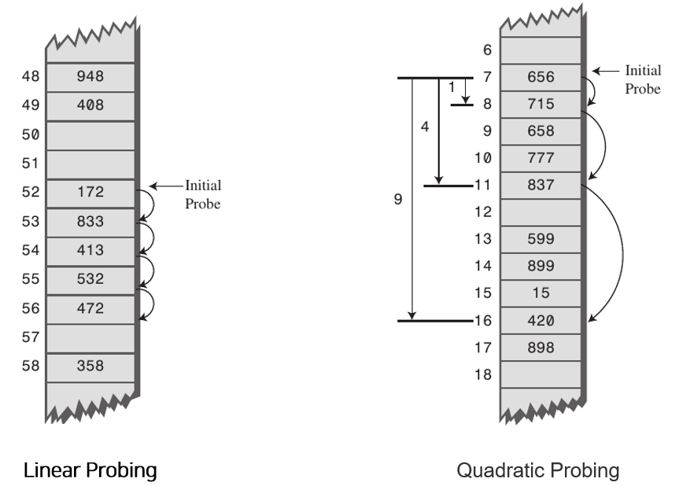
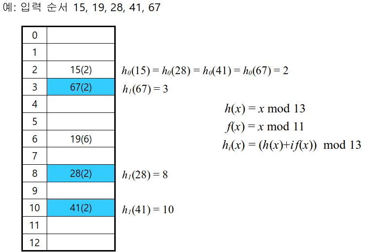

> [해당 포스팅](https://hello-judy-world.tistory.com/205)에서도 내용을 확인할 수 있습니다.

> written by [judy](https://github.com/ParkJungYoon)

자바에서 HashMap에 대해 알아보기 전, Hash에 대해서 알아보자.

자료구조 공부에서 기본은 해당 자료구조의 **특징과 문제점**. 그리고 **구체적으로 어느 곳에서 사용되는지**(use case)를 아는 것이다!

거기서 추가적으로 대답의 깊이를 가져가기 위해서는 hash 자료구조 같은 경우에는 **hash function을 만들 때 고려할 점**과 **collision 상황 해결 방법**에 대해서 알면 좋다!

<br>

## 💫  hash

대략적인 개념들부터 살펴보자.

### [ 해시함수(hash function) ]

데이터의 효율적 관리를 목적으로 <u>임의의 길이의 데이터</u>를 **고정된 길이의 데이터**로 매핑하는 함수

해시함수의 해시값이 최대한 **균등하게** 나오게 하는게 중요하다!

<br>

### [ 해싱(hashing) ]

- `키`(key) : 매핑 전 원래 데이터의 값
- `해시값`(hash value) : 매핑 후 데이터의 값
 
매핑하는 과정 자체를 해싱이라 한다.

<br>

### [ 해시충돌(collision) ]

해시함수는 해시값의 개수보다 대개 많은 키값을 해쉬값으로 변환(many-to-one 대응) 하기 때문에 **해시함수가 서로 다른 두 개의 키에 대해 동일한 해시값**을 내는 해시충돌이 발생하게 된다.

그래서 <u>충돌을 최소화할 수 있는 해시함수</u>를 사용해야한다.

<div align='center'>
    
</div>

<br>

그럼 이러한 hash는 어디에 쓰일까? (나왔다!! use case)

hash는 hashmap 형태로 많은 언어들에서 사용되고 있는데, 주로 특정 데이터를 임시 공간에 저장하고 나중에 데이터의 키로 해당 데이터를 빠르게 찾으려고 할 때 많이 사용된다.

대표적으로 **캐싱**을 할 때 많이 사용되며, key-value store라고 불리는 NoSQL(Redis, etcd 등) 같은 친들이 이러한 해싱 방식을 사용한다.

<br>

## 🗂️ Hash table (hash map)

### [ Map ]

- `정의` : 특정 순서에 따라 키와 매핑된 값의 조합으로 형성된 자료구조
- `구현체` : hash table, tree-based

<br>

### [ Hash table (hash map) ]

- `정의` : 배열과 해시 함수(hash function)를 사용하여 map을 구현한 자료구조
- 키에 대한 해시 값을 사용하여 값을 저장하고 조회하며, 키-값 쌍의 개수에 따라 동적으로 크기가 증가하는 associate array
- 그래서 일반적으로 <u>상수 시간으로 데이터에 접근</u>하기 때문에 빠르다.

조금 더 자세하게 hash table에서 해시함수는 임의의 데이터를 **정수**로 변환해 준다!

이때 데이터가 저장되는 곳은 **버킷(bucket)** 또는 **슬롯(slot)** 이라고 한다.


\* 메모리를 절약하기 위하여 객체에 대한 해시 코드의 <u>나머지 값을 해시 버킷 인덱스 값으로 사용</u>한다.

(HashMap을 비롯한 많은 해시 함수를 이용하는 associative array 구현체에서)

\* **저장/조회할 해시 버킷을 계산하는 방법**

```java
int index = X.hashCode() % M;
```

<br>

### 1) 데이터 삽입

잠시 예시로 데이터를 저장하는 과정을 살펴보자.

**ex. put("John Smith", "521-1234")**

<div align='center'>
    
</div>

현재 버킷의 **capacity**는 16이다.

이 경우에 key 값이 hash function에 나온 결과 **210 % 16**를 하면 값은 2가 된다.

그러면 이 2는 Index 2번 위치에 저장하라는 말이 된다.

|   Index(Hash Value)  |     Data  | 
| :-----: | :-----: |
| 01 | (Lisa Smith, 521-8976) |
| 02 | (John Smith, 521-1234) |

<br>

### 2) 데이터 조회

**ex. get("Jeongyoon Park")**

동일하게 hash function에 값을 돌리고 **226 % 16**를 하면 값은 2가 된다.

이때 2 인덱스에 찾으러 갔을 때 Data는 (John Smith, 521-1234)가 저장되어 있다.

John Smith와 Jeongyoon Park을 비교했을 때 값이 다르기 때문에 값을 찾지 못하고 종료한다.

<br>

### ✔️  Hash collision (해시 충돌)

- key는 다른데 hash가 같을 때
- key도 hash도 다른데 hash % map_capacity 결과가 같을 때

보통의 경우는 실제로 사용하는 key 개수보다 적은 해시테이블의 크기를 가질 것이다.

다뤄야 할 데이터가 정말 많고, 메모리 등 리소스 문제도 생기기 때문이다.

위에서도 간단하게 설명했지만 해시함수는 해시값의 개수보다 대개 많은 키값을 해쉬값으로 변환(many-to-one 대응) 하기 때문에 줄어든 범위에서 충돌이 발생할 수밖에 없다.

그렇기 때문에 해시함수의 해시값이 최대한 균등하게 나오게 하는 게 중요하다!

<br>

### [ 해결 방법 ]

### 1) open addressing (개방 주소법)

해당 버킷에 데이터가 이미 있는데 key 값이 다르면 충돌이 발생한다. 이런 경우에 아래 Separate chaining과 다르게 `open addressing` 방식은 <u>비어있는 버킷</u>을 활용한다.

즉, open addressing은 <u>한 버킷당 들어갈 수 있는 엔트리가 하나뿐인</u> 해시테이블이다.

<br>

이것을 구현하는 방법에는 **3가지**가 있다.

- **`Linear Probing`**(선형 조사법): 현재 버킷의 index에서 고정폭만큼씩 이동하여 비어 있는 버킷에 저장한다. 
- **`Quadratic Probing`**(이차 조사법): 현재 버킷의 index에서 **제곱수**만큼씩 이동하여 비어 있는 버킷에 저장한다.
    - ex. 처음에는 1만큼 이동하고 그다음 계속 충돌이 발생하면 2^2, 3^2칸씩 이동하는 방식
    - 선형 조사법과 이차 조사법의 경우 충돌 횟수가 많았지만 특정 영역에 데이터가 집중적으로 몰리는 클러스터링현상이 발생하는 단점이 있고 이 경우 평균 탐색 시간이 증가한다.

<div align='center'>
    
</div>

<br>

- **`Double Hashing Probing`**(이중 해시, 중복 해시): 이중 해싱은 클러스터링 문제가 발생하지 않도록 2개의 해시 함수를 사용하는 방법이다.

<div align='center'>
    <br>
    <p>출처 : 쉽게 배우는 알고리즘 - 관계 중심의 사고법 /문병로</p>
</div>

<br>

### 2) Separate chaining (분리 연결법)

간단한 아이디어로 한 버킷당 들어갈 수 있는 엔트리의 수에 제한을 두지 않음으로써 모든 자료를 해시테이블에 담는다.

해당 버킷에 데이터가 이미 있는데 key 값이 다르면 충돌이 발생한다. 이때 **연결리스트에 노드를 추가하여 데이터를 저장**한다.

<div align='center'>
    
</div>

### 장점
- 유연하다.

### 단점
- 메모리 문제를 야기할 수 있다.
- 데이터의 수가 많아지면 동일한 버킷에 chaining 되는 데이터가 많아져 캐시의 효율성이 감소한다.

<br>

### ✔️  Java에서 Hash collision (해시 충돌)

Java HashMap에서는 **Separate channing 방식**으로 충돌을 해결한다.

왜냐하면 Open addressing 방식은 데이터 삭제 처리가 효율적이지 않기 때문이다.

이때 해시 버킷을 구현이 자바 버전에 따라 달라진다.

<br>

### [ Java 7 이전 ]

Java 7에서는 버킷 구조를 링크드 리스트만 사용한다.

- **Java 7에서의 put() 메서드 구현**
    - 출처: [네이버 D2](https://d2.naver.com/helloworld/831311)

```java
public V put(K key, V value) { if (table == EMPTY_TABLE) { inflateTable(threshold); // table 배열 생성 } // HashMap에서는 null을 키로 사용할 수 있다. if (key == null) return putForNullKey(value); // value.hashCode() 메서드를 사용하는 것이 아니라, 보조 해시 함수를 이용하여 // 변형된 해시 함수를 사용한다. "보조 해시 함수" 단락에서 설명한다.  
        int hash = hash(key);
 
        // i 값이 해시 버킷의 인덱스이다.
        // indexFor() 메서드는 hash % table.length와 같은 의도의 메서드다.
        int i = indexFor(hash, table.length);
 
 
 
        // 해시 버킷에 있는 링크드 리스트를 순회한다.
        // 만약 같은 키가 이미 저장되어 있다면 교체한다.
        for (Entry<K,V> e = table[i]; e != null; e = e.next) {
            Object k;
            if (e.hash == hash && ((k = e.key) == key || key.equals(k))) {
                V oldValue = e.value;
                e.value = value;
                e.recordAccess(this);
                return oldValue;
            }
        }
 
        // 삽입, 삭제 등으로 이 HashMap 객체가 몇 번이나 변경(modification)되었는지
        // 관리하기 위한 코드다.
        // ConcurrentModificationException를 발생시켜야 하는지 판단할 때 사용한다.
        modCount++;
 
 
        // 아직 해당 키-값 쌍 데이터가 삽입된 적이 없다면 새로 Entry를 생성한다. 
        addEntry(hash, key, value, i);
        return null;
    }
```

<br>

### [ Java 8 ]

Java 7과 달라진 점은 Java 8에서는 데이터의 개수가 많아지면, 링크드 리스트 대신 트리를 사용한다.

링크드 리스트를 사용할 것인가 트리를 사용할 것인가는 **하나의 해시 버킷에 할당된 키-값 쌍의 개수**에 따라 결정된다.

하나의 해시 버킷에 **8개**의 키-값 쌍이 모이면 링크드 리스트를 **트리**로 변경한다. 

이때 사용하는 트리는 `Red-Black Tree`이다.

Red-Black 트리에 대한 자세한 내용은 아래 링크를 통해 확인할 수 있다.

👉 [[자료구조] Red-Black 트리](https://hello-judy-world.tistory.com/199)


- **Java 8 HashMap의 Node 클래스**
    - 출처: [네이버 D2](https://d2.naver.com/helloworld/831311)

```java
// LinkedHashMap.Entry는 HashMap.Node를 상속한 클래스다.
// 따라서 TreeNode 객체를 table 배열에 저장할 수 있다.
static final class TreeNode<K,V> extends LinkedHashMap.Entry<K,V> {
 
 
        TreeNode<K,V> parent;  
        TreeNode<K,V> left;
        TreeNode<K,V> right;
        TreeNode<K,V> prev;   
 
        // Red Black Tree에서 노드는 Red이거나 Black이다.
        boolean red;
 
        TreeNode(int hash, K key, V val, Node<K,V> next) {
            super(hash, key, val, next);
        }
 
        final TreeNode<K,V> root() {
        // Tree 노드의 root를 반환한다. 
        }
 
        static <K,V> void moveRootToFront(Node<K,V>[] tab, TreeNode<K,V> root) {
        // 해시 버킷에 트리를 저장할 때에는, root 노드에 가장 먼저 접근해야 한다.
        }
 
 
        // 순회하며 트리 노드 조회 
        final TreeNode<K,V> find(int h, Object k, Class<?> kc) {}
        final TreeNode<K,V> getTreeNode(int h, Object k) {}
 
 
        static int tieBreakOrder(Object a, Object b) {
         // TreeNode에서 어떤 두 키의comparator 값이 같다면 서로 동등하게 취급된다.
         // 그런데 어떤 두 개의 키의 hash 값이 서로 같아도 이 둘은 서로 동등하지 
         // 않을 수 있다. 따라서 어떤 두 개의 키에 대한 해시 함수 값이 같을 경우, 
         // 임의로 대소 관계를 지정할 필요가 있는 경우가 있다. 
        }
 
 
        final void treeify(Node<K,V>[] tab) {
          // 링크드 리스트를 트리로 변환한다.
        }
 
 
 
        final Node<K,V> untreeify(HashMap<K,V> map) {
          // 트리를 링크드 리스트로 변환한다.
        }
 
        // 다음 두 개 메서드의 역할은 메서드 이름만 읽어도 알 수 있다.
        final TreeNode<K,V> putTreeVal(HashMap<K,V> map, Node<K,V>[] tab,
                                       int h, K k, V v) {}
        final void removeTreeNode(HashMap<K,V> map, Node<K,V>[] tab,
                                  boolean movable) {}
 
 
        // Red Black 구성 규칙에 따라 균형을 유지하기 위한 것이다.
        final void split (…)
        static <K,V> TreeNode<K,V> rotateLeft(…)
        static <K,V> TreeNode<K,V> rotateRight(…)
        static <K,V> TreeNode<K,V> balanceInsertion(…)
        static <K,V> TreeNode<K,V> balanceDeletion(…)
 
 
 
        static <K,V> boolean checkInvariants(TreeNode<K,V> t) {
        // Tree가 규칙에 맞게 잘 생성된 것인지 판단하는 메서드다.
        }
    }
```

<br>

### ✔️ Java에서 HashMap과 HashTable

HashMap과 HashTable은 Java의 API 이름이다.
이 두가지 모두 Map 인터페이스를 구현하고 있다.

**`HashTable`**
- 구현에는 거의 변화가 없다.
- 보조 해시 함수를 사용하지 않는다.

**`HashMap`**
- 지속적으로 개선되고 있다.
- 보조 해시 함수(Additional Hash Function) 사용     
    - 해시 충돌(hash collision)이 덜 발생할 수 있어 상대으로 성능상 이점

<br>

### [ 보조 해시 함수 ]

> 보조 해시 함수(supplement hash function)의 **목적**: '키'의 해시 값을 변형하여, 해시 충돌 가능성을 줄이는 것

- Java 8 HashMap 보조 해시 함수
    - 상위 16비트 값을 XOR 연산하는 매우 단순한 형태의 보조 해시 함수를 사용

```java
static final int hash(Object key) { int h; return (key == null) ? 0 : (h = key.hashCode()) ^ (h >>> 16); }  
```

---

### 📢 같이 공부하면 좋을 면접 질문

- hash에 대해서 설명하고, use case를 설명해 보세요.
    - hash 자료구조에 대해 얼마나(특징 및 문제점) 알고 있는가
    - 자료구조가 구체적으로 어느 곳에서 사용되는지를 알고 있는가
    - hash 함수를 만드는 데에 있어 고려해야 할 것들은 무엇인지 설명하자.
    - hash에서 발생할 수 있는 collision 상황을 어떻게 해결하는지는 꼭 말하자.
- Hash Table에서 collision이 발생하면 어떻게 되나요? 해결방법엔 뭐가 있을까요?
--- 

### 📌 Reference

- [[ratsgo's blog] 해싱, 해시함수, 해시테이블](https://ratsgo.github.io/data%20structure&algorithm/2017/10/25/hash/)
- [쉬운 코드 "맵(map)과 해시 테이블(hash table) 핵심만 모아보기!"](https://youtu.be/ZBu_slSH5Sk)
- [[네이버 D2] Java HashMap은 어떻게 동작하는가?](https://d2.naver.com/helloworld/831311)