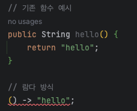
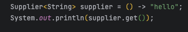
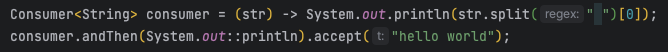
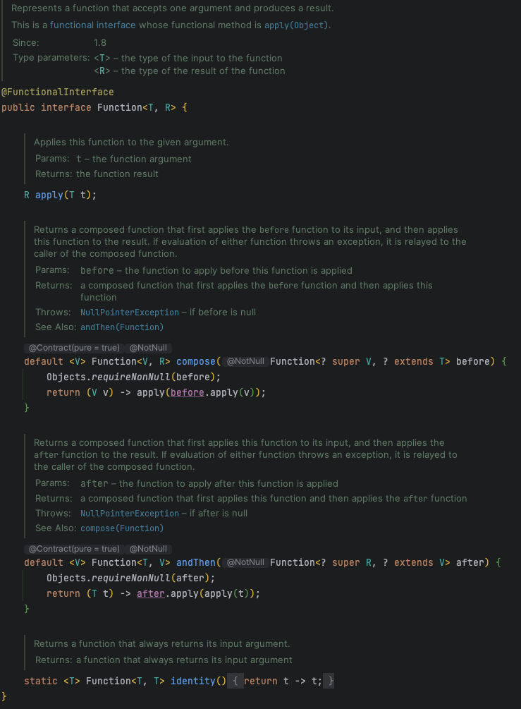
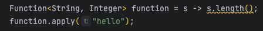
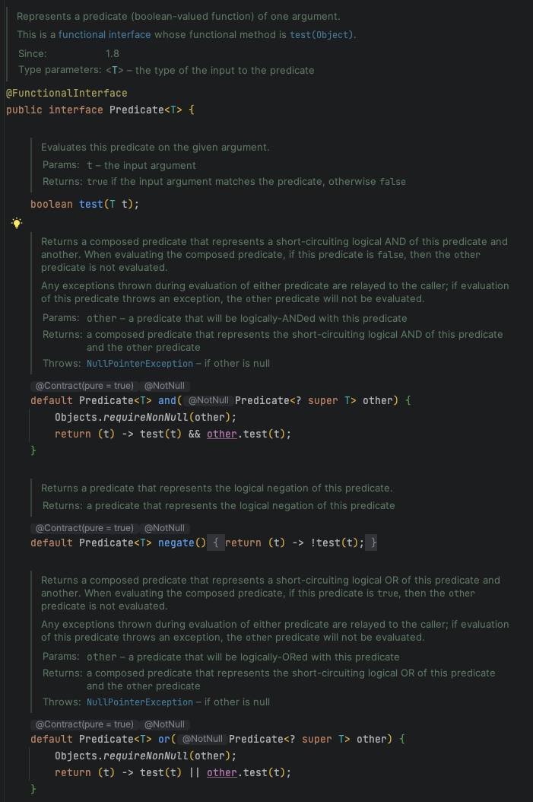
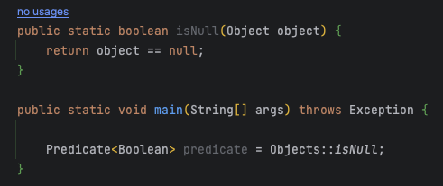
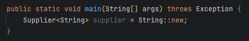

# Lamda, Functional Interface

# 람다식(Lambda Expression) 이란?

람다식이란 함수를 하나의 식으로 표현한 것. 함수를 람다식으로 표현하면 메소드의 이름이 필요 없기 때문에 람다식은 익명함수의 한 종류하고 볼 수 있다.

기존 함수와는 다르게 메소드 명이 필요하지 않으며, 괄호()와 화살표 → 를 이용해 함수를 선언하게 된다.

람다식이 등장하게 된 이유는 불필요한 코드를 줄이고, 가독성을 높이기 위함이다. 

함수형 인터페이스의 인스턴스를 생성하여 함수를 변수처럼 선언하는 람다식에서는 메소드의 이름이 불필요하다고 여켜져 이를 사용하지 않고 대신 컴파일러가 문맥을 살펴 타입을 추론한다.

## 람다식의 특징

1. 람다식 내에서 사용되는 지역변수는 final이 붙지 않아도 상수로 간주된다.
2. 람다식으로 선언된 변수명은 다른 변수명과 중복될 수 없다.

## 람다식의 장점

1. 코드를 간결하게 만들 수 있다.
2. 식에 개발자의 의도가 명확히 드러나 가독성이 높아진다.
3. 함수를 만드는 과정없이 한번에 처리할 수 있어 생산성이 높아진다.
4. 병렬프로그래밍이 용이하다.

## 람다식의 단점

1. 람다를 사용하면서 만든 익명함수는 재사용이 불가능하다.
2. 디버깅이 어렵다.
3. 람다를 남발하면 비슷한 함수가 중복 생성되어 코드가 지저분해질 수 있다.
4. 재귀로 만들경우 부적합하다.

# 함수형 인터페이스(Functional Interface) 란?

자바는 순수 함수와 일반 함수를 다르게 취급하고 있으며, 자바에서는 이를 구분하기 위해 함수형 인터페이스가 등장하였다. 함수형 인터페이스란 함수를 1급 객체처럼 다룰 수 있게 해주는 어노테이션으로, 인터페이스에 선언하여 단 하나의 추상 메소드만을 갖도록 제한하는 역학을 한다. 자바의 람다식은 함수형 인터페이스를 반환한다.

함수형 인터페이스를 구현하기 위해서는 인터페이스를 개발하여 내부에는 1개 뿐인 abstract 함수를 선언하고, 위에는 @FunctionalInterface 어노테이션을 붙여주면 된다.

람다식으로 생성된 순수 함수는 함수형 인터페이스로만 선언이 가능하다. @FunctionalInterface 어노테이션이 붇은 인터페이스에 여러 개의 함수를 선언하면 컴파일 에러가 발생한다.

# Java에서 제공하는 함수형 인터페이스

### 1. Supplier<T>

Supplier는 매개변수 없이 반환값 만을 갖는 함수형 인터페이스다.

Supplier는 T get()을 추상 메소드로 갖고 있다.

Supplier 정의

Supplier 사용예시

### 2. Consumer<T>

Consumer는 객체 T를 매개변수로 받고, 반환값은 없다.

addThen이라는 함수를 제공하는데, 이를 통해 하나의 함수가 끝난 후 다음 Consumer를 연쇄적으로 이용할 수 있다. 함수형에서 함수는 값의 대입 또는 변경 등이 없기 때문에 아래 예시에서 Consumer가 Split으로 데이터를 변경하더라고 원본의 데이터는 유지된다.

Consumer 정의

실행 결과

### Function <T, R>

Function은 객체 T를 매개변수로 받아서 처리한 후 R로 반환한다. Consumer와 마찬가지로 andThen을 제공하고 있고, 추가적으로 compose를 제공한다. andThen은 첫번째 함수가 실행된 이후 다음 함수를 연쇄적으로 실행하도록 연결해주지만 compose는 첫 번째 함수 실행 이전에 먼저 함수를 실행하여 연쇄적으로 연겨해준다는 점에서 차이가 있다. identity 함수의 경우 자기 자신을 반환하는 static함수다.

Function 정의

사용예시

출력해보면 5가 나오는 것을 확인할 수 있다.

### Predicate <T>

Predicate는 객체 T를 매개 변수로 받아 처리한 후 boolean을 반환한다.

Predicate는 Boolean test(T t) 추상 메소드로 갖고 있다.

Predicate 정의1

Predicate 정의2

사용예시

출력결과로 true가 나오는 것을 확인할 수 있다.

### 메소드 참조 (Method Reference)

함수형 인터페이스를 람다식이 아닌 일반 메소드를 참조시켜 선언하는 방법. 일반 메소드를 참조하기 위해 3가지 조건을 만족해야 한다.

- 함수형 인터페이스의 매개변수 타입 = 메소드의 배개변수 타입
- 함수형 인터페이스의 매개변수 개수 = 메소드의 매개변수 개수
- 함수형 인터페이스의 반환형 = 메소드의 반환형

참조가능한 메소드는 일반 메소드, static, 생성자가 있고 클래스이름::메소드이름 으로 참조할 수 있다.

### 일반 메소드 참조

일반 메소드 참조 예시

### Static 메소드 참조

static 메소드 참조 예시

### 생성자 참조

생성자도 메소드 참조를 할 수 있다. 생성자는 new로 생성해주므로 클래스이름 ::new로 참조할 수 있다.

자료 출처: [https://mangkyu.tistory.com/113](https://mangkyu.tistory.com/113)