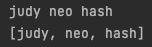
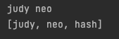
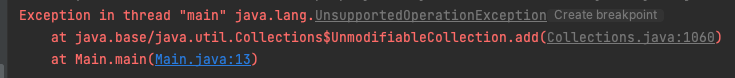

> [해당 포스팅](https://hello-judy-world.tistory.com/209)에서도 내용을 확인할 수 있습니다.

> written by [judy](https://github.com/ParkJungYoon)

## 🎇 Mutable, Immutable

자바는 new 연산자로 객체를 생성힐 수 있고, 이때 heap 영역에 할당되고 stack 영역에서 참조 타입 변수를 통해 데이터에 접근한다.

이때 자바의 객체의 타입은 두 가지 있다.

**`Mutable`**(가변) 객체와 **`Immutable`** (불변) 객체이다.

### ✔️ Immutable(불변) 객체

- `정의`: 객체 생성 이후에는 객체의 상태가 바뀌지 않는 객체
- `불변 객체 종류`: String, Boolean,Integer,Float,Long 등
- String을 제외하고 원시 타입의 wrapper 타입이다.

> 🤖 : 오잇! 나 String 타입 변경한 적 있는 거 같은데?

> 🐰 : 오.. 이 상황을 말하는 거야?

```java
String name = "정윤";
name = "jeongyoon";

System.out.println(name); // jeongyoon
```

이때 name이 jeongyoon으로 변경된 듯 보인다. 하지만 실제로는 객체의 값이 변경된 것이 아니라 새로운 객체를 생성하고 이 객체에 대한 참조값을 변경한 것이다.

<br>

### 🧐 불변 객체는 왜 사용할까요?

> 클래스들은 가변적이어야 하는 매우 타당한 이유가 있지 않는 한 반드시 불변으로 만들어야 한다. 만약 클래스를 불변으로 만드는 것이 불가능하다면, 가능한 변경 가능성을 최소화하라. <br>- Effective Java

1. 단순하다.
    - 불변 객체의 상태는 생성된 시점으로부터 파괴되는 시점까지 그대로 유지된다.

2. (일반적으로) 스레드 안정성(Thread Safety) 보장
    - multi-thread 환경에서 동기화 문제가 발생하는 이유는 공유 자원에 동시 쓰기 연산 때문이다. 이때 불변 객체라면, 항상 동일한 값만 반환한다.
    - multi-thread 환경에서 동기화 처리 없이 객체 공유가 가능하다.

3. 값의 변경을 방지 
    - 불변객체는 생성 시점에 값을 설정한 후, 변경할 수 없기 때문에 예기치 않은 값 변경을 방지할 수 있다.

4. 불변 객체는 객체의 필드로 사용
    - 불변 객체를 필드로 사용하면 방어적 복사를 할 필요가 없다.

<br>

### ✔️ String, StringBuilder, StringBuffer

1. **String** (`Immutable` 객체)

String은 대표적인 Immutable 객체로 읽을 수만 있고 변경은 할 수 없다. (ReadOnly)

이러한 특징 때문에 mutable 객체인 StringBuilder와 StringBuffer를 자주 사용한다.

StringBuilder와 StringBuffer의 차이점은 **동기화 지원 유무**이다.


2. **StringBuilder** (`Mutable` 객체)

StringBuilder는 단일 스레드 환경에서만 사용하도록 설계되어 있다.

3. **StringBuffer** (`Mutable` 객체)

StringBuffer는 각 메사드 별로 synchronized keyword가 존재하여 멀티 스레드 상태에서 동기화를 지원한다.

<br>

### ✔️ 불변 객체 구현

#### 1. 생성자를 제외하고 객체의 상태를 변경하는 메서드(ex. setter)를 사용하지 않는다.

#### 2. 클래스를 확장할 수 없도록 한다.

final 클래스로 선언 등의 방법으로 상속을 막는다.

#### 3. 모든 필드를 private final로 선언한다.

#### 4. 자신 외에는 내부의 가변 컴포넌트에 접근할 수 없도록 한다.

클래스에 가변 객체를 참조하는 필드가 하나라도 있다면, 클라이언트가 그 객체의 참조를 그대로 반환받도록 하지 말고 방어적 복사를 수행해야 한다.

<br>

### ✔️ 방어적 복사 vs Unmodifiable Collection

### [ 방어적 복사 ]

- `의미`: 생성자의 인자로 받은 객체의 복사본을 만들어 내부 필드를 초기화하거나, getter 메서드에서 내부의 객체를 반환할 때, 객체의 복사본을 반환하는 것을 말한다.
- `장점`: 방어적 복사를 사용하면 외부에서 객체를 변경해도 내부의 객체는 변경되지 않는다.

#### 1. (예시) 방어적 복사를 하지 않을 때

- Name 클래스

```java
public class Name {
    private final String name;

    public Name(String name) {
        this.name = name;
    }
}
```

- Names 클래스 (일급 컬렉션)
    - List\<Name>를 가지고 있다.

```java
import java.util.List;

public class Names {
    private final List<Name> names;

    public Names(List<Name> names) {
        this.names = names;
    }
}
```

그리고 만약 아래와 같은 상황이 있다.

originalNames로 judy, hash를 넣어서 리스트를 만들었다.

그리고 이 리스트로 Names 클래스의 객체 crewNames를 생성했다. 이때 originalNames에 neo를 추가하면 crewNames에도 neo가 추가된다.

주소 값을 공유하고 있기 때문에 이런 상황이 발생한다.

```java
import java.util.ArrayList;
import java.util.List;

public class Application {
    public static void main(String[] args) {
        List<Name> originalNames = new ArrayList<>();
        originalNames.add(new Name("judy"));
        originalNames.add(new Name("hash"));
        
        Names crewNames = new Names(originalNames); // crewNames의 names: judy, hash
        originalNames.add(new Name("neo")); // crewNames의 names: judy, hash, neo
    }
}
```

<br>

#### 2. (예시) 방어적 복사를 한 경우

기존에는 생성자에서 인자를 받고 바로 초기화했다면

```java
public Names(List<Name> names) {
    this.names = names;
}
```

방어적 복사를 하는 경우에는 생성자에서 인자를 받으면서 `new ArrayList<>()`를 이용해 만든 복사본으로, 필드 names를 초기화한다.

```java
import java.util.ArrayList;
import java.util.List;

public class Names {
    private final List<Name> names;

    public Names(List<Name> names) {
        // 방어적 복사
        this.names = new ArrayList<>(names);
    }
}
```

복사본으로 초기화하여 원본 값과 주소 공유를 끊었기 때문에 더 이상 외부 값 변경에 따라 변하지 않는다.

<br>

#### 3. 🧐 방어적 복사는 깊은 복사일까?

> 🐰: 아니다!!

컬렉션의 주소만 바뀌었을 뿐 내부 요소들은 여전히 주소를 공유하고 있다.

즉, <u>원본의 내부 요소를 바꾸면 복사본도 바뀌게 된다.</u>

💡 그래서 외부로부터의 변경에 취약하지 않도록 객체를 불변으로 만들고자 한다면 **내부 요소들 또한 불변**이어야 한다.

<br>

#### 4. 🧐 reference 타입이나 collection은 final이면 불변일까?

> 🐰: 아니다!!

위의 예시에서 객체를 생성할 때 **방어적 복사**를 통해 외부 참조를 끊었다. 또한 `names` 필드를 private final로 선언하여 재할당이 불가능하다. 또한 현재 상태를 변화시킬 수 있는 로직 또한 없다.

재할당이 불가능한 것은 맞지만 불변인 것은 아니다.

다음 예시를 보자.

```java
List<Name> names = new ArrayList<>();
names.add(new Name("judy"));
names.add(new Name("neo"));
Names baseNames = new Names(names);

List<Name> getNames = baseNames.getNames();
getNames.add(new Name("hash"));

System.out.println(baseNames.toString());
System.out.println(getNames.toString());
```

baseNames 객체를 생성할 때 방어적 복사를 했다. 그리고 외부로 getter로 꺼낸 `names`는 add 메서드를 통해 값이 변화한다.

getter로 꺼낸 getNames를 변화시키면 기존 객체의 상태가 변하게 된다.

<div align='center'>
    
</div>

<br>

💡 이를 해결하기 위해서는 <u>반환하는 경우에도 방어적 복사를 하거나</u>, List 자체를 불변으로 만들기 위해서는 <u>Collections.unmodifiableList</u>와 같은 불변 자료구조로 만들어주어야 한다.

<br>

```java
public List<Name> getNames() {
    // 방어적 복사
    return new ArrayList<>(names);
}
```

<div align='center'>
    
</div>

<br>

### [ Unmodifiable Collection ]

- 외부에서 변경 시 **예외처리**되기 때문에 안전하게 보장할 수 있다.
- 즉, getter로 값을 꺼내도 데이터를 수정할 수 없다.

이렇게 반환한 값은

```java
public List<Name> getNames() {
    return Collections.unmodifiableList(names);
}
```

<br>

값을 수정하려고 하면 에러가 발생한다.

```java
List<Name> getNames = baseNames.getNames();
getNames.add(new Name("hash"));
```

<div align='center'>
    
</div>

<br>

### 결론

> 클래스들은 가변적이어야 하는 매우 타당한 이유가 있지 않는 한 반드시 불변으로 만들어야 한다. 만약 클래스를 불변으로 만드는 것이 불가능하다면, 가능한 변경 가능성을 최소화하라. <br>- Effective Java

<br>

🧐 방어적 복사와 Unmodifiable Collection는 언제 사용해야 할까?

#### 1. 생성자의 인자로 객체를 받았을 때

- 외부에서 넘겨줬던 객체를 변경해도 내부의 객체는 변하지 않아야 한다.
- **`방어적 복사`**

#### 2. getter를 통해 객체를 리턴할 때

-  **`방어적 복사`** 또는 **`unmodifiableList`** 반환 중 선택

<br>

---

### 📢 같이 공부하면 좋을 면접 질문

- Mutable 객체와 Immutable 객체의 차이점에 대해 설명해주세요.
- 불변 객체는 왜 사용할까요?
- String, StringBuilder, StringBuffer 각각의 차이에 대해 설명해주세요.
- 불변 객체의 장점을 설명해주세요.
- 방어적 복사와 Unmodifiable의 차이점은 무엇인가요?
- 방어적 복사를 사용하면 항상 불변성을 보장하나요?
- 불변 객체는 왜 사용할까요?

---

### 📌 Reference

- [[Tecoble] 방어적 복사와 Unmodifiable Collection](https://tecoble.techcourse.co.kr/post/2021-04-26-defensive-copy-vs-unmodifiable/)
- [이펙티브 자바 아이템 17] 변경 가능성을 최소화하라