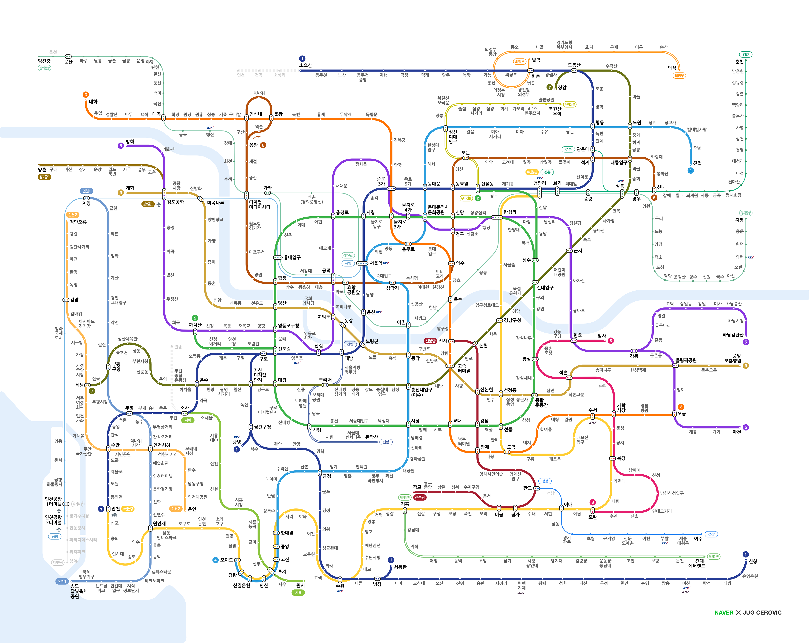
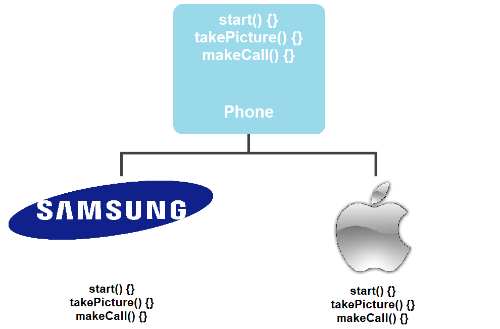
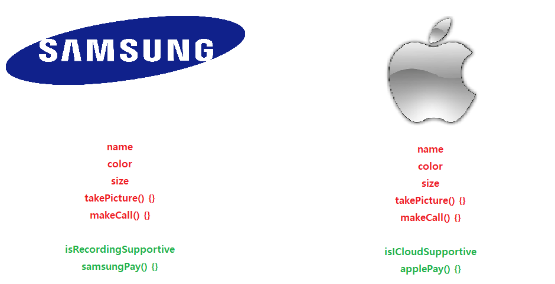
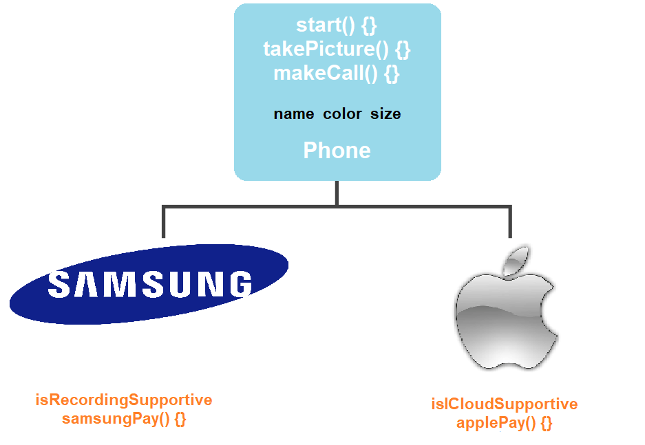
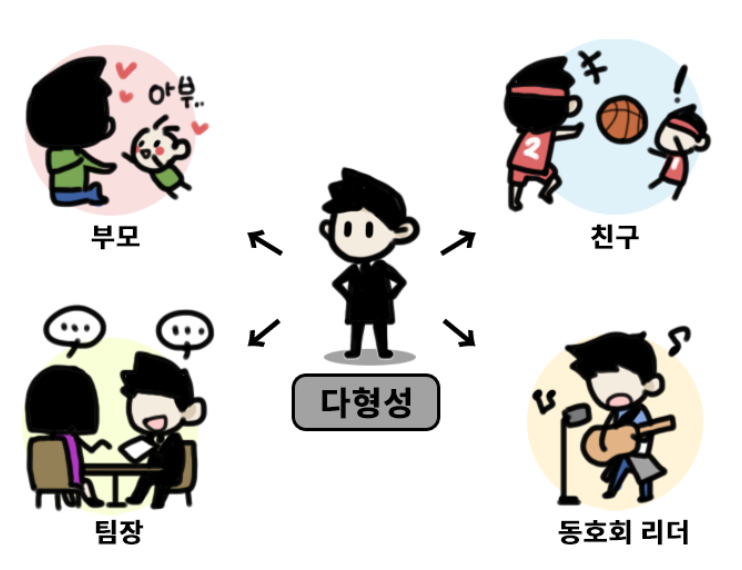

## 객체 지향 프로그래밍(Object-Oriented Programming, OOP)
- `정의` : 프로그래밍에서 필요한 데이터를 추상화시켜, **상태와 행위를 가진 객체**로 만들고, 객체들의 유기적인 결합과 협력으로 파악하고자 하는 컴퓨터 프로그래밍의 패러다임을 의미

### 객체 지향 프로그래밍의 장점
- 프로그램을 유연하고 변경이 용이하게 만들 수 있다  
    - ex) 컴퓨터 부품 변경 시, 나머지 부품을 건들지 않고도 변경 가능한 예

- 인간 친화적이고 직관적인 코드 작성에 용이하다

## 객체(Object)
- `정의` : 객체 지향 프로그래밍의 가장 기본적인 단위이자 시작점

```
class Phone {
    //속성 정의
    String model;
    String color;
    int size;
    boolean isRecordingSupportive;

    //기능 정의
    void start() {
        System.out.println("전원을 켭니다");
    }

    void takePicture() {
        System.out.println("사진을 찍습니다.");
    }

    void makeCall() {
        System.out.println("전화를 겁니다.)"
    }
}
```

객체 지향 프로그래밍에서는 예제에서와 같은 객체를 추상화시켜 속성(state)과 기능(behavior)로 분류하여 각각 변수(variable)와 함수(function)으로 정의합니다.

### 객체 지향 프로그래밍의 4가지 특성
객체 지향 프로그래밍을 통해 소프트웨어를 개발하면 코드를 재사용함으로써 반복적인 코드 최소화, 유연하고 변경에 용이한 프로그램 개발이 가능하다  

이러한 설계는 객체 지향 프로그래밍의 4가지 특징에 기인한다

### [ 추상화(Abstraction) ]
- `정의` : 객체의 공통적인 속성과 기능을 추출하여 정의하는 것
- `예시` : 서울 지하철 노선도

<div align='center'>
    
</div>

중요한 부분을 강조하기 위해 불필요한 사항들은 제거하고 **공통적인 부분만을 추출하여 간단하게 표현** 하였다  

<div align='center'>
    
</div>

위 그림 속 예시를 보면, `Galaxy`와 `IPhone` 모두 `휴대폰` 이며 **그림 찍기와 전화 걸기를 할 수 있다는 공통점**을 가진다  

이는 자바 문법 요소를 이용하여 표현하면, `Galaxy`와 `IPhone`은 상위 클래스(super-class)인 `Phone`을 상속하는 하위 클래스(sub-class)이며 상위 클래스가 지닌 `휴대폰의 기능`을 공통적으로 지니고 있다  

객체 지향 설계에 있어 인터페이스란, 특정 객체의 역할만을 정의하여 객체들 간 관계를 유연하게 연결하는 역할을 담당한다  

```
public interface Phone {
    public abstract void start()
    void takePicture();
    void makeCall();
}
```
`Galaxy`와 `IPhone`의 공통적인 기능들을 모아둔 `Phone` 인터페이스이다  

`Phone` 인터페이스는 `Galaxy`와 `IPhone`이 공통적으로 수행해야하는 핵심적인 기능들만 규정하였다  

보다 실질적인 구현은 `Phone` 인터페이스를 구현하는 `Galaxy`와 `IPhone` 객체에서 이루어진다  

```
public class Galaxy implements Phone {
    @Override
    public void takePicture() {
        System.out.println("갤럭시로 사진을 찍습니다");
    }

    @Override
    public void makeCall() {
        System.out.println("갤럭시로 전화를 겁니다");
    }
}

public class IPhone implements Phone {
    @Override
    public void takePicture() {
        System.out.println("아이폰으로 사진을 찍습니다");
    }

    @Override
    public void makeCall() {
        System.out.println("아이폰으로 전화를 겁니다");
    }
}
```

위 예제에서도 알 수 있다싶이, `Phone` 인터페이스를 구현하는 `Galaxy` 클래스와 `IPhone` 클래스에서 각각의 클래스 맥락에 맞게 인터페이스에서 정의한 역할을 구현하고 있다  

이를 객체 지향 프로그래밍에서는 **역할과 구현의 분리** 라고 한다

### [ 상속(Inheritance) ]
- `정의` : 기존의 클래스를 재활용하여 새로운 클래스를 작성하는 자바 문법 요소

앞의 예제를 변형하여 상속의 맥락에서 생각해보자
<div align='center'>
    
</div>

위 그림을 보면 갤럭시와 아이폰의 기능이 명시되어 있으며 빨간색으로 표시된 속성과 기능들은 갤럭시와 아이폰의 공통적인 기능이고, 초록색으로 표시된 부분들은 그렇지 않은 부분이다  

이를 코드로 표현해보면 다음과 같다

```
public class Galaxy {

    String model;
    String color;
    int size;
    
    //Galaxy 클래스 고유한 속성
    boolean isRecordingSupportive; 

    void takePicture() {
        System.out.println("사진을 찍습니다");
    }

    void makeCall() {
        System.out.println("전화를 겁니다");
    }

    //Galaxy 클래스 고유의 기능
    void samsungPay() {
        System.out.println("삼성 페이로 지불합니다");
    }
}

public class IPhone {
    
    String model;
    String color;
    int size;

    //IPhone 클래스 고유한 속성
    boolean isICloudSupportive;

    void takePicture() {
        System.out.println("사진을 찍습니다");
    }

    void makeCall() {
        System.out.println("전화를 겁니다");
    }

    //IPhone 클래스 고유의 기능
    void applePay() {
        System.out.println("애플 페이로 지불합니다");
    }
}
```

위 코드 예제를 보면, 속성(model, color, size)과 기능(takePicture(), makeCall())이 동일함에도 불구하고 반복적으로 구현되고 있음을 확인가능하다  

 또한 하나의 코드에서 변경 사항이 발생하면, 해당 변경 사항을 다른 클래스에도 일일히 수정해주어야 하는 번거러움이 존재한다  

 아래 그림과 코드는 추상화와 상속을 활용하여 재정의한 모습이다
<div align='center'>
    
</div>

```
//추상화를 통한 상위클래스 정의
public class Phone { 
    String model;
    String color;
    int size;

    void takePicture() {
        System.out.println("사진을 찍습니다");
    }

    void makeCall() {
        System.out.println("전화를 겁니다");
    }
}

public class Galaxy extends Phone {

    boolean isRecordingSupportive;

    void samsungPay() {
        System.out.println("삼성 페이로 지불합니다");
    }
}

public class IPhone extends Phone {

    boolean isICloudSupportive;

    //메서드 오버라이딩 -> 기능 재정의
    @Override
    void takePicture() {
        System.out.println("아이폰으로 사진을 찍습니다");
    }


    void applePay() {
        System.out.println("애플 페이로 지불합니다");
    }
}

public class Main {
    public static void main(String[] args) {

        //객체 생성
        Phone phone = new Phone();
        IPhone IPhone = new IPhone();

        //phone 객체 속성 정의
        phone.model = "갤럭시S20";
        phone.color = "하늘색";

        System.out.println("나의 휴대폰은 " + phone.color + " " + phone.model + "입니다.");

        //객체들의 기능 실행
        phone.takePicture();
        IPhone.takePicture();
        IPhone.makeCall();
    }
}

```

**출력값**
> 나의 휴대폰은 하늘색 갤럭시S20입니다.  
사진을 찍습니다  
아이폰으로 사진을 찍습니다  
아이폰으로 전화를 겁니다

위 코드 예제를 보면, `Galaxy`와 `IPhone` 클래스의 공통적인 속성 및 기능들을 추출(추상화) 하여 `Phone` 클래스(상위 클래스)에 정의하였고, `extends` 키워드를 통해 상위 클래스의 기능들을 하위 클래스로 확장하여 반복적인 코드를 제거하였다  

또한, 코드 변경이 있을 시, 상위 클래스의 코드만 변경하면 이를 상속하는 하위 클래스들도 변경 사항이 반영된다  

`IPhone` 클래스에서 확인할 수 있듯이, 오버라이딩 기능을 사용하여 메소드 내용을 재정의 할 수도 있다  

이를 통하여 알 수 있는 점은, 인터페이스를 통한 구현과 클래스들 간의 상속 모두 상위-하위 클래스 관계를 전제하여 공통 속성 및 기능을 공유하지만, 상속의 경우 오버라이딩을 사용하여 메서드를 재정의 가능한 반면, 인터페이스를 이용한 구현은 인터페이스 내 정의된 추상 메서드 내용이 하위 클래스에서 정의되어야 한다 

결론적으로, 상속 관계가 인터페이스를 사용한 구현에 비해 추상화 정도가 낮다

### [ 다형성(Polymorphism) ]
- `정의` : 어떤 객체의 속성이나 기능이 상황에 따라 여러 가지 형태를 가질 수 있는 성질
- `예시` : 메서드 오버라이딩, 메서드 오버로딩
<div align='center'>
    
</div>

```
public interface Phone {
    public abstract void start()
    //public abstract 키워드 생략 가능
    void takePicture();
    void makeCall();
}

public Galaxy implements Phone {
    
    @Override
    public void takePicture() {
        System.out.println("갤럭시로 사진을 찍습니다");
    }

    @Override
    public void makeCall() {
        System.out.println("갤럭시로 전화를 겁니다");
    }
}

```

위 코드에서 확인할 수 있다싶이, 메서드 오버라이딩을 활용하여 `Phone` 인터페이스를 구현하는 `Galaxy` 클래스 내 메소드 `takePicture()` 과 `makeCall()`이 각각의 맥락과 상황에 맞게 구현되어 있는걸 확인할 수 있다

메서드 오버로딩 또한 하나의 클래스 내에서 같은 이름의 메서드를 여러 개 중복하여 정의한다는 점에서 같은 맥락이라 할 수 있다

메서드 오버로딩, 오버라이딩도 물론 중요한 다형성의 예시들이지만, 객체 지향적 의미에서 다형성이 의마하고자 하는 바는 아래와 같다
> 다형성이란 한 타입의 참조변수를 통하여 여러 타입의 객체를 참조할 수 있도록 만든 것을 의미  
ex) 상위 클래스 타입의 참조변수로 하위 클래스 객체 참조

```
public class Main {
    public static void main(String[] args) {
        //원래 사용했던 객체 생성 방식
        Phone phone = new Phone();
        Galaxy galaxy = new Galaxy();

        //다형성을 활용한 객체 생성 방식
        Phone galaxy = new Galaxy();
    }
}
```

위 코드 예제에서 확인할 수 있듯이, 기존 방식은 하위 클래스 객체를 생성하여 하위 클래스 타입의 참조변수에 할당하였지만, 다형성을 활용한 객체 생성 방식은 하위 클래스 객체를 생성하여 상위 클래스 타입의 참조변수에 할당한 모습을 볼 수 있다

```
public class Main {
    public static void main(String[] args) {

        //상위 클래스 타입의 객체 배열 생성
        Phone[] phones = new Phone[2];
        phones[0] = new Galaxy();
        phones[1] = new IPhone();

        for(Phone phone : phones) {
            System.out.println(phone.getClass());
        }
    }
}

```

**출력값**
> class Galaxy  
class IPhone  

자바에서의 배열은 하나의 같은 타입으로만 이루어져 있는 자료구조인데, 다형성을 활용하면 하나의 타입만으로 여러 가지 타입의 객체를 참조할 수 있다  

즉, 보다 간편하고 유연하게 코드를 작성가능하다  

```
public class Client {

    void usePhone(Galaxy galaxy) {
        galaxy.takePicture();
        galaxy.makeCall();
    }
    
    void usePhone(IPhone iphone) {
        iphone.takePicture();
        iphone.makeCall();
    }


}

public class Main {
    public static void main(String[] args) {

        Galaxy galaxy = new Galaxy();
        IPhone iphone = new Iphone();
        Client client = new Client();

        client.usePhone(galaxy);
        client.usePhone(iphone);

    }
}

```

**출력값**
> 갤럭시로 사진을 찍습니다  
갤럭시로 전화를 겁니다  
아이폰으로 사진을 찍습니다  
아이폰으로 전화를 겁니다

위 코드 속 `Client` 클래스는 매개변수로 갤럭시나 아이폰을 받아 기능을 수행한다  

이렇게 하나의 객체가 다른 객체의 속성 및 기능에 접근하여 어떤 기능을 사용할 때 `의존한다` 라고 표현한다  

즉, `Client` 객체는 `Galaxy`와 `IPhone` 클래스에 의존하고 있다  

이는 다른 말로 `객체 간 결합도가 높다` 라고 표현한다  

하지만 객체들 사이 결합도가 높으면 전달받는 매개변수가 변경되는 경우와 같이 메서드 내 매개변수의 참조변수 타입과 참조변수를 수정할 수 밖에 없는 예가 발생한다  

이에 추상화, 상속, 다형성의 특성들을 활용하여 역할과 구현을 구분하여 객체들 간 강한 결합을 피하고, 느슨한 관계 설정을 통해 유연하고 변경에 용이한 프로그램 설계를 해야한다  

```
public interface Phone {
    void takePicture();
    void makeCall();
}

public class Galaxy implements Phone {

    @Override
    public void takePicture() {
        System.out.println("갤럭시로 사진을 찍습니다)"
    }

    @Override
    public void makeCall() {
        System.out.println("갤럭시로 전화를 겁니다");
    }
}

public class IPhone implements Phone {

    @Override
    public void takePicture() {
        System.out.println("아이폰으로 사진을 찍습니다");
    }

    @Override
    public void makeCall() {
        System.out.println("아이폰으로 전화를 겁니다");
    }
}

public class Client {
    void usePhone(Phone phone) {
        phone.takePicture();
        phone.makeCall();
    }
}

public class Main {
    public static void main(String[] args) {
        Galaxy galaxy = new Galaxy();
        IPhone iphone = new IPhone();
        Client client = new Client();

        client.usePhone(galaxy);
        client.usePhone(iphone);
    }
}

```

**출력값**
> 갤럭시로 사진을 찍습니다  
갤럭시로 전화를 겁니다  
아이폰으로 사진을 찍습니다  
아이폰으로 전화를 겁니다

위 코드 속, Client 클래스를 보면, 전달받는 매개변수를 인터페이스 타입인 `Phone`으로 변경한 것을 확인할 수 있다  

이에 `Phone`인터페이스를 구현하는 어떤 클래스가 매개변수로 전달되어도 상황과 맥락에 맞는 클래스가 오버라이딩한 메서드를 실행가능하다  

즉, 인터페이스를 통해 간접적으로 연결하였기에 `결합도가 낮아졌다` 라고 말할 수 있다 

### [ 캡슐화(Encapsulation) ]
- `정의` : 클래스 안에 서로 연관있는 속성과 기능들을 하나의 캡슐(capsule)로 만들어 외부로부터 보호하는 것을 의미

<div align='center'>
    
</div>

객체 지향 프로그래밍에서 캡슐화를 하는 이유
- 데이터 보호(data protection) : 외부로부터 클래스에 정의된 속성과 기능들을 보호
- 데이터 은닉(data hiding) : 내부의 동작을 감추고 외부에는 필요한 부분만 노출

<div align='center'>
    
</div>

```
package sanghyukpackage;

class Test {
    public static void main(String[] args) {
        SuperClass superClass = new SuperClass();

//      System.out.println(parent.a);
        System.out.println(superClass.b);
        System.out.println(superClass.c);
        System.out.println(superClass.d);
    }
}

public class SuperClass {
    private int a = 1;
    int b = 2;
    protected int c = 3;
    public int d = 4;

    public void printVar() {
        System.out.println(a);
        System.out.println(b);
        System.out.println(c);
        System.out.println(d);
    }
}
```
**출력값**
> 2  
3  
4  

```
package sanghyukpackage2;

import sanghyukpackage.SuperClass;

class SubClass extends SuperClass {
    public void printVar() {
//      System.out.println(a);
//      System.out.println(b);
        System.out.println(c);
        System.out.println(d);
    }
}

public class Test2 {
    public static void main(String[] args) {
        SuperClass parent = new SuperClass();

//      System.out.println(parent.a);
//      System.out.println(parent.b);
//      System.out.println(parent.c);
        System.out.println(parent.d);
    }
}

```

```
public class Galaxy {
    
    String model;
    String color;

    public Galaxy(String model, String color) {
        this.model = model;
        this.color = color;
    }
    
    public void takePicture() {
        System.out.println("갤럭시로 사진을 찍습니다");
    }

    public void makeCall() {
        System.out.println("갤럭시로 전화를 겁니다");
    }

    public void samsungPay() {
        System.out.println("삼성 페이로 지불합니다");
    }
}

public class Client {

    private String name;
    private Galaxy galaxy;

    public Client(String name, Galaxy galaxy) {
        this.name = name;
        this.galaxy = galaxy;
    }

    public void usePhone() {
        galaxy.takePicture();
        galaxy.makeCall();
        galaxy.samsungPay();
    }
}

public class Main {
    public static void main(String[] args) {

        Galaxy galaxy = new Galaxy("갤럭시S20", "하늘색");
        Client client = new Client("댕이", galaxy);

        galaxy.usePhone();
    }
}
```

**출력값**
> 갤럭시로 사진을 찍습니다  
갤럭시로 전화를 겁니다  
삼성 페이로 지불합니다  

위 코드에는 치명적인 문제가 존재한다  
<details>
<summary>문제는 무엇일까요?</summary>
정답 : 객체 간 결합도가 높다  
Galaxy 클래스의 메서드에 변경이 생기면 Client 클래스의 usePhone() 메서드의 수정이 불가피하다
</details>

</br>

문제를 해결한 코드는 아래와 같다  
```
public class Galaxy {
    
    String model;
    String color;

    public Galaxy(String model, String color) {
        this.model = model;
        this.color = color;
    }
    
    private void takePicture() {
        System.out.println("갤럭시로 사진을 찍습니다");
    }

    private void makeCall() {
        System.out.println("갤럭시로 전화를 겁니다");
    }

    private void samsungPay() {
        System.out.println("삼성 페이로 지불합니다");
    }

    public void operate() {
        takePicture();
        makeCall();
        samsungPay();
    }
}

public class Client {
    
    private String name;
    private Galaxy galaxy;

    public Client(String name, Galaxy galaxy) {
        this.name = name;
        this.galaxy = galaxy;
    }

    public void usePhone() {
        galaxy.operate();
    }
}

public class Main {
    public static void main(String[] args) {

        Galaxy galaxy = new Galaxy("갤럭시S20", "하늘색");
        Client client = new Client("댕이", galaxy);

        galaxy.usePhone();
    }
}
```

**출력값**
> 갤럭시로 사진을 찍습니다  
갤럭시로 전화를 겁니다  
삼성 페이로 지불합니다  

---

### 📢 면접 질문들

- 객체 지향이 무엇인지에 대해 설명해주세요
- 객체 지향 프로그래밍의 장점은 무엇인가요
- 캡슐화는 무엇인가요

--- 

### 📌 Reference

- [[simplelearn] What is Encapsulation in Java and How to Implement It](https://www.simplilearn.com/tutorials/java-tutorial/java-encapsulation)
- [[최느님's blog] Java 접근제어자 (Access Modifier)](https://csw7432.tistory.com/entry/Java-%EC%A0%91%EA%B7%BC%EC%A0%9C%EC%96%B4%EC%9E%90-Access-Modifier)
- [[JONGMINFIRE.DEV] 객체지향 프로그래밍이란?](https://jongminfire.dev/%EA%B0%9D%EC%B2%B4%EC%A7%80%ED%96%A5-%ED%94%84%EB%A1%9C%EA%B7%B8%EB%9E%98%EB%B0%8D%EC%9D%B4%EB%9E%80)


