>스프링은 어떻게 실행시점에 빈을 주입할 수 있는 걸까요?  
>
>JPA의 Entity는 왜 꼭 기본 생성자를 가져야만 할까요?  
>
>위에 대한 질문을 Reflection을 공부하고 나면 자신있게 대답할 수 있다!


## 🪞Reflection이란?
- 구체적인 클래스 타입을 알지 못해도 그 클래스의 메소드, 타입, 변수들에 접근할 수 있도록 해주는 자바 API를 의미

Reflection이라는 단어의 사전적 의미 :
<div align='center'>
    
</div> 

자바 세상에서는 무엇이 어디에 반사되어 있는 것일까요?

실체 = Class
거울 = JVM 메모리 영역

<div align='center'>
    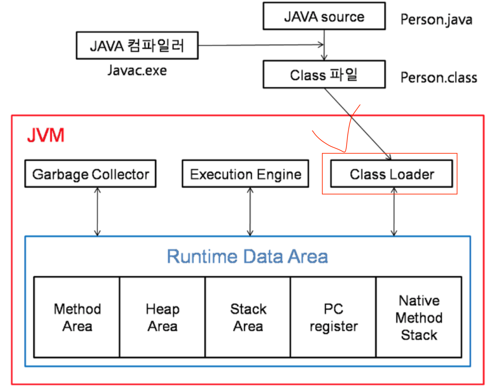
</div>

JVM은 클래스 정보를 클래스 로더를 통해 읽어와서 해당 정보를 JVM 메모리에 저장한다

힙 영역에 로드된 Class 타입의 객체를 통해, 원하는 클래스의 인스턴스를 생성할 수 있도록 지원  

Reflection 기능 지원하지 않는 언어들 :
C, C++, Pascal

### ✏️Class 클래스
- `Class 클래스`는 `java.lang` 패키지에서 제공되는 실행중인 자바 어플리케여션의 클래스와 인터페이스의 정보를 가진 클래스

- public 생성자가 존재하지 않는다

- Class 객체는 JVM에 의해 자동으로 생성된다

### Class의 기능들
1. 클래스에 붙은 어노테이션 조회
2. 클래스 생성자 조회
3. 클래스 필드 조회
4. 클래스 메서드 조회
5. 부모 클래스, 인터페이스 조회

### Class 객체 가져오기
1. **{클래스타입}.class**
```
Class<?> class = Cat.class;
```

2. **{인스턴스}.getClass()**
```
Cat 댕이 = new Cat("댕이");
Class<?> class = 댕이.getClass();
```

3. **Class.forName("{전체 도메인 이름}")**
```
Class<?> class = Class.forName("org.example.Cat");
```

### getMethods vs getDeclaredMethods
- getMethods : 상위 클래스와 상위 인터페이스에서 **상속한 메서드를 포함**하여 **public**인 메서드들을 모두 가져온다

- getDeclaredMethods : 접근 제어자와 관계 없이 상속한 메서드를 제외하고 **직접 클래스에서 선언한 메서드들**을 모두 가져온다


### 📒Java Reflection 사용 실습
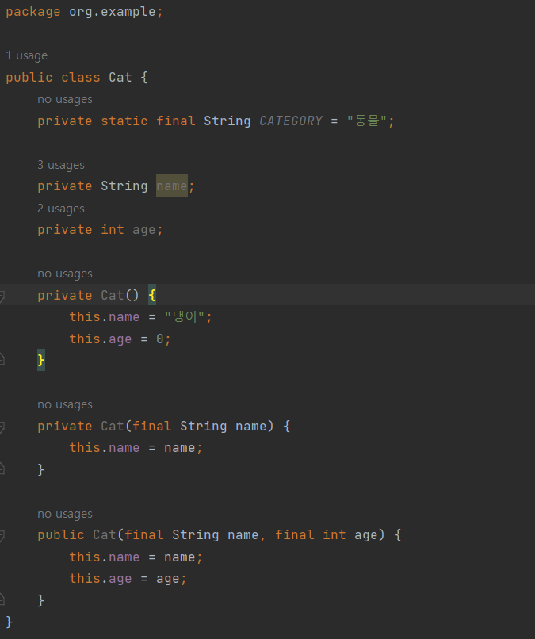  

- getDeclaredConstructor()를 이용해 클래스로부터 생성자를 가져온다

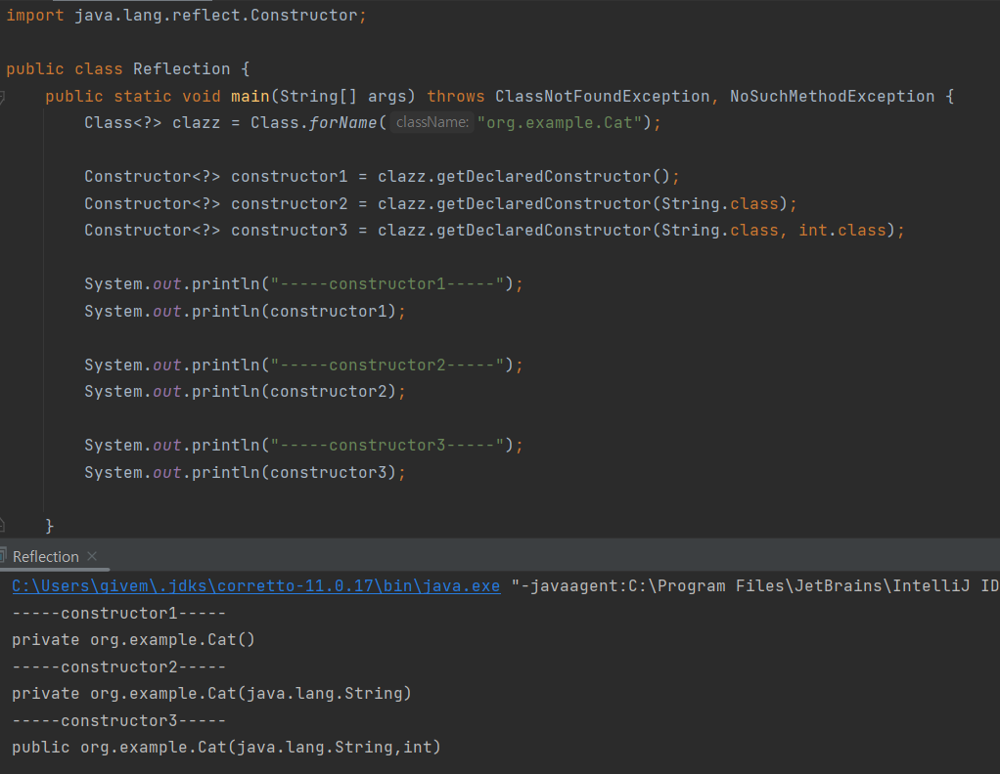  

- newInstance() 메서드를 사용하여 객체를 생성하려고 해도 private 생성자로 객체 생성을 막아 두었기에 UnHandledException이 발생한다  

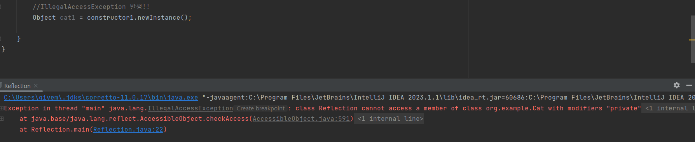

- setAccessible(true) 를 생성자들에게 적용함으로써 에러 없이 객체를 가져 올 수 있다

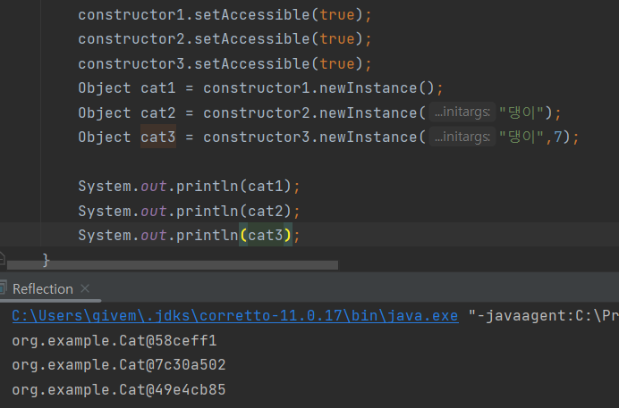

- getDeclaredFields() 메서드를 사용하여 Field 내 정보를 가져온다

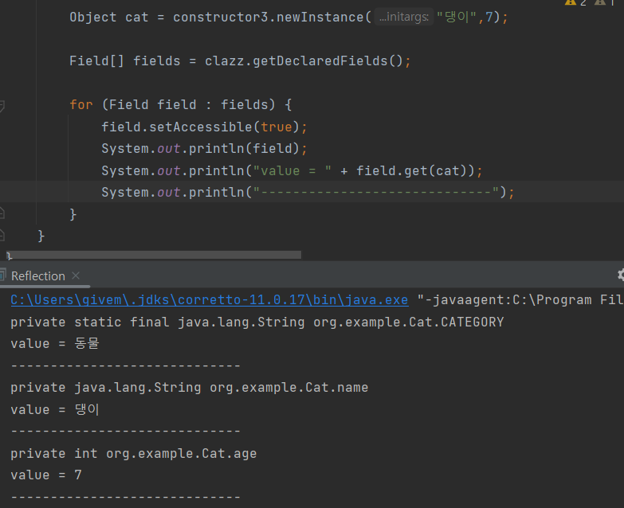

- getDeclaredField() 메서드를 사용하여 private 변수 값도 바꿀 수 있다

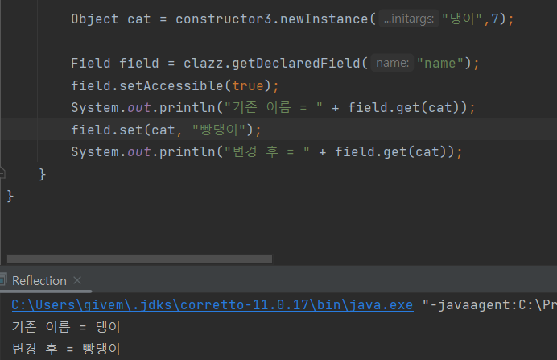

- Cat 클래스 메서드 추가

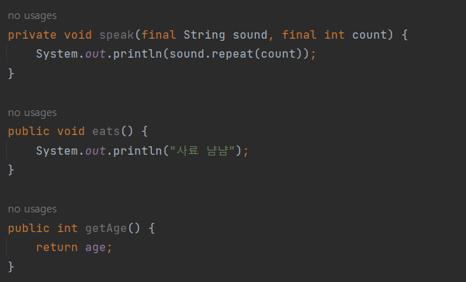

- getDeclaredMethods()를 사용하여 메서드 정보들을 가져온다

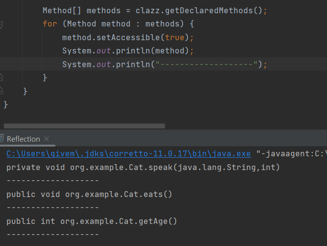

- invoke() 메서드를 사용하여 메서드를 호출한다

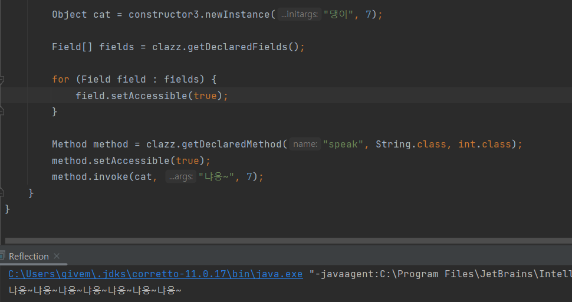

### Reflection 사용하는 곳은 어디??
- 프레임워크나 라이브러리에서 주로 사용됨

1. JPA
2. Jackson
3. Mockito
4. Intellij 자동완성 기능

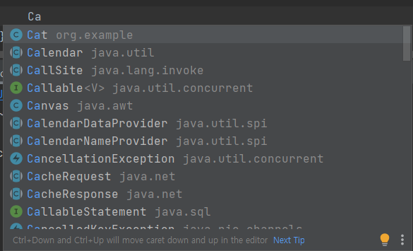

### 기본 생성자의 필요성
- JPA Entity, RequestDTO, ResponseDTO는 기본생성자를 필요로 한다

Reflection으로 객체를 생성가능한데, 생성자가 있는데 왜 또 기본 생성자가 필요로 해?  
**A) 기본 생성자로 객체를 생성하고, 필드를 통해 값을 넣어주는 것이 가장 간단한 방법이기 때문**

1. 어떤 생성자를 사용할지 고르기 힘들다

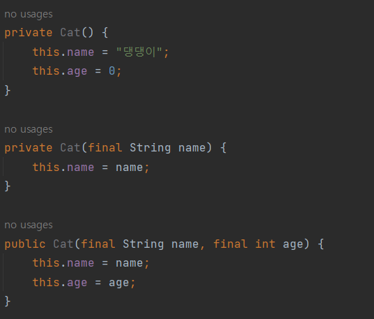

2. 생성자에 로직 있는 경우 원하는 값을 바로 넣어줄 수 없다  

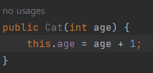

3. 파라미터들의 타입이 같은 경우, 필드와 이름이 다르면 값을 알맞게 넣어주기 힘들다  

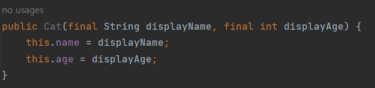  

기본 생성자를 사용할 경우 이 모든 경우의 수를 고려하지 않아도 된다  
기본 생성자로 객체를 생성 후 필드 이름에 맞춰 알맞은 값을 넣어주면 끝!!  

### 어노테이션은 어떻게 작동하나??
1. Reflection을 통해 클래스나 메서드, 파라미터 정보를 가져온다
2. Reflection의 getAnnotation(s), getDeclaredAnnotation(s)등의 메서드를 통해 원하는 어노테이션이 붙어있는지 확인한다
3. 어노테이션이 붙어 있다면 원하는 로직을 수행한다

### Reflection의 장단점

### 장점)
1. 런타임 시점에서 클래스의 인스턴스를 생성하고, 접근 제어자와 관계 없이 필드와 메서드에 접근하여 필요한 작업을 수행할 수 있는 유연성을 지님

### 단점)
1. 일반 메서드 호출보다 성능이 훨씬 떨어진다
    - Reflection API는 컴파일 시점이 아니라 런타임 시점에서 클래스를 분석하기에 JVM을 최적화 할 수 없기 때문에 성능 저하 발생

2. 컴파일 시점에서 타입 체크 기능을 사용할 수 없다
    - 컴파일 시점에 제공하는 type check 기능 사용 불가  

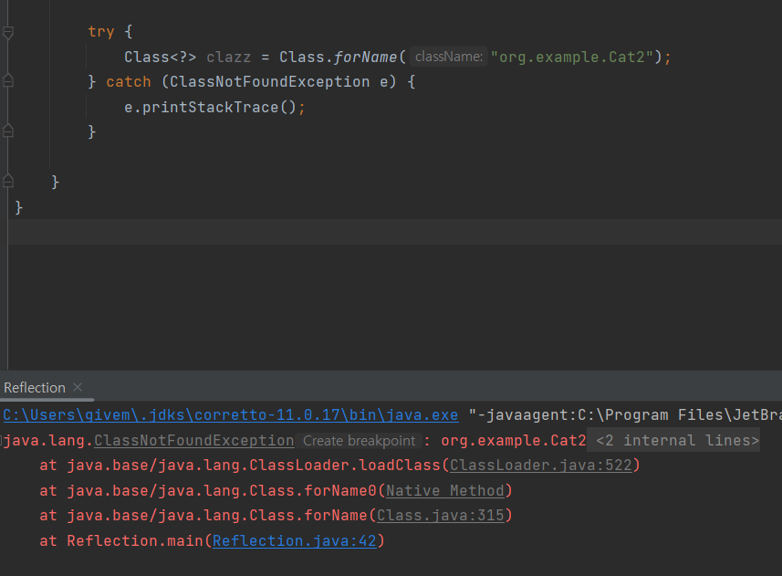

3. 코드가 지저분해지고 장황해진다
4. 내부를 노출해서 추상화를 파.괴.한.다  
    - 접근할 수 없는 필드, 메서드에 접근 가능하며 모든 클래스의 정보 확인 가능

### Reflection 사용 이유
1. 동적인 객체 생성: Reflection을 사용하면 런타임 시에 클래스의 인스턴스를 동적으로 생성할 수 있습니다. 클래스 이름을 동적으로 전달하여 객체를 생성할 수 있으며, 이는 유연한 객체 생성 패턴을 구현하는 데 도움이 됩니다.

2. 클래스 정보 조사: Reflection은 클래스의 메서드, 필드, 상위 클래스, 인터페이스 등의 정보를 동적으로 조사할 수 있습니다. 이를 통해 프로그램이 실행 중에 클래스의 구조를 분석하고 다양한 작업을 수행할 수 있습니다. 예를 들어, 특정 어노테이션을 가진 메서드를 찾거나, 클래스의 필드 값을 변경할 수 있습니다.

3. 동적 메서드 호출: Reflection을 사용하면 메서드의 이름과 매개변수를 동적으로 지정하여 메서드를 호출할 수 있습니다. 이는 일반적으로 알려지지 않은 클래스나 인터페이스와 상호작용해야 할 때 유용합니다. 예를 들어, 외부 라이브러리나 플러그인 시스템과의 통합에 활용할 수 있습니다.

4. 애노테이션 처리: Reflection을 사용하면 애노테이션 정보를 읽고 처리할 수 있습니다. 런타임 시에 애노테이션을 분석하여 특정 작업을 수행하거나, 애노테이션을 기반으로 동적으로 코드를 생성할 수 있습니다. 이는 프레임워크나 라이브러리에서 커스텀 애노테이션을 활용하여 기능을 확장하거나, 실행 중에 설정 정보를 처리하는 데 사용됩니다.

5. 리소스 접근: Reflection을 사용하면 클래스로더를 통해 리소스에 접근할 수 있습니다. 클래스 경로에 있는 파일이나 설정 파일 등을 동적으로 로드하여 사용할 수 있습니다.

### ⚠️ 주의 사항
- Reflection은 강력한 기능이지만, 실행 시간에 타입 검사를 회피하고 퍼포먼스 저하를 일으킬 수 있다 
- 코드의 복잡성을 증가시킬 수 있으므로 신중하게 사용해야 한다 
- 주로 프레임워크, 라이브러리, 개발자 도구 등의 개발에 활용되며, 일반적인 애플리케이션 개발에서는 Reflection을 적게 사용하는 것이 좋다

---

📢 면접 질문들
- 💡 리플렉션(Reflection)이란 무엇인지 설명해주세요
- 💡 리플렉션은 어떤 경우에 사용되는지 설명해주세요.

---
📌 Reference
- [슬기로운 개발생활](https://dev-coco.tistory.com/153)
- [10분 테코톡](https://www.youtube.com/watch?v=67YdHbPZJn4)
- [Oracle](https://www.oracle.com/technical-resources/articles/java/javareflection.html)
- [코오오딩](https://fbtmdwhd33.tistory.com/260)
