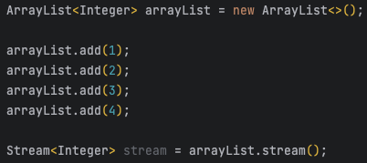
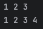

# Stream API

Java의 Stream API는 개체 컬렉션을 처리하는 강력한 도구. 개발자가 간결하고 읽을 수 있는 코드로 컬렉션에 대한 복잡한 작업을 수행할 수 있음. Stream API를 사용하면 기능적 프로그래밍 방식을 사용하여 데이터를 쉽게 필터링, 변환, 집계할 수 있음. 스트림은 병렬처리가 가능하도록 설계되었으므로 멀티 코어 프로세서를 활용하여 처리 속도를 높일 수 있음.

Stream API의 주요 기능

- **Functional programming:** 스트림은 함수형 프로그래밍 기술과 함께 사용되도록 설계 되어서 람다 식과 참조를 사용하여 집합에 대한 작업을 수행할 수 있음.
- **Lazy evaluation:** 필요할 때만 스트림의 요소를 평가하여 메모리 사용량을 줄이고 성능을 향상시킬 수 있음.
- **Parallel processing:** 병렬 처리가 가능하도록 설계되었으므로 멀티 코어 프로세서를 활용하여 처리 속도를 높일 수 있음.
- **Intermediate and terminal operations:** 중간 및 종료의 두 가지 유형의 작업을 지원함. 필터 및 맵과 같은 중간 작업은 추가로 처리할 수 있는 새 스트림을 반환함. 종료 작업은 최종 결과를 생성.

Stream API의 몇 가지 추가 기능:

- **Reduction operations:** 데이터를 단일 값으로 줄이는 데 도움아 되는 ‘average()’, ‘sum()’, ‘count()’와 같은 연산을 사용하여 데이터 수집에 대한 통계를 계산할 수 있음.
- **Short-circuiting operations:** findFirst(), findAny()와 연산을 사용하여 지정된 술어와 일치하는 스트림의 첫 번째 또는 임의 요소를 찾을 수 있음. 이러한 작업은 특정 시나리오에서 성능을 향상시키는데 도움이 될 수 있음.
- **Collectors:** collecotrs는 스트림의 요소를 집합 또는 다른 데이터 구조로 축적하는 데 사용됨. java는 스트림의 요소를 수집하는데 사용할 수 있는 ‘toList()’, ‘toSet()’과 같은 가양한 기본 제공 collectors를 제공.

### Stream API의 특징

- 원본의 데이터를 변경하지 않는다.
원본의 데이터를 조회하여 별도의 요소들로 stream을 생성한다. 원본의 데이터를 읽기만 하고, 정렬이나 필터링 등의 작업은 별도의 stream 요소들에서 처리가 됨.
- 일회용이다.
한번 사용하면 재사용이 불가능하다. stream이 또 필요할 경우 다시 생성해주어야 함.
- 내부 반복으로 작업을 처리한다.
기존에는 반복문을 사용하기 위해 for이나 while과 같은 문법을 사용해야 했지만, stream에서는 그런 문법을 메소드 내에 숨기고 있기 때문에, 보다 간결한 코드의 작성이 가능.
- 스트림의 연산은 필터(filter)-맵(map)기반의 API를 사요앟여 지연 연산을 통해 성능을 최적화 한다.
- parallelStream() 메서드를 통한 손쉬운 병렬 처리를 지원한다.

### Stream API의 3가지 단계

1. 생성하기

배열, 컬렉션, 임의의 수, 파일 등 거의 모든 것을 가지고 스트림을 생성할 수 있음.

2. 가공하기

원본의 데이터를 별도의 데이터로 가공하기 위한 중간 연산의 단계. 어떤 객체의 stream을 원하는 형태로 처리할 수 있으며, 중간 연산의 반환값은 stream이기 때문에 필요한 만큼 중간 연사을 연결 할 수 있음.

3. 결과 만들기

stream의 요소들을 소모하면서 연산이 수행되기 때문에 한번만 처리 가능.

### Stream의 생성
스트림 API는 다양항 데이터 소스에서 생성할 수 있음.

1. 컬렉션

자바에서 제공하는 모든 컬렉션의 최고 상위 조상인 Collection 인터페이스에 stream()메소드가 정의되어 있음.

    

2. 배열

배열에 관한 스트림을 생성하기 위해 Arrays 클래스에는 다양한 형태의 stream() 메소드가 정의되어 있음.
기본 타입을 저장할 수 있는 배열에 관한 스트림이 별도로 정의되어 있음.
이러한 스트림은 java.util.stream 패키지의 IntStream, LongStream, DoubleStream 인터페이스로 각각 제공 됨.

    

3. 가변 매개변수

Stream 클래스의 of() 메소드를 사용하면 가변 매개변수를 전달받아 스트림을 생성할 수 있음.

Stream<Double> stream = Stream.of(1.1, 2.2, 3.3, 4.4, 5.5);

4. 지정된 범위의 연속된 정수

IntStream이나 LongStream 인터페이스에는 range()와 rangeClosed() 메소드가 정의되어 있음.

range()메소드는 시작 정수를 포함하지만 마지막 정수는 포함하지 않음.
rangeClosed()메소드는 시작 정수와 마지막 정수까지도 포함하는 스트림 생성.

    

    

5. 특정 타입의 난수들

특정 타입의 난수로 이루어진 스트림을 생성하기 위해 Random 클래스에는 ints(), longs(), doubles()와 같은 메소드가 정의되어 있음. 매개변수로 long타입으로 전달받을 수 있음. 매개변수를 전달하지 않으면 크기가 정해지지 않은 무한 스트림을 반환하므로 limit() 메소드를 사용하여 따로 스트림의 크기를 제한해야함.

IntStream stream = new Random().ints(4);

6. 람다 표현식

람다 표현식을 매개변수로 전달받아 해당 람다 표현식에 의해 반환되는 값을 요소로 하는 무한 스트림을 생성하기 위해 stream 클래스에는 iterate()와 generate() 메서드가 정의되어 있음.

iterate() 메소드 예
IntStream stream = IntStream.iterate(2, n -> n + 2).limit(10); // 2부터 짝수 10개 생성

7. 파일

파일의 한행을 요소로 하는 스트림을 생성하기 위해 java.nio.file.Files 클래스에는 lines() 메소드가 정의되어 있음.
java.io.BufferedReader 클래스의 lines() 메소드를 사용하면 파일뿐만 아니라 다른 입력으로부터도 데이터를 행 당위로 읽어 올 수 있음.

String<String> stream = Files.lines(Path Path);

8. 빈 스트림

아무 요소도 가지지 않는 빈 스트림은 Stream 클래스의 empty() 메소드를 사용하여 생성 가능

Stream<Object> stream = Stream.empty();

### 스트림의 중개 연산

초기 스트림은 중개 연산을 통해 또 다른 스트림으로 변환되고 이러한 중개 연산은 스트림을 전달받아 스트림을 반환하므로, 중개 연산은 연속으로 연결해서 사용할 수 있음.

1. 스트림 필터링
 - filter() : 해당 스트림에서 주어진 조건에 맞는 요소만으로 구성된 새로운 스트림 반환
 - distinct() : 내부적으로 Object 클래스의 equals() 메소드를 사용하여 요소의 중복 비교하고 중복 요소 제거

2. 스트림 변환
 - map() : 해당 스트림의 요소들을 주어진 함수에 인수로 전달하여, 그 반환값들로 이루어진 새로운 스트림 반환
 - flatMap() : 각 배열의 각 요소의 반환값을 하나로 합친 새로운 스트림을 얻을 수 있음.

3. 스트림 제한
 - limit() : 첫 번째 요소부터 전달된 개수만큼의 요소만으로 이루어진 새로운 스트림 반환
 - skip() : 첫 번째 요소부터 잔달된 개수만큼의 요소를 제외한 나머지 요소만으로 이루어진 새로운 스트림 반환

4. 스트림 정렬
 - sorted() : 주어진 비교자를 이용하여 정렬하고 비교자를 전달하지 않으면 기본적으로 오름차순 정렬

5. 스트림 연산 결과 확인
 - peek() : 원본 스트림에서 요소를 소모하지 않고, 연산과 연산 사이에 결과를 확인하고 싶을 때 사용.

### 스트림의 최종 연산

중개 연산을 통해 변환된 스트림은 마지막으로 최종 연산을 통해 각 요소를 소모하여 결과 표시.
지연 되었던 모든 중개 연산들이 최종 연산에서 모두 수행되고 해당 스트림은 더 이상 사용할 수 없음.

1. 요소의 출력
 - forEach() : 스트림의 각 요소를 소모하여 명시된 동작 수행. 반환 타입이 void 이므로 스트림의 모든 요소를 출력하는 용도로 많이 사용

2. 요소의 소모
 - reduce() : 첫 번째와 두 번째 요소를 가지고 연산을 수행한 뒤, 그 결과와 세변째 요소를 가지고 또다시 연산 수행. 
인수로 초기값을 전달하면 초기값과 해당 스트림의 첫 번째 요소로 연산을 시작하며, 그 결과와 두 번째 요소를 가지고 걔속해서 연산 수행

3. 요소의 검색
 - findFirst(), findAny() : 첫 번째 요소를 참조하는 Optional 객체 반환. 병렬 스트림일 경우 findAny() 메소드를 사용해야만 정확한 연산 결과 반환.

4. 요소의 검사
 - anyMatch() : 해당 스트림의 일부 요소가 특정 조건을 만족할 경우 true 반환
 - allMatch() : 해당 스트림의 모든 요소가 특정 조건을 만족할 경우 true 반환
 - noneMatch() : 해당 스트림의 모든 요소가 특정 조건을 만족하지 않을 경우 true 반환

5. 요소의 통계
 - count() : 해당 스트림의 요소의 총 개수를 long타입으로 반환
 - max(), min() : 해당 스트림의 요소 중 가장 큰 값과 가장 작은 값을 참조하는 Optional 객체 반환

6. 요소의 연산
 - sum(), average() : IntStream, DoubleStream과 같은 기본 타입 스트림에는 모든 요소에 대해 합과 평균을 구할 수 있는 메소드가 정의되어 있음. average() 메소드는 각 기본 타입으로 래핑 된 Optional 객체 반환

7. 요소의 수집

collect() 메소드는 인수로 전달되는 Collectors 객체에 구현된 방법대로 스트림의 요소를 수집

 - 스트림을 배열이나 컬렉션으로 변환 : toArray(), toCollection(), toList(), toSet(), toMap()
 - 요소의 통계와 연산 메소드와 같은 동작 수행 : counting(), maxBy(), minBy(), summingInt(), averagingInt() 등
 - 요소의 소모와 같은 동작을 수행 : reducing(), joining()
 - 요소의 그룹화와 분할 : groupingBy(), partitioningBy()